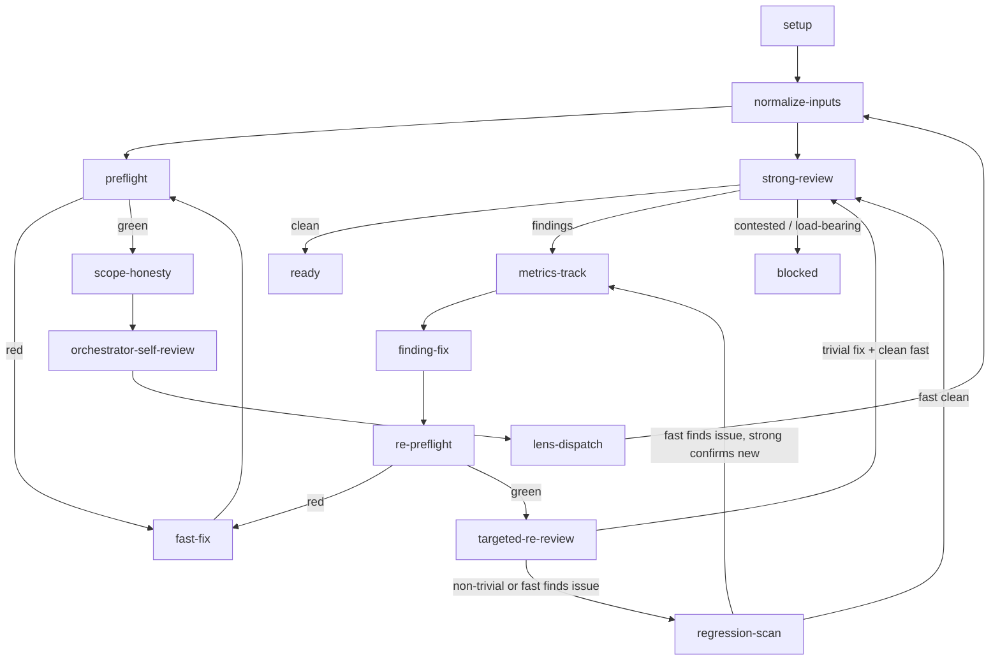
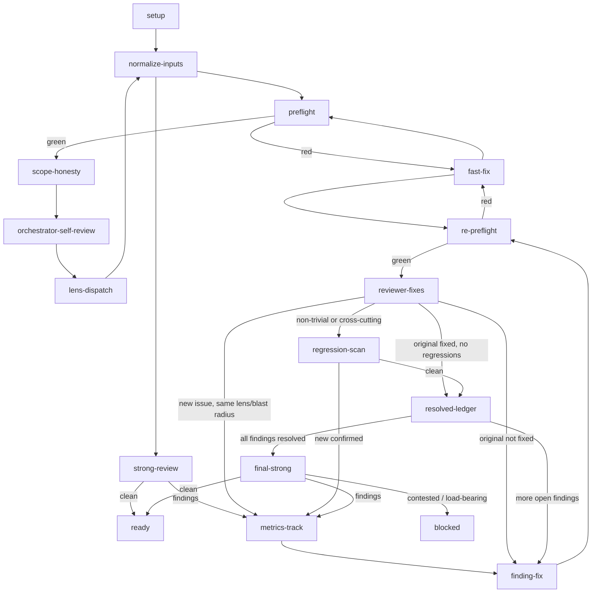

# Iterative review churn reduction — Implementation Plan

> **For agentic workers:** REQUIRED SUB-SKILL: Use `/subagent-driven-development` (recommended) or `/executing-plans` to implement this plan task-by-task. Steps use checkbox (`- [ ]`) syntax for tracking.

**Goal:** Update the `iterative-review` skill to use lens-aware `reviewer-fixes` and `implementer` subagents for fixes, run `reviewer-strong` only once per cycle, and instrument the loop with `regression_class` metrics.

**Architecture:** Modify the source `codex-marketplace/plugins/superpowers-plus/skills/iterative-review/` graph, skill, and metrics; update the source `reviewer-fixes.md` profile; regenerate the marketplace; dogfood on the implementation PR.

**Tech Stack:** Markdown skill files, `py -3 tools/run.py marketplace --apply`, `py -3 tools/run.py ci --check`.

## Global Constraints

- Source edits for the `iterative-review` and `reviewer-fixes` skill changes happen under `codex-marketplace/plugins/superpowers-plus/`. The CI/pre-commit hardening task (Task 7) also edits `codex-marketplace/plugins/repo-worker-pack/skills/repo-standards/templates/`, `scripts/ci-preflight.{sh,ps1}`, `tools/run.py`, and `.agents/doctrine/repo-runbook-policy.md`; these are source edits for that hardening and may be hand-edited. Generated surfaces are regenerated by `py -3 tools/run.py ci --apply`, not hand-edited.
- Each task must end with `py -3 tools/run.py ci --check` passing or a documented interim state.
- All commits use the repo's conventional commit style and the Devin commit trailer.
- The `review-metrics.json` schema changes must be backward-compatible with existing metrics files.

## Reference

The full design is in `.agents/specs/completed/2026-08-06-iterative-review-reduce-churn-design.md`. The `edit` steps in this plan provide the exact `old_string` and `new_string` for each file change.

---

### Task 1: Make `reviewer-fixes` lens-aware

**Files:**
- Modify: `codex-marketplace/plugins/superpowers-plus/skills/selecting-a-subagent/assets/reviewer-fixes.md`

**Interfaces:**
- Consumes: current `reviewer-fixes.md`.
- Produces: updated `reviewer-fixes.md` that accepts `<lens>` and `<lens_checklist>` inputs.

- [ ] **Step 1: Update `## Applies to` inputs**

Use `edit` to add the lens-aware inputs.

```text
old_string:
- inputs:
  - `<diff_path>`
  - `<log_path>`
  - `<pr_description>`
  - `<original_finding>` (fix re-review)
  - `<fix_diff_path>` (fix re-review)
  - `<full_diff_slice_path>` (fix re-review)
```

```markdown
new_string:
- inputs:
  - `<diff_path>`
  - `<log_path>`
  - `<pr_description>`
  - `<original_finding>` (fix re-review)
  - `<fix_diff_path>` (fix re-review)
  - `<full_diff_slice_path>` (fix re-review)
  - `<lens>` (lens-aware re-review)
  - `<lens_checklist>` (lens-aware re-review)
```

- [ ] **Step 2: Update `## Inputs the orchestrator must provide` for lens-aware re-review**

```text
old_string:
- For a fix re-review, the orchestrator must also provide:
  - `<original_finding>` — the issue the fix is addressing.
  - `<fix_diff_path>` — the prepared fix diff (`git diff <pre-fix-sha>...<post-fix-sha>` output written to a file).
  - `<full_diff_slice_path>` — the relevant slices of the full branch diff that the fix touches.
```

```markdown
new_string:
- For a fix re-review, the orchestrator must also provide:
  - `<original_finding>` — the issue the fix is addressing.
  - `<fix_diff_path>` — the prepared fix diff (`git diff <pre-fix-sha>...<post-fix-sha>` output written to a file).
  - `<full_diff_slice_path>` — the relevant slices of the full branch diff that the fix touches.

- For a lens-aware re-review, the orchestrator must also provide:
  - `<lens>` — the originating `reviewer-*.md` lens profile name, e.g. `reviewer-security`.
  - `<lens_checklist>` — the `## Checklist` section from that lens profile, prepared as a plain UTF-8 file.
```

- [ ] **Step 3: Update `## Procedure` step 4 to branch on lens-aware mode**

```text
old_string:
4. If this is a fix re-review, follow `## Fix re-review scope` below. If this is a general small re-review, do a lighter scan across the rest of the diff for regressions; do not deep-dive unless something looks off.
```

```text
new_string:
4. If this is a fix re-review and `<lens_checklist>` is provided, follow `## Lens-aware re-review scope` below. If `<lens_checklist>` is not provided, follow `## Fix re-review scope` below. If this is a general small re-review, do a lighter scan across the rest of the diff for regressions; do not deep-dive unless something looks off.
```

- [ ] **Step 4: Add `## Lens-aware re-review scope` after `## Fix re-review scope`**

```text
old_string:
## Fix re-review scope

When this profile is used for a fix re-review, the orchestrator will provide the original finding, the prepared fix diff (`git diff <pre-fix-sha>...<post-fix-sha>`), and the relevant slices of the full branch diff the fix touches.

Evaluate **only**:

1. whether the fix diff resolves the listed finding,
2. whether the fix introduces any obvious regressions in the code it touches,
3. whether the fix is consistent with the immediate surrounding context.

Do not broaden the review to the whole branch. Do not re-evaluate parts of the branch the fix does not touch. Keep findings brief, concrete, and actionable, with specific file and line citations.
```

```markdown
new_string:
## Fix re-review scope

When this profile is used for a fix re-review, the orchestrator will provide the original finding, the prepared fix diff (`git diff <pre-fix-sha>...<post-fix-sha>`), and the relevant slices of the full branch diff the fix touches.

Evaluate **only**:

1. whether the fix diff resolves the listed finding,
2. whether the fix introduces any obvious regressions in the code it touches,
3. whether the fix is consistent with the immediate surrounding context.

Do not broaden the review to the whole branch. Do not re-evaluate parts of the branch the fix does not touch. Keep findings brief, concrete, and actionable, with specific file and line citations.

## Lens-aware re-review scope

When `<lens>` and `<lens_checklist>` are provided, this is a lens-aware re-review. The originating lens has already reviewed the full branch; your job is to re-apply that lens's `## Checklist` to the blast radius of the fix only.

Evaluate **only**:

1. whether the fix diff resolves the listed original finding,
2. whether the fix introduces any new issues that the `## Checklist` would have caught, within the files the fix touched,
3. whether the fix is consistent with the immediate surrounding context and the lens's checklist.

Use the provided `## Checklist` mechanically. Do not broaden the review to the whole branch. Do not re-evaluate parts of the branch the fix does not touch. Report out-of-scope observations separately and do not let them block the fix. Keep findings brief, concrete, and actionable, with specific file and line citations.
```

- [ ] **Step 5: Mark this task's checklist boxes `[x]` and commit**

```bash
git add codex-marketplace/plugins/superpowers-plus/skills/selecting-a-subagent/assets/reviewer-fixes.md
git commit -m "feat(reviewer-fixes): accept lens and lens_checklist inputs for lens-aware re-review"
```

---

### Task 2: Extend `review-metrics-schema.json` with `regression_class`

**Files:**
- Modify: `codex-marketplace/plugins/superpowers-plus/skills/iterative-review/references/review-metrics-schema.json`

**Interfaces:**
- Consumes: current `review-metrics-schema.json`.
- Produces: schema that records `regression_class`, `regression_of`, and `lens` for `regressions` and `rounds_per_finding`.

- [ ] **Step 1: Update the `regressions` item schema**

```text
old_string:
    "regressions": {
      "type": "array",
      "items": {
        "type": "object",
        "required": ["fix_for", "new_finding", "discovered_at_node", "discovered_at_round", "severity"],
        "properties": {
          "fix_for": {"type": "string"},
          "new_finding": {"type": "string"},
          "discovered_at_node": {"type": "string"},
          "discovered_at_round": {"type": "integer", "minimum": 1},
          "severity": {"type": "string", "enum": ["blocking", "important", "minor"]}
        }
      }
    },
```

```json
new_string:
    "regressions": {
      "type": "array",
      "items": {
        "type": "object",
        "required": ["fix_for", "new_finding", "discovered_at_node", "discovered_at_round", "regression_class", "severity"],
        "properties": {
          "fix_for": {"type": "string"},
          "new_finding": {"type": "string"},
          "discovered_at_node": {"type": "string"},
          "discovered_at_round": {"type": "integer", "minimum": 1},
          "lens": {"type": "string"},
          "regression_class": {"type": "string", "enum": ["same-lens-blast-radius", "cross-lens-blast-radius", "outside-blast-radius"]},
          "severity": {"type": "string", "enum": ["blocking", "important", "minor"]}
        }
      }
    },
```

- [ ] **Step 2: Update the `rounds_per_finding` item schema**

```text
old_string:
    "rounds_per_finding": {
      "type": "array",
      "items": {
        "type": "object",
        "required": ["finding_id", "lens", "discovered_at_node", "discovered_at_round", "resolved_at_node", "resolved_at_round", "severity"],
        "properties": {
          "finding_id": {"type": "string"},
          "lens": {"type": "string"},
          "discovered_at_node": {"type": "string"},
          "discovered_at_round": {"type": "integer", "minimum": 1},
          "resolved_at_node": {"type": "string"},
          "resolved_at_round": {"type": "integer", "minimum": 1},
          "regression_of": {"type": "string"},
          "severity": {"type": "string", "enum": ["blocking", "important", "minor"]}
        }
      }
    },
```

```json
new_string:
    "rounds_per_finding": {
      "type": "array",
      "items": {
        "type": "object",
        "required": ["finding_id", "lens", "discovered_at_node", "discovered_at_round", "resolved_at_node", "resolved_at_round", "severity"],
        "properties": {
          "finding_id": {"type": "string"},
          "lens": {"type": "string"},
          "discovered_at_node": {"type": "string"},
          "discovered_at_round": {"type": "integer", "minimum": 1},
          "resolved_at_node": {"type": "string"},
          "resolved_at_round": {"type": "integer", "minimum": 1},
          "regression_of": {"type": "string"},
          "regression_class": {"type": "string", "enum": ["same-lens-blast-radius", "cross-lens-blast-radius", "outside-blast-radius"]},
          "severity": {"type": "string", "enum": ["blocking", "important", "minor"]}
        }
      }
    },
```

- [ ] **Step 3: Mark this task's checklist boxes `[x]` and commit**

```bash
git add codex-marketplace/plugins/superpowers-plus/skills/iterative-review/references/review-metrics-schema.json
git commit -m "feat(iterative-review): add regression_class, regression_of, and lens to metrics schema"
```

---

### Task 3: Rewrite `review-state-graph.md`

**Files:**
- Modify: `codex-marketplace/plugins/superpowers-plus/skills/iterative-review/references/review-state-graph.md`

**Interfaces:**
- Consumes: current `review-state-graph.md`.
- Produces: graph with `implementer`, `reviewer-fixes`, `resolved-ledger`, `final-strong`.

- [ ] **Step 1: Replace the Mermaid graph**

```text
old_string:

```

```markdown
new_string:

```

- [ ] **Step 2: Replace the `## Nodes` table**

```text
old_string:
## Nodes

| Node | Actor | Purpose |
|---|---|---|
| `setup` | orchestrator | Prepare the workspace, diff, PR context, and `scan_findings`. |
| `normalize-inputs` | orchestrator | Run `normalize_review_inputs.py --apply` on the scratch directory so every downstream file is plain UTF-8. |
| `preflight` | `tools/run.py ci --check` | Run deterministic pattern checks on the branch before any subagent. |
| `fast-fix` | orchestrator | Fix a deterministic preflight finding. |
| `scope-honesty` | orchestrator | Compare the diff to the plan, spec, PR body, and linked issues. Fix drift. |
| `orchestrator-self-review` | orchestrator | Apply each relevant `reviewer-*.md` profile's `## Checklist` to the diff (resolving each name through the Devin Desktop agents search path); fix predictable items; record uncertain items in `review-log-orchestrator-self-review.md`. |
| `lens-dispatch` | parallel subagents | Run the relevant lens reviewers with the prediction log as input. This node is mandatory; do not route around it because the orchestrator-self-review was clean. |
| `strong-review` | `reviewer-strong` | Whole-branch pass that combines lens logs, finds gaps, contradictions, and design issues. |
| `metrics-track` | orchestrator | Record the finding, the node that discovered it, the round number, and the node where it resolves. This node does not block. |
| `finding-fix` | orchestrator + implementer subagent | Resolve one finding and commit the fix. |
| `re-preflight` | `tools/run.py ci --check` | Re-run the deterministic checks on the post-fix range. |
| `targeted-re-review` | `reviewer-fixes` | Cheap gate to confirm the original finding is resolved on the fix diff before a whole-branch `reviewer-strong`. |
| `regression-scan` | `reviewer-fixes` on the touched area, then `reviewer-strong` on the touched area only if the fast pass finds a new issue | Check for new issues a non-trivial fix introduced. The initial fast pass keeps this node cheap. |
| `ready` | orchestrator | Final `ci --check`; wait for remote CI to pass; mark the PR ready. |
| `blocked` | orchestrator | Human escalation for contested or load-bearing findings the orchestrator cannot resolve. |
```

```markdown
new_string:
## Nodes

| Node | Actor | Purpose |
|---|---|---|
| `setup` | orchestrator | Prepare the workspace, diff, PR context, and `scan_findings`. |
| `normalize-inputs` | orchestrator | Run `normalize_review_inputs.py --apply` on the scratch directory so every downstream file is plain UTF-8. |
| `preflight` | consumer CI preflight | Run deterministic pattern checks on the branch before any subagent. |
| `fast-fix` | orchestrator or implementer | Fix a deterministic preflight finding; trivial items the orchestrator can fix, mechanical items an `implementer`. |
| `scope-honesty` | orchestrator | Compare the diff to the plan, spec, PR body, and linked issues. Fix drift. |
| `orchestrator-self-review` | orchestrator | Apply each relevant `reviewer-*.md` profile's `## Checklist` to the diff (resolving each name through the Devin Desktop agents search path); fix predictable items; record uncertain items in `review-log-orchestrator-self-review.md`. |
| `lens-dispatch` | parallel subagents | Run the relevant lens reviewers with the prediction log as input. This node is mandatory; do not route around it because the orchestrator-self-review was clean. |
| `strong-review` | `reviewer-strong` | Whole-branch pass that combines lens logs, finds gaps, contradictions, and design issues. |
| `metrics-track` | orchestrator | Record the finding, the node that discovered it, the round number, the node where it resolves, and the `regression_class`. This node does not block. |
| `finding-fix` | `implementer` subagent | Resolve one finding with the original finding, relevant diff slice, lens checklist, and preflight command. The orchestrator verifies and commits. |
| `re-preflight` | consumer CI preflight | Re-run the deterministic checks on the post-fix range. |
| `reviewer-fixes` | `reviewer-fixes` | Lens-aware cheap gate to verify the original finding is resolved and scan the blast radius for lens-specific regressions. |
| `regression-scan` | `reviewer-strong` on the touched area | For non-trivial/cross-cutting fixes, confirm any new issue `reviewer-fixes` spotted. |
| `resolved-ledger` | orchestrator | Mark the finding resolved; route to the next finding or to `final-strong` when the queue is empty. |
| `final-strong` | `reviewer-strong` | One whole-branch pass after all findings are confirmed fixed. |
| `ready` | orchestrator | Final `ci --check`; wait for remote CI to pass; mark the PR ready. |
| `blocked` | orchestrator | Human escalation for contested or load-bearing findings the orchestrator cannot resolve. |
```

- [ ] **Step 3: Replace the `## Edges` table**

```text
old_string:
## Edges

| From | To | Condition |
|---|---|---|
| `setup` | `normalize-inputs` | Always. |
| `normalize-inputs` | `preflight` | Always. |
| `preflight` | `fast-fix` | Any deterministic finding from `review-preflight`. |
| `fast-fix` | `preflight` | Always; re-run preflight after the fix. |
| `preflight` | `scope-honesty` | `ci --check` passes. |
| `scope-honesty` | `orchestrator-self-review` | Drift corrected or no drift. |
| `orchestrator-self-review` | `lens-dispatch` | Always; the orchestrator's prediction is not a substitute for lens review. The only exception is a PR with zero changed files. |
| `lens-dispatch` | `normalize-inputs` | All lens logs are available. |
| `normalize-inputs` | `strong-review` | UTF-8 backstop has run on the scratch directory. |
| `strong-review` | `ready` | `reviewer-strong` reports `reviewer-strong: clean`. |
| `strong-review` | `metrics-track` | `reviewer-strong` or lens review reports findings. |
| `metrics-track` | `finding-fix` | Always; choose the next finding to fix. |
| `finding-fix` | `re-preflight` | Fix is committed. |
| `re-preflight` | `fast-fix` | A new deterministic issue appears. |
| `re-preflight` | `targeted-re-review` | `ci --check` passes. |
| `targeted-re-review` | `strong-review` | The fix is trivial and the cheap `reviewer-fixes` pass on the fix diff is clean. |
| `targeted-re-review` | `regression-scan` | The fix is non-trivial (multi-file, generated surfaces, security/tooling boundary, or changes a public interface) or `reviewer-fixes` finds a new issue. |
| `regression-scan` | `metrics-track` | `reviewer-strong` on the touched area confirms a new issue introduced by the fix. |
| `regression-scan` | `strong-review` | The widened `reviewer-fixes` pass on the touched area is clean. |
| `strong-review` | `blocked` | A finding is contested or load-bearing and the orchestrator cannot resolve it. |
```

```markdown
new_string:
## Edges

| From | To | Condition |
|---|---|---|
| `setup` | `normalize-inputs` | Always. |
| `normalize-inputs` | `preflight` | Always. |
| `preflight` | `fast-fix` | Any deterministic finding from `review-preflight`. |
| `fast-fix` | `preflight` | Always; re-run preflight after the fix. |
| `preflight` | `scope-honesty` | `ci --check` passes. |
| `scope-honesty` | `orchestrator-self-review` | Drift corrected or no drift. |
| `orchestrator-self-review` | `lens-dispatch` | Always; the orchestrator's prediction is not a substitute for lens review. The only exception is a PR with zero changed files. |
| `lens-dispatch` | `normalize-inputs` | All lens logs are available. |
| `normalize-inputs` | `strong-review` | UTF-8 backstop has run on the scratch directory. |
| `strong-review` | `ready` | `reviewer-strong` reports `reviewer-strong: clean` and preflight is clean. |
| `strong-review` | `metrics-track` | `reviewer-strong` or lens review reports findings. |
| `metrics-track` | `finding-fix` | Always; choose the next open finding. |
| `finding-fix` | `re-preflight` | Implementer reports the fix and the orchestrator commits it. |
| `re-preflight` | `fast-fix` | A new deterministic issue appears. |
| `re-preflight` | `reviewer-fixes` | Deterministic checks pass. |
| `reviewer-fixes` | `resolved-ledger` | Original finding fixed and no new issues. |
| `reviewer-fixes` | `finding-fix` | Original finding not fixed; repeat the fix loop. |
| `reviewer-fixes` | `metrics-track` | A new same-lens/blast-radius issue is found. |
| `reviewer-fixes` | `regression-scan` | The fix is non-trivial, cross-cutting, generated, at a security/tooling boundary, or changes a public interface. |
| `regression-scan` | `resolved-ledger` | No new issue confirmed. |
| `regression-scan` | `metrics-track` | `reviewer-strong` on the touched area confirms a new issue. |
| `resolved-ledger` | `finding-fix` | More open findings remain. |
| `resolved-ledger` | `final-strong` | The finding queue is empty. |
| `final-strong` | `ready` | `reviewer-strong: clean` and preflight is clean. |
| `final-strong` | `metrics-track` | New findings remain. |
| `final-strong` | `blocked` | A finding is contested or load-bearing. |
```

- [ ] **Step 4: Replace `## Round counting`**

```text
old_string:
## Round counting

A "round" is one complete traversal through `lens-dispatch` or `strong-review` that produces findings. `orchestrator-self-review` and cheap `reviewer-fixes` gates (`targeted-re-review` and the fast phase of `regression-scan`) are not rounds because they are cheap gates. The first `lens-dispatch` is round 1. The first `strong-review` is round 2. A `regression-scan` that confirms a new issue with `reviewer-strong` starts a new round at `metrics-track`.
```

```markdown
new_string:
## Round counting

A "round" is one full `lens-dispatch` or `reviewer-strong` traversal that produces findings. `orchestrator-self-review`, `reviewer-fixes`, and `re-preflight` are cheap gates and are **not** counted as rounds.

- Round 1: `lens-dispatch`
- Round 2: first `strong-review`
- Round 3 (if needed): `final-strong`

`regression-scan` that confirms a new issue with `reviewer-strong` on the touched area starts a new round at `metrics-track`.
```

- [ ] **Step 5: Mark this task's checklist boxes `[x]` and commit**

```bash
git add codex-marketplace/plugins/superpowers-plus/skills/iterative-review/references/review-state-graph.md
git commit -m "feat(iterative-review): update state graph for implementer, reviewer-fixes, and final-strong"
```

---

### Task 4: Update `iterative-review/SKILL.md`

**Files:**
- Modify: `codex-marketplace/plugins/superpowers-plus/skills/iterative-review/SKILL.md`

**Interfaces:**
- Consumes: current `SKILL.md` and the design spec.
- Produces: updated `SKILL.md` that walks the new graph.

- [ ] **Step 1: Update `## Core Pattern` paragraph**

```text
old_string:
Follow the `review-state-graph.md` reference. The graph routes the orchestrator through deterministic preflight, orchestrator prediction, parallel lens review, `reviewer-strong` whole-branch review, fix, re-preflight, targeted re-review, and conditional regression-scan. Every finding records the node and round that discovered it. There are no fixed "Round N" steps.
```

```text
new_string:
Follow the `review-state-graph.md` reference. The graph routes the orchestrator through deterministic preflight, `orchestrator-self-review`, parallel `lens-dispatch`, `reviewer-strong` whole-branch review, `finding-fix` by an `implementer`, `re-preflight`, lens-aware `reviewer-fixes`, `resolved-ledger`, conditional `regression-scan`, and a final `reviewer-strong`. Every finding records the node and round that discovered it. There are no fixed "Round N" steps.
```

- [ ] **Step 2: Replace `### finding-fix` section**

```text
old_string:
### `finding-fix`

For each finding, use `receiving-code-review` to verify it, then fix it. Commit the fix. The fix should be narrow.
```

```markdown
new_string:
### `finding-fix`

For each finding, the orchestrator first uses `receiving-code-review` to verify it. Then it builds a task brief and dispatches an `implementer` subagent:

- `original_finding` — the exact finding text and severity, with file and line citations.
- `lens` — the originating `reviewer-*.md` lens, e.g. `reviewer-security`.
- `lens_checklist` — the `## Checklist` section from that lens profile.
- `diff_slice` — the relevant slice of the full branch diff that the finding touches.
- `fix_constraints` — what not to break, which tests to run, and the consumer's `ci --check` command.

The `implementer` edits, runs the consumer's preflight, and commits. The orchestrator verifies the commit and the report, then moves to `re-preflight`.

Use `implementer` for rounds 1–3. If a finding fails `reviewer-fixes` three times, escalate to `implementer-strong` for round 4. If it still fails, route to `blocked`.
```

- [ ] **Step 3: Replace `### targeted-re-review` with `### reviewer-fixes` section**

```text
old_string:
### `targeted-re-review`

Before spending a full whole-branch `reviewer-strong` pass, dispatch `reviewer-fixes` with a tight scope and a concrete `<log_path>` (e.g. `$scratch/review-log-fixes.md`):
- the original finding,
- the fix diff (e.g. `HEAD~N..HEAD` or `origin/main..HEAD` if the fixes are the latest commits),
- the relevant slice of the full branch diff,
- `<log_path>` where `reviewer-fixes` must use the `write` tool to write its report.

Use `reviewer-fixes` to verify the original finding is resolved and to look for obvious new issues in the fix. Do not broaden into a whole-branch review here.

Confirm the original finding is resolved. Then:
- If the fix is trivial (single file, same concern, no cross-cutting impact) and `reviewer-fixes` is clean, go to `strong-review`.
- If the fix is non-trivial (multi-file, generated surfaces, security/tooling boundary, public interface change) or `reviewer-fixes` finds any new issue, go to `regression-scan`.
```

```markdown
new_string:
### `reviewer-fixes`

Before spending a full whole-branch `reviewer-strong` pass, dispatch `reviewer-fixes` with the following lens-aware package and a concrete `<log_path>` (e.g. `$scratch/review-log-fixes.md`):
- `original_finding` — the issue the fix is addressing.
- `fix_diff_path` — the prepared fix diff (`git diff <pre-fix-sha>...<post-fix-sha>`).
- `full_diff_slice_path` — the relevant slices of the full branch diff that the fix touches (the blast radius).
- `lens` — the originating `reviewer-*.md` lens.
- `lens_checklist` — the `## Checklist` from that lens.
- `<log_path>` where `reviewer-fixes` must use the `write` tool to write its report.

`reviewer-fixes` verifies the original finding is resolved and applies the originating lens's checklist to the blast radius only. It is not a whole-branch review.

Confirm the original finding is resolved. Then:
- If the original finding is fixed and `reviewer-fixes` is clean, go to `resolved-ledger`.
- If the original finding is not fixed, go back to `finding-fix` for the same finding.
- If `reviewer-fixes` finds a new same-lens/blast-radius issue, record it in `metrics-track` with `regression_class: same-lens-blast-radius`.
- If the fix is non-trivial (multi-file, generated surfaces, security/tooling boundary, public interface change), go to `regression-scan` even if `reviewer-fixes` is clean.
```

- [ ] **Step 4: Replace `### regression-scan` and add `### resolved-ledger` and `### final-strong` sections**

```text
old_string:
### `regression-scan`

Widen the scope to the fix and immediate surrounding area. First dispatch `reviewer-fixes` on that widened diff, with `<log_path>` set to `$scratch/review-log-fixes.md`, to catch cheap regressions. If `reviewer-fixes` is clean, go to `strong-review` for the final whole-branch pass. If `reviewer-fixes` finds a new issue, dispatch `reviewer-strong` on the touched area, with its own `<log_path>` (e.g. `$scratch/review-log-strong.md`), to confirm and classify it; then return to `metrics-track` so it is recorded as a regression.
```

```markdown
new_string:
### `regression-scan`

For non-trivial or cross-cutting fixes, widen the scope to the fix and immediate surrounding area. Dispatch `reviewer-strong` on the touched area with `<log_path>` set to `$scratch/review-log-strong.md`. Its job is to confirm and classify any new issue the fix introduced.

If `reviewer-strong` on the touched area is clean, go to `resolved-ledger`. If it finds a new issue, classify it:
- `same-lens-blast-radius` if the issue is in the same lens and in the blast radius.
- `cross-lens-blast-radius` if the issue is in a different lens and in the blast radius.
- `outside-blast-radius` if the issue is outside the blast radius.

Record the new finding in `metrics-track` with `regression_class` and `regression_of` set to the original finding, then return to `finding-fix`.

### `resolved-ledger`

This is an orchestrator bookkeeping node, not a subagent dispatch. When `reviewer-fixes` or `regression-scan` is clean, mark the original finding `resolved` and record the `resolved_at_node` and `resolved_at_round` in `review-metrics.json`.

If more findings remain in the queue, choose the next one and go to `finding-fix`. If the queue is empty, go to `final-strong`.

### `final-strong`

Run one whole-branch `reviewer-strong` pass after all findings are resolved. It receives the full branch diff, PR description, all lens logs, the `resolved-ledger` of fixed findings, and the `regression_class` records. Its job is to confirm there are no remaining gaps, contradictions, or design issues.

If `reviewer-strong` reports `reviewer-strong: clean` and the preflight is clean, go to `ready`. If it reports findings, go to `metrics-track` to start a new fix loop. If it reports a contested or load-bearing finding, go to `blocked`.
```

- [ ] **Step 5: Update `### ready` to use `final-strong`**

```text
old_string:
### `ready`

When `strong-review` reports `reviewer-strong: clean` and the preflight is clean:
```

```text
new_string:
### `ready`

When `final-strong` reports `reviewer-strong: clean` and the preflight is clean:
```

- [ ] **Step 6: Update `## Recording review-metrics.json` section**

```text
old_string:
At every `metrics-track` and at `ready` or `blocked`, write or update `review-metrics.json` in the off-repo scratch. The schema is in `references/review-metrics-schema.json`. This file is evidence for:

- **Fast catch**: `findings_by_node.preflight` should dominate.
- **Early catch**: most lens/strong findings should appear at low `discovered_at_round` values.
- **No sloppy fixes**: `regressions` should be low relative to `rounds_per_finding`.
```

```markdown
new_string:
At every `metrics-track` and at `ready`, `resolved-ledger`, or `blocked`, write or update `review-metrics.json` in the off-repo scratch. The schema is in `references/review-metrics-schema.json`. This file is evidence for:

- **Fast catch**: `findings_by_node.preflight` should dominate.
- **Early catch**: most lens/strong findings should appear at low `discovered_at_round` values.
- **No sloppy fixes**: `regressions` should be low relative to `rounds_per_finding`.
- **Tunable regressions**: the `regression_class` distribution tells us whether late findings are due to weak lens review (`outside-blast-radius`), shoddy same-lens fixes (`same-lens-blast-radius`), or cross-cutting regressions (`cross-lens-blast-radius`).

For every post-fix finding, set `regression_class` from the decision table in the design spec (`## Concrete regression_class assignment`). Also set `regression_of` on the `rounds_per_finding` entry for the new finding.
```

- [ ] **Step 7: Update `## Invariants`**

```text
old_string:
- The orchestrator owns the scope-honesty preflight, all fixes, and the final decision to flip the PR to ready.
```

```text
new_string:
- The orchestrator owns the scope-honesty preflight, all verification, the `resolved-ledger`, and the final decision to flip the PR to ready. `implementer` subagents own the fix edits under the orchestrator's brief.
```

- [ ] **Step 8: Mark this task's checklist boxes `[x]` and commit**

```bash
git add codex-marketplace/plugins/superpowers-plus/skills/iterative-review/SKILL.md
git commit -m "feat(iterative-review): SKILL.md uses implementer, reviewer-fixes, and final-strong"
```

---

### Task 5: Regenerate marketplace and validate

**Files:**
- Generated: `.agents/skills/`, `.agents/agents/`, `codex-marketplace/plugins/superpowers-plus/` derived surfaces.

**Interfaces:**
- Consumes: updated source skill files.
- Produces: regenerated and validated installed and bundled surfaces.

- [ ] **Step 1: Stage all source changes**

```bash
git add codex-marketplace/plugins/superpowers-plus/
```

- [ ] **Step 2: Run marketplace regeneration**

```bash
py -3 tools/run.py marketplace --apply
```

- [ ] **Step 3: Stage regenerated files and run CI check**

```bash
git add -A
py -3 tools/run.py ci --check
```

Expected: `py -3 tools/run.py ci --check` passes. If it fails, fix the offending source or generated file and re-run.

- [ ] **Step 4: Commit the regenerated surfaces**

```bash
git commit -m "chore: regenerate marketplace and installed surfaces"
```

---

### Task 6: Open a draft PR and dogfood the new graph

**Files:**
- External: GitHub PR.

**Interfaces:**
- Consumes: the implementation branch.
- Produces: a draft PR with baseline and implementation metrics.

- [ ] **Step 1: Push the branch and open a draft PR into `main`**

Use the repo's PR flow (`gh` or the GitHub MCP). Title: `Reduce iterative-review churn with lens-aware reviewer-fixes and implementer-driven fixes`.

- [ ] **Step 2: Run `iterative-review` on the implementation PR**

With the new graph in effect in the worktree, run the updated `iterative-review` skill on this same PR. Save the resulting `review-metrics.json` to the PR as a comment or attachment.

- [ ] **Step 3: Compare with the spec/plan PR baseline**

If available, compare the metrics from the implementation PR with the baseline collected on the spec/plan PR. Report the total rounds, total `regressions`, and the `regression_class` distribution. If the new graph shows fewer rounds and a low `outside-blast-radius` rate, the implementation is validated.

- [ ] **Step 4: Mark this task's checklist boxes `[x]` and commit any follow-up fixes**

If the dogfood reveals issues, create follow-up commits on the same branch. Re-run `py -3 tools/run.py ci --check` before each commit.

---

### Task 7: Harden the consumer CI/pre-commit gate

**Files:**
- `tools/run.py`
- `codex-marketplace/plugins/repo-worker-pack/skills/repo-standards/templates/ci-preflight.{sh,ps1}` and `pre-commit`
- `scripts/ci-preflight.{sh,ps1}`
- `.agents/doctrine/repo-runbook-policy.md`

- [ ] **Step 1: Update the consumer pre-commit script templates**

Edit the `ci-preflight.sh` and `ci-preflight.ps1` templates so the consumer hook:
1. Invokes the Python interpreter explicitly (e.g. `python3` with a `python` fallback on POSIX, `py -3` on Windows).
2. Runs `tools/run.py ci --apply --allow-shared-checkout` to regenerate mechanical artifacts.
3. Stages only tracked changes with `git add -u`.
4. Runs `tools/run.py ci --check --allow-shared-checkout` and aborts the commit if it fails.
5. Restores the original working directory on exit (e.g. `pushd`/`popd` in `.sh`, `Push-Location`/`Pop-Location` in `.ps1`).

- [ ] **Step 2: Update the tracked `scripts/ci-preflight.{sh,ps1}`**

Apply the same changes to the repo-owned `scripts/ci-preflight.sh` and `scripts/ci-preflight.ps1` so the local pre-commit hook matches the source templates.

- [ ] **Step 3: Update `tools/run.py` epilog**

Change the `ci` help text to state that `ci --apply` regenerates artifacts and `ci --check` is the separate verification gate.

- [ ] **Step 4: Update `.agents/doctrine/repo-runbook-policy.md`**

Remove any exception that prevents `repo-standards` from overwriting the consumer pre-commit hook, documenting that the hook is now a `repo-standards` managed surface.

- [ ] **Step 5: Mark this task's checklist boxes `[x]` and commit**

```bash
git add tools/run.py codex-marketplace/plugins/repo-worker-pack/skills/repo-standards/templates/ci-preflight.sh codex-marketplace/plugins/repo-worker-pack/skills/repo-standards/templates/ci-preflight.ps1 codex-marketplace/plugins/repo-worker-pack/skills/repo-standards/templates/pre-commit scripts/ci-preflight.sh scripts/ci-preflight.ps1 .agents/doctrine/repo-runbook-policy.md
git commit -m "feat(repo-standards): harden pre-commit to apply, stage tracked changes, and verify"
```

---

## Plan-Readiness Self-Review

- [ ] **Spec coverage:** Every design section in `.agents/specs/completed/2026-08-06-iterative-review-reduce-churn-design.md` maps to one or more tasks above.
- [ ] **Placeholder scan:** No `TBD`, `TODO`, or vague instructions remain.
- [ ] **Source facts verified:** Paths, skill names, and commands were read from the current source tree.
- [ ] **CI gate:** The final task runs `py -3 tools/run.py ci --check` on the staged tree before the last commit.

## Execution Confidence Rating

I rate this plan **9/10** for plan-readiness: every task has exact file targets, `edit` old/new strings, validation commands, and commit messages. The only open variable is the dogfood result, which is explicitly a validation step, not a pre-requisite for the implementation.
