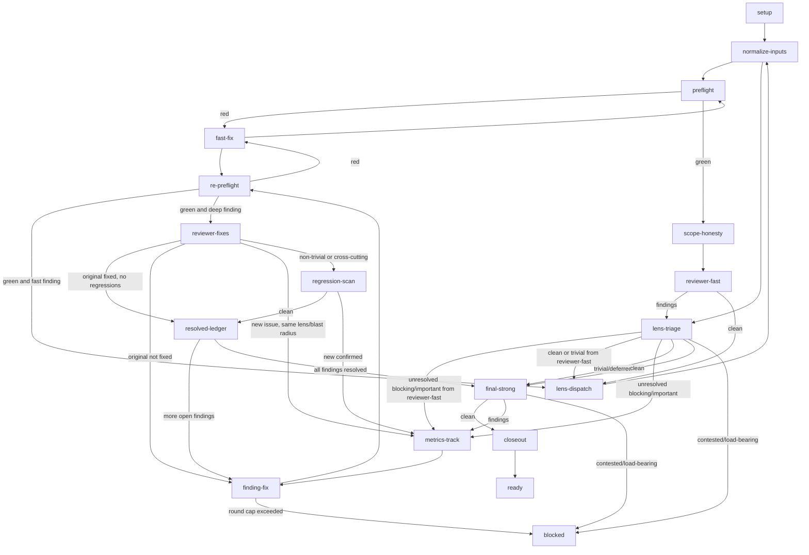

# Pre-lens Dispatch Shape and Cheap-Lens Hygiene

> **For agentic workers:** REQUIRED SUB-SKILL: Use `/subagent-driven-development` (recommended) or `/executing-plans` to implement this plan task-by-task. Steps use checkbox (`- [x]`) syntax for tracking.

**Goal:** Close out the `iterative-review-improvements` epic, then make `reviewer-fast` a true pre-lens that gates `lens-dispatch` and stop `reviewer-security` from matching every non-empty diff.

**Architecture:** Add a `reviewer-fast` node between `scope-honesty` and `lens-dispatch`, update the graph and `next_node.py` to route fast findings through `lens-triage` and `finding-fix` before deep lenses are dispatched, and update `select_lenses.py` to omit `reviewer-fast`. Fix the `reviewer-security` `Applies to` glob in the `selecting-a-subagent` assets.

**Tech Stack:** Python 3, `codex-marketplace/plugins/superpowers-plus/skills/iterative-review/`, `codex-marketplace/plugins/superpowers-plus/skills/selecting-a-subagent/`, `py -3 tools/run.py marketplace --apply`, `py -3 tools/run.py ci --check`.

## Global Constraints

- Only edit canonical source under `codex-marketplace/plugins/...`; never edit installed `.agents/skills/` copies directly.
- Every new script must satisfy `--help` and `--check`.
- No emojis and no em-dashes.
- Regenerate installed skills with `py -3 tools/run.py marketplace --apply` before final CI.
- `py -3 tools/run.py ci --check` must pass before claiming this plan complete.

---

### Task 1: Close out the `iterative-review-improvements` epic

**Files:**
- Move: `.agents/plans/iterative-review-improvements/` to `.agents/plans/completed/iterative-review-improvements/`
- Modify: `.agents/plans/INDEX.md` and `.agents/plans/completed/INDEX.md` (regenerated by mesh)
- Test: `py -3 tools/check_archive_links.py` and `py -3 tools/run.py ci --check`

**Interfaces:**
- Consumes: the completed `iterative-review-improvements` epic folder.
- Produces: an archived epic and a clean base for the new work.

- [x] **Step 1: Move the completed epic folder to the archive**
```bash
git mv .agents/plans/iterative-review-improvements .agents/plans/completed/iterative-review-improvements
```

- [x] **Step 2: Heal in-boundary archive links**
```bash
py -3 tools/heal_archive_links.py --apply
```

- [x] **Step 3: Verify no stale archive links remain**
```bash
py -3 tools/check_archive_links.py
```

- [x] **Step 4: Regenerate the agent mesh and plan indexes**
```bash
py -3 tools/run.py mesh --apply
```

- [x] **Step 5: Run CI on the archived state**
```bash
py -3 tools/run.py ci --check
```

- [x] **Step 6: Commit the closeout**
```bash
git add -A
git commit -m "archive(plans): close out iterative-review-improvements epic"
```

---

### Task 2: Update the review state graph for a pre-lens `reviewer-fast`

**Files:**
- Modify: `codex-marketplace/plugins/superpowers-plus/skills/iterative-review/references/review-state-graph.md`
- Test: `py -3 .agents/skills/iterative-review/scripts/next_node.py --check`

**Interfaces:**
- Consumes: the current `review-state-graph.md` mermaid and edges table.
- Produces: a graph where `reviewer-fast` sits after `scope-honesty` and gates `lens-dispatch`.

- [x] **Step 1: Replace the Mermaid `flowchart TD` block with the exact block below**


- [x] **Step 2: Update the `## Edges` table to match the Mermaid block**
Replace the existing `reviewer-fast`, `re-preflight`, and `lens-triage` rows with these exact rows:

| From | To | Condition |
|---|---|---|
| `setup` | `normalize-inputs` | Always. |
| `normalize-inputs` | `preflight` | Always. |
| `preflight` | `fast-fix` | Any deterministic finding from `review-preflight`. |
| `fast-fix` | `preflight` | Always; re-run preflight after the fix. |
| `preflight` | `scope-honesty` | `ci --check` passes. |
| `scope-honesty` | `reviewer-fast` | Drift corrected or no drift. |
| `reviewer-fast` | `lens-triage` | `reviewer-fast` reported findings. |
| `reviewer-fast` | `lens-dispatch` | `reviewer-fast: clean`. |
| `lens-triage` | `metrics-track` | `blocking/important` findings that need a fix before the next dispatch or final. |
| `lens-triage` | `lens-dispatch` | When the previous node was `reviewer-fast` and all remaining findings are `trivial/deferred` or none. |
| `lens-triage` | `final-strong` | When the previous node was `lens-dispatch` and all remaining findings are `trivial/deferred` or none. |
| `lens-triage` | `blocked` | A finding is `contested`, `tool-blocked`, or `load-bearing`. |
| `metrics-track` | `finding-fix` | Always; choose the next finding to fix. |
| `finding-fix` | `re-preflight` | Fix is committed. |
| `re-preflight` | `fast-fix` | A new deterministic issue appears. |
| `re-preflight` | `lens-dispatch` | `ci --check` passes and the finding being fixed originated from `reviewer-fast`. |
| `re-preflight` | `reviewer-fixes` | `ci --check` passes and the finding being fixed originated from a deep lens. |
| `lens-dispatch` | `normalize-inputs` | All deep lens logs are available. |
| `normalize-inputs` | `lens-triage` | UTF-8 backstop has run on the scratch directory. |
| `reviewer-fixes` | `resolved-ledger` | The original finding is fixed and `reviewer-fixes` is clean. |
| `reviewer-fixes` | `finding-fix` | The original finding is not fixed. |
| `reviewer-fixes` | `metrics-track` | `reviewer-fixes` finds a new same-lens/blast-radius issue. |
| `reviewer-fixes` | `regression-scan` | The fix is non-trivial. |
| `regression-scan` | `resolved-ledger` | `reviewer-strong` on the touched area is clean. |
| `regression-scan` | `metrics-track` | `reviewer-strong` on the touched area confirms a new issue. |
| `resolved-ledger` | `finding-fix` | More findings remain in the queue. |
| `resolved-ledger` | `final-strong` | All findings are resolved. |
| `final-strong` | `closeout` | `reviewer-strong` reports `reviewer-strong: clean`. |
| `final-strong` | `metrics-track` | `reviewer-strong` reports findings. |
| `final-strong` | `blocked` | A finding is contested or load-bearing. |
| `closeout` | `ready` | Archives (if any) are committed and the local tree passes `ci --check`. |

---

### Task 3: Update `next_node.py` to route the new graph

**Files:**
- Modify: `codex-marketplace/plugins/superpowers-plus/skills/iterative-review/scripts/next_node.py`
- Test: `py -3 .agents/skills/iterative-review/scripts/next_node.py --check`

**Interfaces:**
- Consumes: the updated `review-state-graph.md` and `lens` field on each finding.
- Produces: a `next_node.py` that uses `previous_node` and `originating_lens` to route fast findings back to `lens-dispatch` and deep findings to `reviewer-fixes`.

- [x] **Step 1: Update the `GRAPH` transitions for `scope-honesty`, `reviewer-fast`, `re-preflight`, and `lens-triage`**
Replace the relevant entries in the `GRAPH` dictionary with these exact entries:
```python
    "scope-honesty": [("always", "reviewer-fast")],
    "reviewer-fast": [
        ("findings", "lens-triage"),
        ("clean", "lens-dispatch"),
    ],
    "lens-triage": [
        ("blocked", "blocked"),
        ("findings", "metrics-track"),
        ("after_reviewer_fast", "lens-dispatch"),
        ("after_lens_dispatch", "final-strong"),
    ],
    "metrics-track": [("always", "finding-fix")],
    "finding-fix": [
        ("round_cap", "blocked"),
        ("always", "re-preflight"),
    ],
    "re-preflight": [
        ("red", "fast-fix"),
        ("fast_origin", "lens-dispatch"),
        ("green", "reviewer-fixes"),
    ],
    "lens-dispatch": [("always", "normalize-inputs")],
    "normalize-inputs": [
        ("after_lens_dispatch", "lens-triage"),
        ("after_setup", "preflight"),
    ],
```

- [x] **Step 2: Add the new conditions to `_condition_holds`**
Add these exact cases to `_condition_holds` before the final `return False`:
```python
    if condition == "after_reviewer_fast":
        return previous_node == "reviewer-fast" and not unresolved
    if condition == "after_lens_dispatch":
        return previous_node == "lens-dispatch" and not unresolved
    if condition == "fast_origin":
        findings = _load_jsonl(scratch / "findings.jsonl")
        resolved_ids = {r["finding_id"] for r in _load_jsonl(scratch / "resolutions.jsonl")}
        first_unresolved = next(
            (f for f in findings if f["finding_id"] not in resolved_ids and f.get("severity") in ("blocking", "important")),
            None,
        )
        return not unresolved or (first_unresolved is not None and first_unresolved.get("lens") == "reviewer-fast")
```

- [x] **Step 3: Add the new `reviewer-fast` terminal condition to `_lens_log_clean`**
No change is required; `_lens_log_clean` already checks for `<lens>: clean` by filename. Verify that `scratch / "review-log-reviewer-fast.md"` is read the same way as other lens logs.

- [x] **Step 4: Run the `--check` self-test**
```bash
py -3 .agents/skills/iterative-review/scripts/next_node.py --check
```

---

### Task 4: Update `select_lenses.py` to stop selecting `reviewer-fast`

**Files:**
- Modify: `codex-marketplace/plugins/superpowers-plus/skills/iterative-review/scripts/select_lenses.py`
- Test: `py -3 .agents/skills/iterative-review/scripts/select_lenses.py --check`

**Interfaces:**
- Consumes: the current `select_lenses.py` `_select` return.
- Produces: `lenses.jsonl` that no longer contains `reviewer-fast`; `reviewer-fast` is dispatched by its own node.

- [x] **Step 1: Remove the `reviewer-fast` pre-lens selection logic**
In `_select`, replace:
```python
    preflight_log = scratch / "review-log-reviewer-fast.md"
    selected = [s for s in selected if s["lens"] != "reviewer-fast" or not preflight_log.exists()]
    return selected
```
with:
```python
    selected = [s for s in selected if s["lens"] != "reviewer-fast"]
    return selected
```

- [x] **Step 2: Run the `--check` self-test**
```bash
py -3 .agents/skills/iterative-review/scripts/select_lenses.py --check
```

---

### Task 5: Update the `lens-dispatch` recipe

**Files:**
- Modify: `codex-marketplace/plugins/superpowers-plus/skills/iterative-review/references/node-lens-dispatch.md`

**Interfaces:**
- Consumes: the updated `select_lenses.py` and `reviewer-fast` node.
- Produces: a `node-lens-dispatch.md` recipe that only dispatches deep lenses and uses `diff_slicer.py` for their scoped diffs.

- [x] **Step 1: Rewrite the recipe to remove `reviewer-fast`**
Replace the `## Recipe` section with this exact text:
```markdown
## Recipe

1. Run `select_lenses.py` to discover matching deep lenses. `reviewer-fast` is no longer selected here; it is dispatched by the `reviewer-fast` node.
   ```
   py -3 .agents/skills/iterative-review/scripts/select_lenses.py --state <scratch_dir>/review-state.json --apply
   ```
2. Run `diff_slicer.py` to generate a scoped diff for each selected deep lens:
   ```
   py -3 .agents/skills/iterative-review/scripts/diff_slicer.py --state <scratch_dir>/review-state.json --apply
   ```
3. Read `<scratch_dir>/lenses.jsonl`; each line now includes a `diff_path`. Build the common input package: `<pr_description>`, `<scan_findings>`, and `review-log-reviewer-fast.md` from the pre-lens pass. Use the lens's `diff_path` for the scoped diff. If the lens's `## Inputs` section calls for `<plan_path>`, `<spec_path>`, or `<roadmap_path>`, add the requested file to that lens's package.
4. `run_subagent` each deep lens from `lenses.jsonl` with its `profile_path`, `output_path`, and the lens-specific input package.
5. Wait for all `run_subagent` calls to complete. From each `review-log-<lens>.md`, extract the terminal (last) line.
6. If no deep lens matches, continue to `lens-triage` with only the `reviewer-fast` log.
7. If `run_subagent` is unavailable, route to `blocked`.
```

---

### Task 6: Create the `reviewer-fast` node recipe

**Files:**
- Create: `codex-marketplace/plugins/superpowers-plus/skills/iterative-review/references/node-reviewer-fast.md`

**Interfaces:**
- Consumes: the full branch `<diff_path>` and `<pr_description>`.
- Produces: `review-log-reviewer-fast.md` and the next node.

- [x] **Step 1: Write `node-reviewer-fast.md` with this exact content**
```markdown
# node-reviewer-fast

## Purpose
Run the cheap `reviewer-fast` pre-lens before any deep lens is dispatched. Catch mechanical, surface-level issues that the deep reviewers should not waste effort on, and fix them before `lens-dispatch`.

## Inputs
- `reviewer-fast` profile from the Devin Desktop agents search path
- Full branch `<diff_path>`
- `<pr_description>`
- Off-repo `<scratch_dir>`

## Recipe
1. Verify the graph is at `reviewer-fast`:
   ```
   py -3 .agents/skills/iterative-review/scripts/next_node.py \
       --state <scratch_dir>/review-state.json \
       --propose reviewer-fast
   ```
2. `run_subagent` `reviewer-fast` with `<diff_path>`, `<pr_description>`, and `output_path` `<scratch_dir>/review-log-reviewer-fast.md`.
3. Extract the terminal line from `review-log-reviewer-fast.md`. If it is `reviewer-fast: clean`, authorize `lens-dispatch`:
   ```
   py -3 .agents/skills/iterative-review/scripts/next_node.py \
       --state <scratch_dir>/review-state.json \
       --propose lens-dispatch
   ```
4. If `reviewer-fast` reported `N issue(s)`, record each finding, then run `compile_metrics.py` and route to `lens-triage`:
   ```
   py -3 .agents/skills/iterative-review/scripts/record_finding.py \
       --state <scratch_dir>/review-state.json \
       --data '{"finding_id": "<id>", "lens": "reviewer-fast", "discovered_at_node": "reviewer-fast", "discovered_at_round": <round>, "severity": "<severity>", "contested": <true|false>}'
   py -3 .agents/skills/iterative-review/scripts/compile_metrics.py \
       --state <scratch_dir>/review-state.json \
       --metrics <scratch_dir>/review-metrics.json
   py -3 .agents/skills/iterative-review/scripts/next_node.py \
       --state <scratch_dir>/review-state.json \
       --propose lens-triage
   ```

## Outputs
- `review-log-reviewer-fast.md` written by the `reviewer-fast` subagent
- `findings.jsonl` updated when `reviewer-fast` reports issues

## Next check
```
py -3 .agents/skills/iterative-review/scripts/next_node.py --state <scratch_dir>/review-state.json
```
```

---

### Task 7: Fix the `reviewer-security` `Applies to` glob

**Files:**
- Modify: `codex-marketplace/plugins/superpowers-plus/skills/selecting-a-subagent/assets/reviewer-security.md`
- Test: synthetic `select_lenses.py` check against a diff with no security keywords

**Interfaces:**
- Consumes: the current `reviewer-security.md` `## Applies to` section.
- Produces: a `reviewer-security` that only dispatches when security-relevant keywords appear in the diff or PR body.

- [x] **Step 1: Replace the `## Applies to` section with this exact block**
```markdown
## Applies to

Use this section to decide whether `reviewer-security` should be dispatched for a PR.

- keywords:
  - secret
  - token
  - credential
  - password
  - private_key
  - api_key
- inputs:
  - `<diff_path>`
```

- [x] **Step 2: Run a synthetic check to confirm `reviewer-security` is no longer always selected**
```bash
py -3 .agents/skills/iterative-review/scripts/select_lenses.py --state <synthetic-state>/review-state.json
```
Use a synthetic `review-state.json` with a scratch dir containing a diff with no security keywords and verify `reviewer-security` is not in the output.

---

### Task 8: Regenerate installed skills and validate

**Files:**
- Regenerate: `.agents/skills/iterative-review/` and `.agents/skills/selecting-a-subagent/`
- Test: `py -3 tools/run.py ci --check`

**Interfaces:**
- Consumes: the canonical source changes from Tasks 1-7.
- Produces: installed copies in sync with source and a green CI run.

- [x] **Step 1: Regenerate installed skills from the canonical source**
```bash
py -3 tools/run.py marketplace --apply
```

- [x] **Step 2: Run the canonical preflight**
```bash
py -3 tools/run.py ci --check
```

- [x] **Step 3: Commit the implementation and regenerated surfaces**
```bash
git add -A
git commit -m "feat(iterative-review): pre-lens dispatch shape and cheap-lens hygiene"
```

- [x] **Step 4: Push the branch and open a draft PR**
```bash
git push origin iterative-review-triage-and-selection
gh pr create --draft --title "Pre-lens dispatch shape and cheap-lens hygiene" --body-file .agents/plans/iterative-review-triage-and-selection/2026-08-15-plan-1-pre-lens-dispatch-shape.md
```
