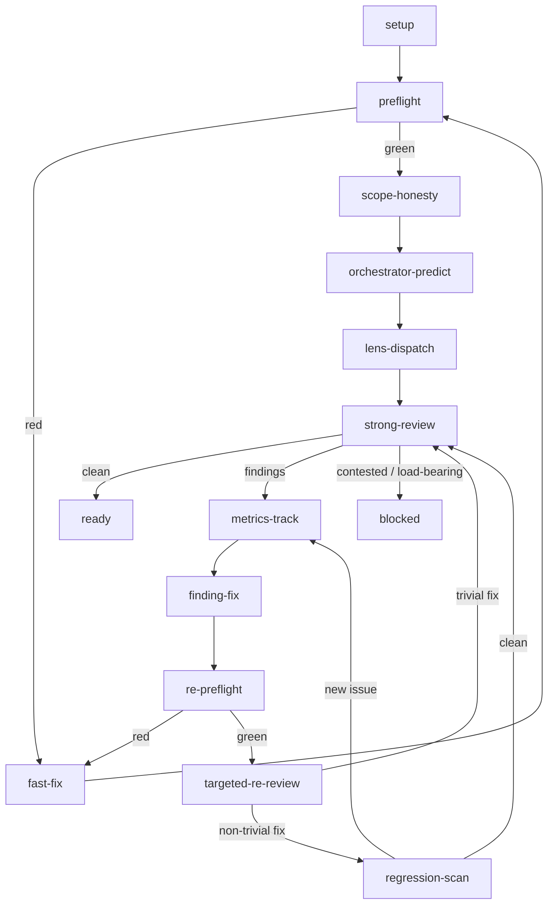

# Iterative review state graph

This is the canonical control-flow graph for the `iterative-review` skill. The
orchestrator follows the graph from `setup` to `ready` or `blocked`, recording
state at every `metrics-track`.

## Mermaid graph



## Nodes

| Node | Actor | Purpose |
|---|---|---|
| `setup` | orchestrator | Prepare the workspace, diff, PR context, and `scan_findings`. |
| `preflight` | `tools/run.py ci --check` | Run deterministic pattern checks on the branch before any subagent. |
| `fast-fix` | orchestrator | Fix a deterministic preflight finding. |
| `scope-honesty` | orchestrator | Compare the diff to the plan, spec, PR body, and linked issues. Fix drift. |
| `orchestrator-predict` | orchestrator | Apply each relevant `.agents/agents/reviewer-*.md` `## Checklist` to the diff; fix predictable items; record uncertain items in `review-log-orchestrator-prediction.md`. |
| `lens-dispatch` | parallel subagents | Run the relevant lens reviewers with the prediction log as input. This node is mandatory; do not route around it because the orchestrator-predict was clean. |
| `strong-review` | `reviewer-strong` | Whole-branch pass that combines lens logs, finds gaps, contradictions, and design issues. |
| `metrics-track` | orchestrator | Record the finding, the node that discovered it, the round number, and the node where it resolves. This node does not block. |
| `finding-fix` | orchestrator + implementer subagent | Resolve one finding and commit the fix. |
| `re-preflight` | `tools/run.py ci --check` | Re-run the deterministic checks on the post-fix range. |
| `targeted-re-review` | `reviewer-fast` or the originating lens | Confirm the original finding is resolved. |
| `regression-scan` | `reviewer-strong` on the touched area | Check for new issues the fix introduced. Conditional on non-trivial fixes. |
| `ready` | orchestrator | Final `ci --check`; wait for remote CI to pass; mark the PR ready. |
| `blocked` | orchestrator | Human escalation for contested or load-bearing findings the orchestrator cannot resolve. |

## Edges

| From | To | Condition |
|---|---|---|
| `setup` | `preflight` | Always. |
| `preflight` | `fast-fix` | Any deterministic finding from `review-preflight`. |
| `fast-fix` | `preflight` | Always; re-run preflight after the fix. |
| `preflight` | `scope-honesty` | `ci --check` passes. |
| `scope-honesty` | `orchestrator-predict` | Drift corrected or no drift. |
| `orchestrator-predict` | `lens-dispatch` | Always; the orchestrator's prediction is not a substitute for lens review. The only exception is a PR with zero changed files. |
| `lens-dispatch` | `strong-review` | All lens logs are available. |
| `strong-review` | `ready` | `reviewer-strong` reports `reviewer-clean`. |
| `strong-review` | `metrics-track` | `reviewer-strong` or lens review reports findings. |
| `metrics-track` | `finding-fix` | Always; choose the next finding to fix. |
| `finding-fix` | `re-preflight` | Fix is committed. |
| `re-preflight` | `fast-fix` | A new deterministic issue appears. |
| `re-preflight` | `targeted-re-review` | `ci --check` passes. |
| `targeted-re-review` | `strong-review` | The fix is trivial (single file, same concern, no cross-cutting impact). |
| `targeted-re-review` | `regression-scan` | The fix is non-trivial (multi-file, generated surfaces, security/tooling boundary, or changes a public interface). |
| `regression-scan` | `metrics-track` | A new issue appears. |
| `regression-scan` | `strong-review` | The fix area is clean. |
| `strong-review` | `blocked` | A finding is contested or load-bearing and the orchestrator cannot resolve it. |

## Round counting

A "round" is one complete traversal through `lens-dispatch` or `strong-review` that produces findings. `orchestrator-predict` is not a round because it is orchestrator-time. The first `lens-dispatch` is round 1. The first `strong-review` is round 2. A `regression-scan` that finds a new issue starts a new round at `metrics-track`.

## `review-metrics.json` schema

```json
{
  "pr": {
    "branch": "feat/example",
    "base": "main",
    "head_sha": "..."
  },
  "findings_by_node": {
    "preflight": 0,
    "orchestrator-predict": 0,
    "lens-security": 0,
    "lens-skills": 0,
    "lens-marketplace": 0,
    "strong-review": 0,
    "regression-scan": 0
  },
  "rounds_per_finding": [
    {
      "finding_id": "F1",
      "lens": "reviewer-skills",
      "discovered_at_node": "lens-dispatch",
      "discovered_at_round": 1,
      "resolved_at_node": "targeted-re-review",
      "resolved_at_round": 2,
      "severity": "important"
    }
  ],
  "regressions": [
    {
      "fix_for": "F1",
      "new_finding": "F2",
      "discovered_at_node": "regression-scan",
      "discovered_at_round": 2,
      "severity": "blocking"
    }
  ],
  "total_rounds": 2,
  "total_reviewer_subagent_dispatches": 4,
  "devin_auto_review_invocations": 1
}
```

## `review-log-orchestrator-prediction.md` template

Use this off-repo scratch file to record what the orchestrator could predict
and fix, and what it left for the lens reviewers.

```markdown
# Orchestrator prediction log

## Reviewed lens profiles

- [ ] `reviewer-security.md`
- [ ] `reviewer-skills.md`
- [ ] `reviewer-marketplace.md`
- [ ] `reviewer-strong.md`

## Predicted and fixed

| Checklist item | Lens | Action | Rationale |
|---|---|---|---|
| ... | ... | fixed / n/a | ... |

## Uncertain (send to lens)

| Checklist item | Lens | Why uncertain |
|---|---|---|
| ... | ... | ... |

## Next node

Proceed to `lens-dispatch` and dispatch the relevant lens reviewers. A clean prediction log does not bypass this node.

## Metrics snapshot

```json
{"orchestrator_predict_findings_fixed": 0, "orchestrator_predict_items_uncertain": 0}
```

```
