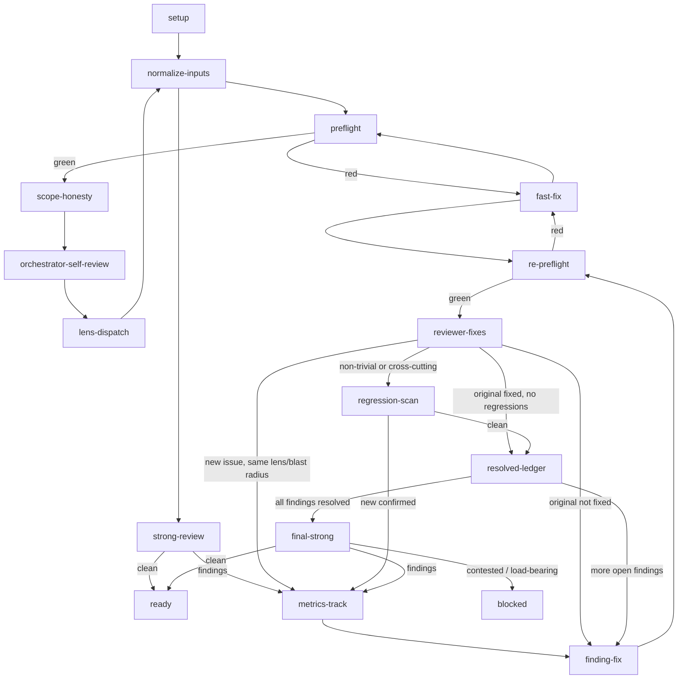

# Iterative review state graph

This is the canonical control-flow graph for the `iterative-review` skill. The
orchestrator follows the graph from `setup` to `ready` or `blocked`, recording
state at every `metrics-track`.

## Mermaid graph



## Nodes

| Node | Actor | Purpose |
|---|---|---|
| `setup` | orchestrator | Prepare the workspace, diff, PR context, and `scan_findings`. |
| `normalize-inputs` | orchestrator | Run `normalize_review_inputs.py --apply` on the scratch directory so every downstream file is plain UTF-8. |
| `preflight` | consumer CI preflight | Run deterministic pattern checks on the branch before any subagent. |
| `fast-fix` | orchestrator or implementer | Fix a deterministic preflight finding; trivial items the orchestrator can fix, mechanical items an `implementer`. |
| `scope-honesty` | orchestrator | Compare the diff to the plan, spec, PR body, and linked issues. Fix drift. |
| `orchestrator-self-review` | orchestrator | Apply each relevant `reviewer-*.md` profile's `## Checklist` to the diff (resolving each name through the Devin Desktop agents search path); fix predictable items; record uncertain items in `review-log-orchestrator-self-review.md`. |
| `lens-dispatch` | parallel subagents | Run the relevant lens reviewers with the prediction log as input. This node is mandatory; do not route around it because the orchestrator-self-review was clean. |
| `strong-review` | `reviewer-strong` | Whole-branch pass that combines lens logs, finds gaps, contradictions, and design issues. |
| `metrics-track` | orchestrator | Record the finding, the node that discovered it, the round number, the node where it resolves, and the `regression_class`. This node does not block. |
| `finding-fix` | `implementer` subagent | Resolve one finding with the lens's checklist and a concrete brief, then commit. |
| `re-preflight` | `tools/run.py ci --check` | Re-run the deterministic checks on the post-fix range. |
| `reviewer-fixes` | `reviewer-fixes` subagent | Cheap lens-aware re-review of the fix blast radius. Verifies the original finding and applies the originating lens's `## Checklist` to the changed files only. |
| `regression-scan` | `reviewer-strong` on the touched area | For non-trivial or cross-cutting fixes, confirm and classify any new issue the fix introduced. |
| `resolved-ledger` | orchestrator | Bookkeeping node that marks a finding resolved and records `resolved_at_node` and `resolved_at_round` in `review-metrics.json`. |
| `final-strong` | `reviewer-strong` | One whole-branch pass after all queued findings are resolved. Confirms no remaining gaps, contradictions, or design issues. |
| `ready` | orchestrator | Final `ci --check`; wait for remote CI to pass; mark the PR ready. |
| `blocked` | orchestrator | Human escalation for contested or load-bearing findings the orchestrator cannot resolve. |

## Edges

| From | To | Condition |
|---|---|---|
| `setup` | `normalize-inputs` | Always. |
| `normalize-inputs` | `preflight` | Always. |
| `preflight` | `fast-fix` | Any deterministic finding from `review-preflight`. |
| `fast-fix` | `preflight` | Always; re-run preflight after the fix. |
| `preflight` | `scope-honesty` | `ci --check` passes. |
| `scope-honesty` | `orchestrator-self-review` | Drift corrected or no drift. |
| `orchestrator-self-review` | `lens-dispatch` | Always; the orchestrator's prediction is not a substitute for lens review. The only exception is a PR with zero changed files. |
| `lens-dispatch` | `normalize-inputs` | All lens logs are available. |
| `normalize-inputs` | `strong-review` | UTF-8 backstop has run on the scratch directory. |
| `strong-review` | `ready` | `reviewer-strong` reports `reviewer-strong: clean`. |
| `strong-review` | `metrics-track` | `reviewer-strong` or lens review reports findings. |
| `metrics-track` | `finding-fix` | Always; choose the next finding to fix. |
| `finding-fix` | `re-preflight` | Fix is committed. |
| `re-preflight` | `fast-fix` | A new deterministic issue appears. |
| `fast-fix` | `re-preflight` | Always; re-run preflight after the fix. |
| `re-preflight` | `reviewer-fixes` | `ci --check` passes. |
| `reviewer-fixes` | `resolved-ledger` | The original finding is fixed and `reviewer-fixes` is clean. |
| `reviewer-fixes` | `finding-fix` | The original finding is not fixed. |
| `reviewer-fixes` | `metrics-track` | `reviewer-fixes` finds a new same-lens/blast-radius issue. |
| `reviewer-fixes` | `regression-scan` | The fix is non-trivial (multi-file, generated surfaces, security/tooling boundary, or changes a public interface). |
| `regression-scan` | `resolved-ledger` | `reviewer-strong` on the touched area is clean. |
| `regression-scan` | `metrics-track` | `reviewer-strong` on the touched area confirms a new issue. |
| `resolved-ledger` | `finding-fix` | More findings remain in the queue. |
| `resolved-ledger` | `final-strong` | All findings are resolved. |
| `final-strong` | `ready` | `reviewer-strong` reports `reviewer-strong: clean`. |
| `final-strong` | `metrics-track` | `reviewer-strong` reports findings. |
| `final-strong` | `blocked` | A finding is contested or load-bearing. |
| `strong-review` | `blocked` | A finding is contested or load-bearing and the orchestrator cannot resolve it. |

## Round counting

A "round" is one complete traversal through `lens-dispatch` or `strong-review` (including `final-strong`) that produces findings. `orchestrator-self-review`, `reviewer-fixes`, and `resolved-ledger` are not rounds because they are cheap or bookkeeping nodes. The first `lens-dispatch` is round 1. The first `strong-review` is round 2. A `regression-scan` or `final-strong` that confirms a new issue starts a new round at `metrics-track`.

## `review-metrics.json` schema

```json
{
  "pr": {
    "branch": "feat/example",
    "base": "main",
    "head_sha": "..."
  },
  "findings_by_node": {
    "preflight": 0,
    "orchestrator-self-review": 0,
    "lens-security": 0,
    "lens-skills": 0,
    "lens-marketplace": 0,
    "lens-plans": 0,
    "lens-mesh": 0,
    "lens-scripts": 0,
    "strong-review": 0,
    "regression-scan": 0
  },
  "rounds_per_finding": [
    {
      "finding_id": "F1",
      "lens": "reviewer-skills",
      "discovered_at_node": "lens-dispatch",
      "discovered_at_round": 1,
      "resolved_at_node": "resolved-ledger",
      "resolved_at_round": 2,
      "severity": "important"
    }
  ],
  "regressions": [
    {
      "fix_for": "F1",
      "new_finding": "F2",
      "discovered_at_node": "regression-scan",
      "discovered_at_round": 2,
      "severity": "blocking"
    }
  ],
  "total_rounds": 2,
  "total_reviewer_subagent_dispatches": 4,
  "devin_auto_review_invocations": 1
}
```

## `review-log-orchestrator-self-review.md` template

Use this off-repo scratch file to record what the orchestrator could predict
and fix, and what it left for the lens reviewers.

```markdown
# Orchestrator self-review log

## Reviewed lens profiles

- [ ] `reviewer-security.md`
- [ ] `reviewer-skills.md`
- [ ] `reviewer-marketplace.md`
- [ ] `reviewer-strong.md`
- [ ] `reviewer-plans.md`
- [ ] `reviewer-mesh.md`
- [ ] `reviewer-scripts.md`

## Predicted and fixed

| Checklist item | Lens | Action | Rationale |
|---|---|---|---|
| ... | ... | fixed / n/a | ... |

## Uncertain (send to lens)

| Checklist item | Lens | Why uncertain |
|---|---|---|
| ... | ... | ... |

## Next node

Proceed to `lens-dispatch` and dispatch the relevant lens reviewers. A clean prediction log does not bypass this node.

## Metrics snapshot

```json
{"orchestrator_self_review_findings_fixed": 0, "orchestrator_self_review_items_uncertain": 0}
```

## Review artifacts

The orchestrator writes all review inputs and logs to the off-repo `iterative-review-<pr_number>` directory. The canonical file names are:

- `review-<base7>..<head7>.diff`
- `pr_description.txt`
- `review-log-orchestrator-self-review.md`
- `review-log-skills.md`
- `review-log-marketplace.md`
- `review-log-security.md`
- `review-log-plans.md`
- `review-log-mesh.md`
- `review-log-scripts.md`
- `review-log-strong.md`
- `review-log-<lens>-<round>.md` for re-review rounds
- `review-metrics.json`

These files are never committed. They are the review proto-memory: later reviewers and the orchestrator read them to avoid re-deriving earlier work, to verify claimed fixes, and to detect regressions.
