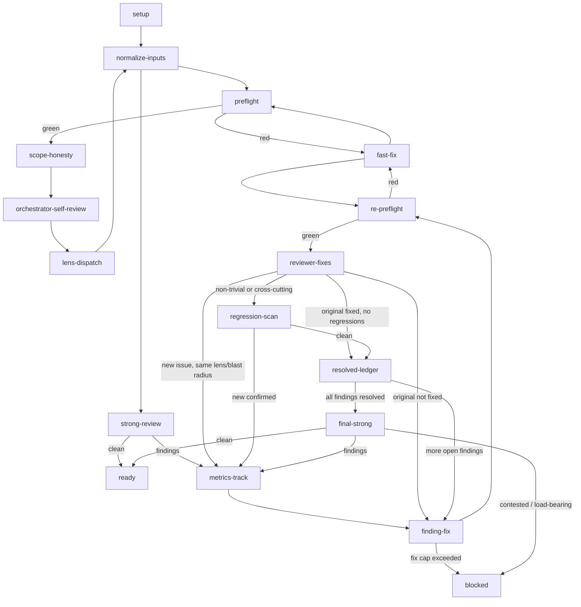

# Iterative review: reduce churn with lens-aware fast re-review and implementer-driven fixes

## Problem

The `iterative-review` skill works, but it churns rounds on draft PRs:

- The orchestrator performs most `finding-fix` edits itself. That bloats the main-agent context and produces shoddy, context-squeezed fixes.
- After a fix, the loop can re-escalate to expensive full reviews (`reviewer-strong` on the touched area, or in practice a full re-dispatch of the originating lens) instead of a cheap, targeted re-check of the fix and its immediate blast radius.
- There is no explicit classification of *why* a late-round finding appeared: was the original lens not strong enough, or did the fix introduce a regression? Without that, we cannot tune the right part of the loop.

The result is that a PR often needs more review rounds than it should, and we cannot tell which component to improve.

## Goals

1. **Move fix work off the orchestrator.** Each `finding-fix` dispatches a focused `implementer` subagent, modeled on `subagent-driven-development`.
2. **Make the fast re-review gate lens-aware.** `reviewer-fixes` receives the originating lens's `## Checklist` and only the blast-radius diff, so it can catch lens-specific regressions without doing a whole-branch review.
3. **Run `reviewer-strong` only once per review cycle.** After all `reviewer-fixes` gates are clean, one final `reviewer-strong` whole-branch pass is the only full re-review. Targeted `regression-scan` (with `reviewer-strong` on the touched area) is reserved for non-trivial or cross-cutting fixes.
4. **Instrument the loop to expose the real churn causes.** Extend `review-metrics.json` with `regression_class` so we can tell whether late findings are due to weak lens review, shoddy same-lens fixes, or cross-cutting regressions.
5. **Dogfood the change before it ships to consumer repos.** Collect metrics on the spec/plan PR and on the implementation PR.

## Non-goals

- Do not add a full `lens-dispatch` re-run in this iteration. A targeted `regression-scan` for non-trivial fixes plus one final `reviewer-strong` is enough to start; the metrics will tell us if a full `lens-dispatch` re-run is needed.
- Do not change the `iterative-review` public skill contract (when to invoke it, input types). The inputs remain `<base>`, `<branch>`, `<pr_description>`, optional `<issue_context>`.
- Do not edit installed `.agents/skills/` files by hand; the source-of-truth is `codex-marketplace/plugins/superpowers-plus/`.

## Design

### Review state graph

The updated control-flow graph keeps the early deterministic gates and the first `lens-dispatch` + `strong-review` pass. The fix loop changes to `implementer` → `re-preflight` → `reviewer-fixes`, with a `resolved-ledger` before the final `reviewer-strong`.



### Nodes

| Node | Actor | Purpose |
|---|---|---|
| `setup` | orchestrator | Prepare workspace, diff, PR context, `scan_findings`. |
| `normalize-inputs` | orchestrator | Run `normalize_review_inputs.py --apply` on the scratch directory. |
| `preflight` | consumer CI preflight | Deterministic checks before any subagent. |
| `fast-fix` | orchestrator or implementer | Fix a deterministic preflight finding; trivial items the orchestrator can fix, mechanical items an `implementer`. |
| `scope-honesty` | orchestrator | Compare the diff to the plan/spec/PR; correct drift. |
| `orchestrator-self-review` | orchestrator | Apply each relevant `reviewer-*.md` `## Checklist` to the diff; record uncertain items. |
| `lens-dispatch` | parallel subagents | Run the relevant lens reviewers with the prediction log. |
| `strong-review` | `reviewer-strong` | Whole-branch pass combining lens logs; finds gaps, contradictions, design issues. |
| `metrics-track` | orchestrator | Record every finding, the node and round it was discovered, severity, and `regression_class`. |
| `finding-fix` | `implementer` subagent | Resolve one finding with the original finding, relevant diff slice, lens checklist, and preflight command. The orchestrator verifies and commits. |
| `re-preflight` | consumer CI preflight | Deterministic checks on the post-fix range. |
| `reviewer-fixes` | `reviewer-fixes` subagent | Verify the original finding is resolved and scan the blast radius with the originating lens's checklist. Not a full branch review. |
| `regression-scan` | `reviewer-strong` on touched area | For non-trivial/cross-cutting fixes, confirm any new issue `reviewer-fixes` spotted. |
| `resolved-ledger` | orchestrator | Mark the finding resolved; route to the next finding or to `final-strong` when the queue is empty. |
| `final-strong` | `reviewer-strong` | One whole-branch pass after all findings are confirmed fixed. |
| `ready` | orchestrator | Clean CI; archive completed plan/spec if needed; flip PR to ready. |
| `blocked` | orchestrator | Human escalation for contested or load-bearing findings. |

### Edges

| From | To | Condition |
|---|---|---|
| `setup` | `normalize-inputs` | Always. |
| `normalize-inputs` | `preflight` | Always. |
| `preflight` | `fast-fix` | Any deterministic finding. |
| `fast-fix` | `preflight` | Always. |
| `preflight` | `scope-honesty` | `ci --check` equivalent passes. |
| `scope-honesty` | `orchestrator-self-review` | Drift corrected or no drift. |
| `orchestrator-self-review` | `lens-dispatch` | Always; a clean prediction is not a substitute for lens review. |
| `lens-dispatch` | `normalize-inputs` | All lens logs available. |
| `normalize-inputs` | `strong-review` | UTF-8 backstop has run. |
| `strong-review` | `ready` | `reviewer-strong: clean` and preflight is clean. |
| `strong-review` | `metrics-track` | `reviewer-strong` or lens reviews report findings. |
| `metrics-track` | `finding-fix` | Always; choose the next open finding. |
| `finding-fix` | `re-preflight` | Implementer reports the fix and the orchestrator commits it. |
| `finding-fix` | `blocked` | Round cap exceeded (`implementer-strong` on round 4 still fails). |
| `re-preflight` | `fast-fix` | A new deterministic issue appears. |
| `re-preflight` | `reviewer-fixes` | Deterministic checks pass. |
| `reviewer-fixes` | `resolved-ledger` | Original finding fixed and no new issues. |
| `reviewer-fixes` | `finding-fix` | Original finding not fixed; repeat the fix loop. |
| `reviewer-fixes` | `metrics-track` | A new same-lens/blast-radius issue is found. |
| `reviewer-fixes` | `regression-scan` | The fix is non-trivial, cross-cutting, generated, at a security/tooling boundary, or changes a public interface. |
| `regression-scan` | `resolved-ledger` | No new issue confirmed. |
| `regression-scan` | `metrics-track` | `reviewer-strong` on the touched area confirms a new issue. |
| `resolved-ledger` | `finding-fix` | More open findings remain. |
| `resolved-ledger` | `final-strong` | The finding queue is empty. |
| `final-strong` | `ready` | `reviewer-strong: clean` and preflight is clean. |
| `final-strong` | `metrics-track` | New findings remain. |
| `final-strong` | `blocked` | A finding is contested or load-bearing. |

### Round counting

A "round" is one full `lens-dispatch` or `reviewer-strong` traversal that produces findings. `orchestrator-self-review`, `reviewer-fixes`, and `re-preflight` are cheap gates and are **not** counted as rounds.

- Round 1: `lens-dispatch`
- Round 2: first `strong-review`
- Round 3 (if needed): `final-strong`

`regression-scan` that confirms a new issue with `reviewer-strong` on the touched area starts a new round at `metrics-track`.

### `finding-fix` implementer contract

The orchestrator builds a task brief for the `implementer` subagent:

- `original_finding` — the exact finding text and severity, with file and line citations.
- `lens` — the originating `reviewer-*.md` lens, e.g. `reviewer-security`.
- `lens_checklist` — the `## Checklist` section from that lens profile.
- `diff_slice` — the relevant slice of the full branch diff that the finding touches.
- `fix_constraints` — what not to break, which tests to run, and the consumer's `ci --check` command.

The `implementer` edits, runs the preflight, commits, and writes a short report. The orchestrator verifies the report and the commit, then moves to `re-preflight`.

If a finding fails `reviewer-fixes` three times, escalate to `implementer-strong` on the fourth attempt and then to `blocked` if it still fails.

### `reviewer-fixes` lens-aware inputs

Update the source `reviewer-fixes.md` profile in `codex-marketplace/plugins/superpowers-plus/skills/selecting-a-subagent/assets/reviewer-fixes.md` to accept and apply the originating lens's checklist:

- `<lens>` — optional; the name of the originating lens profile.
- `<lens_checklist>` — optional; a prepared file containing the `## Checklist` from that lens.
- `<original_finding>`, `<fix_diff_path>`, `<full_diff_slice_path>` — as today.

When these are provided, `reviewer-fixes`:
1. Verifies the `original_finding` is resolved.
2. Applies the `lens_checklist` to the changed lines and their immediate context (the blast radius).
3. Reports only issues in the blast radius; anything outside is `out-of-scope`.
4. Returns `reviewer-fixes: clean` or `reviewer-fixes: N issue(s)`.

When `<lens>` is absent, the existing generic `reviewer-fixes` behavior remains unchanged.

### `regression_class` metrics

Extend `review-metrics-schema.json` and the `regressions` array so every post-fix finding records:

```json
{
  "fix_for": "F1",
  "new_finding": "F2",
  "discovered_at_node": "reviewer-fixes",
  "regression_class": "same-lens-blast-radius",
  "lens": "reviewer-security",
  "severity": "important"
}
```

Allowed `regression_class` values:

- `same-lens-blast-radius` — a regression in the same lens's concern, inside the blast radius. This is a `reviewer-fixes` or implementer gap.
- `cross-lens-blast-radius` — the fix touched a different lens's concern. This is what `regression-scan` is for.
- `outside-blast-radius` — the issue was not in the fix's blast radius; the original lens or `reviewer-strong` missed it the first time.

The orchestrator sets `regression_class` based on the node that discovered the post-fix issue and the file/line relative to the fix.

### Guards against the two churn vectors

**Weak initial lens review (`outside-blast-radius`)**
- `orchestrator-self-review` must apply the full `## Checklist` of each dispatched lens to the original diff before `lens-dispatch`, fixing predictable items.
- `reviewer-strong` in the first pass reviews the lens logs and flags gaps.
- If a lens's `outside-blast-radius` rate exceeds a configurable threshold across several runs, that lens's `## Checklist` or `## Applies to` is the next tuning target.

**Sloppy implementer fixes (`same-lens-blast-radius` and `cross-lens-blast-radius`)**
- The `implementer` must run the consumer's preflight before reporting a fix.
- `re-preflight` runs after every commit.
- `reviewer-fixes` is lens-aware.
- `regression-scan` runs for any non-trivial fix.
- If a finding still fails after `implementer-strong` on round 4, route it to `blocked` for human adjudication.

### Concrete `reviewer-fixes` input package

When the orchestrator dispatches `reviewer-fixes` for a fix re-review, it provides:

- `<fix_diff_path>` — `git diff --no-color <pre-fix-sha>...<post-fix-sha>` output, written to a file.
- `<full_diff_slice_path>` — `git diff --no-color <base>...<branch>` restricted to the files the fix touched (the blast radius), written to a file.
- `<original_finding>` — the exact finding text, severity, and file/line citations.
- `<lens>` — the originating lens profile name, e.g. `reviewer-security`.
- `<lens_checklist>` — the `## Checklist` section from that lens profile, prepared as a plain UTF-8 file.
- `<log_path>` — the off-repo report file.

`reviewer-fixes` reads the original finding and the fix diff first, then applies `<lens_checklist>` to the blast-radius slice. It writes only to `<log_path>` and returns `reviewer-fixes: clean` or `reviewer-fixes: N issue(s)`.

### Concrete `regression_class` assignment

The orchestrator sets `regression_class` for every post-fix finding using this decision table:

| Discovered by | In fix blast radius? | Same lens as the original finding? | `regression_class` |
|---|---|---|---|
| `reviewer-fixes` | yes | yes | `same-lens-blast-radius` |
| `reviewer-fixes` | yes | no | `cross-lens-blast-radius` |
| `regression-scan` or `final-strong` | yes | yes | `same-lens-blast-radius` |
| `regression-scan` or `final-strong` | yes | no | `cross-lens-blast-radius` |
| `regression-scan` or `final-strong` | no | any | `outside-blast-radius` |

The blast radius is the set of files the fix touched. The same-lens check is whether the issue matches the originating lens's `## Applies to` rules. The classification is written into `review-metrics.json` at the same moment the finding is recorded.

### Dogfooding

1. **Spec/plan PR baseline.** Run the *current* `iterative-review` graph on the PR that lands this spec and the plan. Record `review-metrics.json` as the baseline: total rounds, findings by node, number of regressions.
2. **Implementation PR validation.** After the new graph is implemented, run the *new* `iterative-review` graph on the PR that lands the implementation. Record the new `review-metrics.json` with `regression_class`.
3. **Comparison.** Compare total rounds, total regressions, and the `regression_class` distribution. The implementation PR is the strongest test: the new review loop reviewing its own changes.

If the new graph shows fewer rounds and a low `outside-blast-radius` rate, it is ready for consumer repos. If `outside-blast-radius` is high, strengthen the initial lens reviews before shipping. If `same-lens-blast-radius` is high, strengthen the `implementer` brief or the `reviewer-fixes` prompt.

### CI/pre-commit hardening

The consumer pre-commit hook currently ships as a read-only `ci --check` gate. For this PR it is reclassified as a mutating guard: it runs `ci --apply` to regenerate mechanical artifacts, stages only the tracked changes (`git add -u`), then runs `ci --check` as a separate verification gate before the commit is allowed. This requires:

- `tools/run.py` epilog to state that `ci --apply` does not re-verify and that `ci --check` is the separate gate.
- `codex-marketplace/plugins/repo-worker-pack/skills/repo-standards/templates/ci-preflight.{sh,ps1}` and `pre-commit` to invoke the Python interpreter explicitly, apply fixes, stage tracked files, and run `ci --check`.
- `scripts/ci-preflight.{sh,ps1}` as the tracked repo-owned copies of the consumer pre-commit scripts.
- `.agents/doctrine/repo-runbook-policy.md` to remove the exception that prevented `repo-standards` from overwriting the consumer pre-commit hook.

## Files to change

- `codex-marketplace/plugins/superpowers-plus/skills/iterative-review/SKILL.md` — update the fix loop to dispatch `implementer`, route through `reviewer-fixes` with lens context, and add `regression_class` instructions.
- `codex-marketplace/plugins/superpowers-plus/skills/iterative-review/references/review-state-graph.md` — replace the Mermaid graph, node table, and edge table.
- `codex-marketplace/plugins/superpowers-plus/skills/iterative-review/references/review-metrics-schema.json` — add `regression_class` and `lens` to the `regressions` entry; add `regression_of`, `regression_class`, and `lens` to the `rounds_per_finding` entry.
- `codex-marketplace/plugins/superpowers-plus/skills/selecting-a-subagent/assets/reviewer-fixes.md` — add `<lens>`, `<lens_checklist>` inputs and a lens-aware re-review scope.
- `codex-marketplace/plugins/superpowers-plus/references/bundle-manifest.json` — no new skill, but verify the existing `iterative-review` and `selecting-a-subagent` entries still cover the changed files.
- `codex-marketplace/plugins/repo-worker-pack/skills/repo-standards/templates/ci-preflight.{sh,ps1}` and `pre-commit` — update the consumer pre-commit script templates to apply, stage tracked changes, and verify.
- `scripts/ci-preflight.{sh,ps1}` — tracked repo-owned copies of the consumer pre-commit scripts.
- `tools/run.py` — clarify the `ci --apply` / `ci --check` split in the epilog.
- `.agents/doctrine/repo-runbook-policy.md` — remove the pre-commit-hook exception so `repo-standards` can own the consumer hook.
- Downstream installed surfaces are regenerated by `py -3 tools/run.py marketplace --apply`.

## Acceptance

- `py -3 tools/run.py ci --check` passes after the changes.
- `py -3 tools/run.py marketplace --apply` produces a clean diff against the installed `.agents/skills/` and `.agents/agents/` surfaces.
- The updated `review-state-graph.md` contains the Mermaid graph, node table, and edge table above.
- `reviewer-fixes.md` accepts `<lens>` and `<lens_checklist>` inputs and applies them to the blast radius.
- `review-metrics.json` from the implementation PR is attached to the PR and shows the `regression_class` distribution.

## Risks and mitigations

| Risk | Mitigation |
|---|---|
| `reviewer-fixes` becomes too narrow and misses same-lens regressions. | Feed it the originating lens's `## Checklist` and the blast-radius diff; classify misses as `same-lens-blast-radius` and tune. |
| `implementer` subagents produce worse fixes because they lack the orchestrator's full context. | The brief includes the full finding, the lens checklist, constraints, and the preflight command; round cap and escalation to `implementer-strong` protect against drift. |
| The new graph is not actually faster. | Baseline and implementation PR metrics prove the round-count reduction. |
| Consumer repos inherit half-baked behavior. | Dogfood on this repo before the marketplace bundles are published. |
