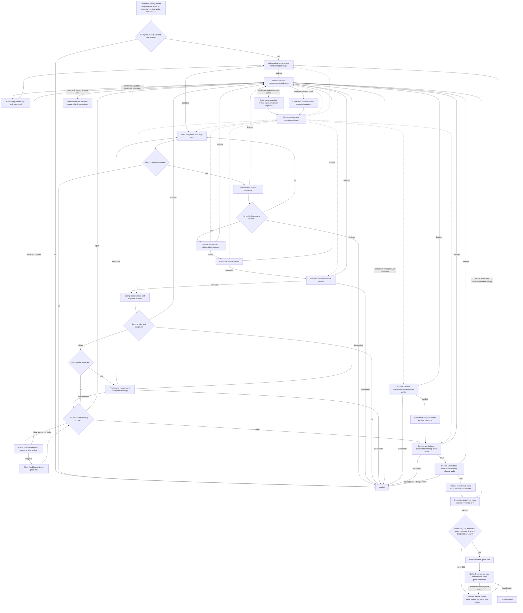

# Trustworthy Iterative Review Design

> **Status:** Approved for implementation by the human partner on 2026-08-21.

## Problem

The current `iterative-review` skill contains useful review-loop ideas, but it cannot safely prove that a pull request is reviewed green. Its router primarily sequences node names. It does not prove that every affected surface and risk obligation was assessed, that reviewer output is complete, that findings were resolved with evidence, or that all evidence applies to the exact remote pull-request snapshot presented to the human partner.

The current implementation also has executable contradictions: normal routes can be circular or non-terminating, some evidence-producing nodes can be skipped, snapshot material can become stale after fixes, and the final reviewer can authorize closeout without a machine-validated review report.

## Goal

Build an `iterative-review` skill that lets a weaker agent model reliably obtain the defect-detection quality a frontier agent can normally achieve by decomposing review into explicit obligations, assigning bounded independent reviewer roles, validating structured evidence, and failing closed whenever coverage or evidence is incomplete.

The system does not promise omniscience or formal correctness. It prevents a false green caused by incomplete process, missing evidence, stale inputs, unresolved findings, reviewer truncation, or pull-request drift.

This creates two separately measured guarantees:

- **Process soundness:** deterministic tests prove that an incomplete, stale, malformed, uncertain, or internally inconsistent review state cannot become green.
- **Detection sensitivity:** an adversarial benchmark proves that the weaker-model workflow finds every issue in a stable frontier-reference set on every required trial. This is an empirical release gate, not a universal correctness proof.

Before kernel implementation, a capability gate must prove in the target harness that an authority outside the reviewed head can issue and later independently retrieve every required receipt kind, bind one-time challenges/execution identities, confine blind-review tool reads, run candidate commands from a sealed immutable source materialization inside a disposable process sandbox that cannot reach review authority/evidence, and preserve exact raw payload bytes. The matrix covers authority discovery, profile resolution, review launch/completion, confined command execution, ready transition, remote observation, and blind-tool results. A synthetic verifier is useful only after this gate passes; it cannot prove the existence or custody of a production trust root. Missing capability blocks implementation and requires an explicit harness integration plan rather than weakening the invariant.

## Green invariant

`reviewed-green` is lawful only when all of the following predicates hold for one immutable review snapshot:

1. **Authority complete:** a trusted connector-discovery receipt proves expected repository law, pull-request description, linked issues/documents, governing plans/specs, declared non-goals, policy-complete actionable feedback history/current unresolved subset, and required-check policy; every expected authority is loaded, unavailable required authority blocks, every feedback item has a durable finding lifecycle, and the exact typed unresolved subset is empty.
2. **Snapshot sealed:** repository and pull-request identity, base commit, head commit, tree, diff, authority manifest, complete feedback history/current unresolved subset, required-check policy, authority-discovery policy, receipt-authority policy, review-assignment policy, command-execution policy, and pull-request metadata use full identifiers and content hashes.
3. **Coverage complete:** every changed and affected surface is mapped to every applicable review obligation, and every obligation is `covered` or has a structured current `not-applicable` attestation at its required tier; high-risk exemptions require independent overlap.
4. **No accepted defect:** every finding at every severity is `fixed`, `review-repaired`, or `false-positive`; no finding is open, fixing, review-repairing, deferred, contested, unassessed, or accepted as risk. `review-repaired` is lawful only for a confirmed process/evidence defect on unchanged candidate bytes and requires independent current repair proof. An accepted risk produces `reviewed-with-exceptions`, never `reviewed-green`.
5. **Verification current:** deterministic/targeted checks, reviewer attestations, final review, closure audit, and hosted CI all refer to the current snapshot epoch; local commands start from the sealed tree in a disposable confined sandbox whose immutable source, toolchain/environment, denied authority/evidence access, and complete process-tree termination are receipt-bound; reviewer results have independently retrievable harness launch/completion receipts bound to their dispatch and output digest.
6. **Independent closure:** a blind final reviewer and a separate closure auditor both return valid structured attestations.
7. **Remote identity:** the remote pull-request head equals the reviewed head and the commit tested by required hosted checks.
8. **No uncertainty:** tool failures, truncation, unavailable reviewers, malformed reports, unreviewed obligations, or unresolved assumptions route to `blocked`.
9. **Reasoning floor met:** every review dispatch meets the maximum of its assignment-derived and role-derived minimum capability/reasoning tier and satisfies the role's fresh-context, distinct-execution, and non-self-adjudication rules; the whole-PR final review and closure audit use a trusted `final-strong` route in fresh contexts, preferring an effective harness-defined custom profile such as `reviewer-strong` only when its independently resolved contract supports the requested blind-final or closure role.

The final report must still state residual uncertainty: review green means no known unresolved issue and no uncovered declared obligation, not proof that no defect can exist.

## Architecture

### 1. One machine authority

`review-state.json` becomes the sole decision authority. All mutations go through one thin CLI, `reviewctl.py`, backed by focused modules under `scripts/review_core/`.

The state contains:

- schema version and review identity;
- current snapshot epoch and snapshot fingerprint;
- a trusted expected-authority manifest and authority records;
- coverage obligations and assignments;
- reviewer dispatches, attestations, and runtime receipts;
- findings and dispositions;
- deterministic and hosted verification results;
- blockers and resume evidence;
- the final green seal;
- an append-only history of accepted transitions.

Reports, metrics, Markdown summaries, and JSON exports are derived views. They never decide the next action.

All mutations hold one exclusive review-state lock from load through validation, evidence ingestion, and compare-and-swap replacement. The persisted generation and exact prior-byte digest must still match at replacement, so atomic rename cannot silently lose a concurrently recorded finding. Evidence bytes are ingested once into a review-owned immutable content store by content digest; separate epoch-bound evidence records let the same immutable blob support more than one snapshot without rewriting history. Unknown fields, invalid enum values, missing evidence references, stale epochs, broken history hashes, or ad hoc edits that do not preserve the complete validated contract fail validation. Local state and hashes prove internal consistency, not provenance: authority discovery, profile resolution, reviewer launch/completion, command execution, and remote observations count only when a policy-owned adapter outside the reviewed head re-fetches and verifies their receipts. If that adapter or receipt class is unavailable, the corresponding predicate blocks.

#### Version-2 state contract

The top-level object contains exactly these keys:

```json
{
  "schema_version": 2,
  "review_id": "review-uuid",
  "generation": 0,
  "status": "active",
  "stage": "intake",
  "scratch_dir": "C:/absolute/review/path",
  "snapshot": null,
  "content_objects": {},
  "evidence": {},
  "authorities": {},
  "authority_manifest": null,
  "impact_maps": {},
  "coverage_inventory": null,
  "obligations": {},
  "hypothesis_assignments": {},
  "dispatches": {},
  "reviews": {},
  "route_selections": {},
  "runtime_receipts": {},
  "findings": {},
  "review_repairs": {},
  "checks": {},
  "ready_transition": null,
  "ci_candidate": null,
  "blockers": {},
  "green_seal": null,
  "history": []
}
```

`status` is one of `active`, `blocked`, or `reviewed-with-exceptions`. Stored state never asserts green; it may only reach the derived `green-candidate` stage. `stage` is derived from predicates and cannot be advanced by caller assertion. Mappings are keyed by the identifier repeated inside their record. Every record uses `additionalProperties: false` in the interoperability schema.

| Record | Required fields |
|---|---|
| Content object | `content_id`, absolute review-owned `path`, `sha256`, `bytes` |
| Evidence binding | `evidence_id`, `content_id`, `kind`, `snapshot_epoch`, `snapshot_fingerprint` |
| Loaded authority | `authority_id`, `kind`, `locator`, `availability: loaded`, `sha256`, `evidence_id`, `snapshot_epoch`, `snapshot_fingerprint` |
| Unavailable authority | `authority_id`, `kind`, `locator`, `availability: unavailable`, `failure_class`, `failure_sha256`, `failure_evidence_id`, `snapshot_epoch`, `snapshot_fingerprint`; forbids source `sha256` and source `evidence_id` |
| Authority manifest | `authority_manifest_id`, `payload_evidence_id`, `discovery_receipt_id`, `snapshot_epoch`, `snapshot_fingerprint` |
| Impact map | `impact_map_id`, `role`, non-empty `entries`, `evidence_id`, `snapshot_epoch`, `snapshot_fingerprint` |
| Coverage inventory | `coverage_inventory_id`, `semantic_impact_map_id`, `contract_impact_map_id`, `challenger_attestation_id`, non-empty `entries`, `evidence_id`, `snapshot_epoch`, `snapshot_fingerprint` |
| Obligation | `obligation_id`, `category`, non-empty `surfaces`, `risk`, non-empty typed `consequences`, `scope_level`, `minimum_capability_tier`, `minimum_reasoning_floor`, non-empty `assignees`, `status`, `evidence_ids`, `not_applicable_attestation_ids`, `snapshot_epoch`, `snapshot_fingerprint` |
| Hypothesis assignment | `hypothesis_assignment_id`, `obligation_id`, `family`, `polarity`, `statement`, `derivation_policy_sha256`, `minimum_capability_tier`, `minimum_reasoning_floor`, `snapshot_epoch`, `snapshot_fingerprint` |
| Route selection | `route_selection_id`, `observed_at`, `inventory_evidence_sha256`, `budget_contract_sha256`, `profile_authority_sha256`, `resolved_route_token_sha256`, `required_capability_tier`, `required_role`, `qualified_roles`, `profile`, `profile_sha256`, `selection_mode`, `selected_model`, `selected_reasoning`, `selected_context_mode`, nullable `parent_model`, nullable `parent_reasoning`, `qualification_source`, `rationale`, `evidence_id`, `snapshot_epoch`, `snapshot_fingerprint` |
| Dispatch | `dispatch_id`, `route_selection_id`, `profile_resolution_receipt_id`, nullable `launch_challenge_id`, nullable `launch_receipt_id`, non-empty `assignment_ids`, non-empty `context_evidence_ids`, `instruction_manifest_sha256`, `data_manifest_sha256`, `tool_confinement_policy_sha256`, `context_package_sha256`, nullable `hazard_framing_sha256`, `required_tool_classes`, `status`, `snapshot_epoch`, `snapshot_fingerprint` |
| Review | `attestation_id`, `dispatch_id`, non-empty `assignment_ids`, `verdict`, `finding_ids`, `uncertainties`, `tool_transcript_sha256`, `evidence_id`, `completion_receipt_id`, `snapshot_epoch`, `snapshot_fingerprint` |
| Runtime receipt | `receipt_id`, `kind`, `issuer_id`, `locator`, `envelope_evidence_id`, nullable `challenge_id`, `snapshot_epoch`, `snapshot_fingerprint` |
| Finding | `finding_id`, `source_kind`, `source_id`, `source_assignment_id`, nullable `obligation_id`, `severity`, `title`, `description`, non-empty `locations`, `evidence_ids`, nullable `regression_of`, `disposition`, nullable `resolution`, `discovered_snapshot_epoch`, `discovered_snapshot_fingerprint` |
| Review repair | `repair_id`, `finding_id`, `target_kind`, non-empty `target_ids`, non-empty `invalidated_record_ids`, `entry_adjudicator_attestation_id`, `status`, nullable `verification_attestation_id`, `snapshot_epoch`, `snapshot_fingerprint` |
| Local check | `check_id`, `kind`, `policy_item_id`, `name`, `command`, `working_directory`, `local_check_policy_sha256`, `command_execution_policy_sha256`, `required`, `conclusion`, `head_sha`, `source_materialization_sha256`, `toolchain_sha256`, `environment_sha256`, `sandbox_id`, `pre_source_sha256`, `post_source_sha256`, `process_tree_terminated`, `evidence_id`, `execution_receipt_id`, `snapshot_epoch`, `snapshot_fingerprint` |
| Hosted check | `check_id`, `kind`, `policy_item_id`, `name`, `required`, `conclusion`, `head_sha`, `app_id`, `workflow_id`, `workflow_path`, `workflow_definition_ref`, `workflow_definition_sha`, `event`, `trigger_subject`, `policy_inputs_sha256`, `configuration_sha256`, `check_run_id`, `workflow_run_id`, `run_attempt`, `evidence_id`, `remote_observation_receipt_id`, `snapshot_epoch`, `snapshot_fingerprint` |
| Ready transition | `ready_transition_id`, `idempotency_key`, `repository_id`, `pr_number`, `head_sha`, `prior_lifecycle_state`, `expected_lifecycle_state`, nullable `challenge_id`, nullable `execution_id`, nullable `transition_receipt_id`, `status`, `snapshot_epoch`, `snapshot_fingerprint` |
| CI candidate | `ci_candidate_id`, `repository_id`, `pr_number`, `head_sha`, `lifecycle_state`, `transition_receipt_id`, `snapshot_epoch`, `snapshot_fingerprint` |
| Blocker | `blocker_id`, `class`, `reason`, `evidence_ids`, `active`, `opened_sequence`, nullable `closed_sequence`, `resolution_evidence_ids`, nullable `resolution_snapshot_epoch`, nullable `resolution_snapshot_fingerprint`, `snapshot_epoch`, `snapshot_fingerprint` |
| Green seal | `snapshot_epoch`, `snapshot_fingerprint`, `coverage_sha256`, `findings_sha256`, `repairs_sha256`, `reviews_sha256`, `checks_sha256`, `evidence_ids`, `created_at` |
| History | `sequence`, `generation`, `event`, `snapshot_epoch`, `snapshot_fingerprint`, `data_sha256`, `previous_record_sha256`, `record_sha256` |

Evidence-backed state records are local wrappers around canonical subject bytes. A record subject never contains its local `evidence_id`, content-store path, wrapper-only epoch/fingerprint binding, or a derived ID that hashes that same subject. The exact table below is authoritative for intentional scope fields: the snapshot subject includes its epoch, an evidence-binding subject includes epoch/fingerprint by definition, and externally issued receipt envelopes include epoch/fingerprint to prevent replay. The engine hashes and stores the subject first, derives any content-based record ID second, derives the snapshot fingerprint when applicable, and attaches local wrappers last. Externally assigned semantic IDs may remain in subjects when they are not defined as hashes of those subjects. Every mapping ID is globally unique within the review; snapshot-derived record IDs are epoch-namespaced and are never reused for a later epoch, even when their content is unchanged. Finding IDs are the intentional exception: the same immutable identity accrues disposition/resolution fields across epochs. Each record type has one constructor-owned subject projection; callers cannot choose projection fields.

The projection allowlist below is normative. “Derived ID” means `<kind>:<epoch>:<sha256(canonical subject bytes)>` unless a different formula is stated. Lists whose schema declares set semantics are sorted by their canonical identifier before hashing; ordered transcripts and command argv retain order. A field omitted from a content subject is not ignored: the strict wrapper schema, full-state/history digest, and green-seal digest still bind every wrapper and lifecycle field.

| Projection | Exact canonical subject fields | ID and exact excluded wrapper fields |
|---|---|---|
| PR metadata | `title`, `body`, `base_ref`, canonical sorted `scope_labels`, canonical sorted `declared_links` | `pr_metadata_sha256` is the subject digest; excludes draft/ready state, timestamps, reviews/checks, mergeability, and queue state |
| Authority-manifest payload | The exact payload fields enumerated below, including each enumerated policy identity/version/digest triple, canonical authority entries, required-check digest, and both feedback digests | `authority_manifest_id` is the payload digest; wrapper excludes `authority_manifest_id`, `payload_evidence_id`, `discovery_receipt_id`, epoch, and fingerprint |
| Snapshot | Every field in the snapshot record below except `fingerprint` | `fingerprint` is the subject digest; no other exclusion |
| Content object | Exact raw content bytes | `content_id = sha256:<raw-byte digest>`; `path`, stored `sha256`, and `bytes` are verified wrapper metadata, not input to their own identity |
| Evidence binding | `content_id`, `kind`, `snapshot_epoch`, `snapshot_fingerprint` | `evidence_id = evidence:<sha256(subject)>`; no other exclusion |
| Loaded authority | `authority_id`, `kind`, `locator`, `availability`, `sha256` | Excludes `evidence_id`, epoch, fingerprint; ID is policy-assigned and included |
| Unavailable authority | `authority_id`, `kind`, `locator`, `availability`, `failure_class`, `failure_sha256` | Excludes `failure_evidence_id`, epoch, fingerprint; ID is policy-assigned and included |
| Impact map | `role`, canonical `entries` | Derived `impact_map_id`; excludes ID, `evidence_id`, epoch, fingerprint |
| Coverage inventory | `semantic_impact_map_id`, `contract_impact_map_id`, `challenger_attestation_id`, canonical `entries` | Derived `coverage_inventory_id`; excludes ID, `evidence_id`, epoch, fingerprint |
| Obligation | canonical `category`, `surfaces`, `risk`, `consequences`, `scope_level`, `minimum_capability_tier`, `minimum_reasoning_floor`, and `assignees` | Derived `obligation_id`; excludes ID, mutable `status`, `evidence_ids`, `not_applicable_attestation_ids`, epoch, fingerprint |
| Hypothesis assignment | `obligation_id`, `family`, `polarity`, `statement`, `derivation_policy_sha256`, `minimum_capability_tier`, `minimum_reasoning_floor` | `hypothesis:<epoch>:<sha256(subject)>`; excludes ID, epoch, fingerprint |
| Route selection | Every route-selection field in the record contract except the exclusions at right, including its externally assigned `route_selection_id` and resolved-route-token digest | Excludes `evidence_id`, epoch, fingerprint |
| Pending dispatch intent | `dispatch_id`, `route_selection_id`, `profile_resolution_receipt_id`, canonical `assignment_ids`, canonical `context_evidence_ids`, all instruction/data/tool/context/hazard digests, and canonical `required_tool_classes` | Excludes launch challenge/receipt, mutable `status`, epoch, fingerprint; ID is externally assigned and included |
| Validated review wrapper | `attestation_id`, `dispatch_id`, canonical `assignment_ids`, `verdict`, canonical `finding_ids`, `uncertainties`, and `tool_transcript_sha256` | Excludes `evidence_id`, `completion_receipt_id`, epoch, fingerprint; the completion subject separately binds exact raw attestation bytes |
| Runtime-receipt envelope | Exactly every envelope field enumerated below | `receipt_id` is issuer-assigned and included; wrapper excludes only `envelope_evidence_id` |
| Finding identity | `source_kind`, `source_id`, `source_assignment_id`, nullable `obligation_id`, `severity`, `title`, `description`, canonical `locations`, nullable `regression_of` | `finding:<sha256(subject)>` persists across epochs; excludes ID, evidence/lifecycle/resolution fields and discovery epoch/fingerprint, all of which remain full-state/seal-bound |
| Review-repair intent | `repair_id`, `finding_id`, `target_kind`, canonical `target_ids`, canonical `invalidated_record_ids`, `entry_adjudicator_attestation_id` | ID is externally assigned and included; excludes mutable `status`, `verification_attestation_id`, epoch, fingerprint |
| Local check | Every local-check field in the record contract except the exclusions at right, including command policy/materialization/toolchain/environment/sandbox/pre-post-source/process-termination identity | Excludes `evidence_id`, `execution_receipt_id`, epoch, fingerprint; ID is externally assigned and included |
| Hosted check | Every hosted-check field in the record contract except the exclusions at right, including event, trigger, policy inputs/configuration, run and attempt identity | Excludes `evidence_id`, `remote_observation_receipt_id`, epoch, fingerprint; ID is externally assigned and included |
| Ready intent | `idempotency_key`, `repository_id`, `pr_number`, `head_sha`, `prior_lifecycle_state`, `expected_lifecycle_state` | `ready_transition_id = ready:<epoch>:<idempotency_key>`; excludes ID, challenge/execution/receipt, mutable status, epoch, fingerprint |
| CI candidate | `repository_id`, `pr_number`, `head_sha`, `lifecycle_state`, `transition_receipt_id` | Derived `ci_candidate_id`; excludes ID, epoch, fingerprint |
| Blocker identity | `blocker_id`, `class`, `reason`, canonical opening `evidence_ids`, `opened_sequence` | ID is externally assigned and included; excludes mutable active/closure/resolution fields and wrapper epoch/fingerprint, which remain full-state/history-bound |
| Green seal | `snapshot_epoch`, `snapshot_fingerprint`, `coverage_sha256`, `findings_sha256`, `repairs_sha256`, `reviews_sha256`, `checks_sha256`, canonical `evidence_ids`, `created_at` | The complete record is its subject; it has no self-derived ID |
| History record | `sequence`, `generation`, `event`, `snapshot_epoch`, `snapshot_fingerprint`, `data_sha256`, `previous_record_sha256` | `record_sha256` is the subject digest and is excluded |

Receipt target subjects are also exact allowlists:

| Receipt kind | Exact target subject |
|---|---|
| `authority-discovery` | Complete snapshot subject, snapshot fingerprint, and typed authority-manifest payload digest |
| `profile-resolution` | Exact route-selection subject bytes |
| `review-launch` | Exact pending-dispatch-intent subject, instruction/data/tool-confinement/context manifests, one-time challenge, immutable resolved-route token, realized profile/role/model/reasoning/context configuration, and exact injected-byte digests |
| `review-completion` | SHA-256 of the exact accepted raw attestation bytes, SHA-256 of the validated structured attestation, and ordered typed tool-transcript digest |
| `command-execution` | Exact policy item/argv/normalized sandbox working directory, expected head/tree, source-materialization digest, toolchain/environment digests, confinement-policy digest, sandbox/execution/challenge identity, followed by exit/timing/output digest, equal pre/post immutable-source digests, and positive complete-process-tree termination |
| `remote-transition` | Exact ready intent, challenge, execution, prior lifecycle, result lifecycle, and snapshot scope |
| `remote-observation` | Exact strict remote observation without its `receipt` field |

Plan 1 must ship independently authored literal golden vectors for every row: strict input, expected canonical UTF-8 bytes, expected digest/derived ID, and where applicable expected receipt target digest. Production constructors must not generate or rewrite the fixture. Tests mutate each included field and require a digest change, and mutate each explicitly excluded wrapper field and require the subject bytes to remain unchanged while wrapper/state validation still detects unlawful changes.

The closed vocabularies are:

- evidence `kind`: `snapshot`, `authority`, `authority-manifest-payload`, `impact-map`, `scope-challenge`, `route-selection`, `runtime-receipt-envelope`, `check-output`, `review-attestation`, `tool-transcript`, `finding-proof`, `fix-proof`, `review-repair-proof`, `human-decision`, `remote-observation`;
- authority `kind`: `repo-law`, `pr-description`, `issue`, `document`, `plan`, `spec`, `non-goal`, `review-feedback`; `availability`: `loaded`, `unavailable`;
- obligation `category`: `authority-scope`, `behavioral-correctness`, `test-adequacy`, `security-privacy`, `reliability-concurrency`, `compatibility-migration`, `performance-resources`, `operability-configuration`, `documentation-contract`, `source-custody`; `risk`: `high`, `medium`, `low`; `consequences`: one or more of `none`, `security`, `authorization`, `privacy`, `secrets`, `irreversible-data-loss`, `concurrency-recovery`, `migration-rollback`, `public-compatibility`, `source-custody`, where `none` cannot coexist with another value; `status`: `pending`, `covered`, `not-applicable`, `invalidated`, `unassessed`;
- hypothesis assignment `polarity`: `claim`, `counterexample`; each high-risk obligation has at least one of each polarity in the same policy-defined `family`;
- obligation `scope_level`: `hunk`, `file`, `surface`, `cross-surface`, `whole-pr`; `minimum_capability_tier`: `fast`, `focused`, `strong`, `final-strong`; `minimum_reasoning_floor`: `low`, `standard`, `high`, `final-strong`;
- dispatch `selection_mode`: `trusted-profile`, `runtime-role-map`, `literal-inherit`, `explicit-route`; `context_mode`: `fresh`, `forked`; `status`: `pending`, `reported`, `incomplete`, `invalidated`; `required_tool_classes` contains zero or more of `repo-read`, `git-read`, `github-read`, `issue-read`, `document-read`, `command-exec`, `browser-read`, `domain-read`;
- route-selection `qualification_source`: `effective-profile`, `runtime-adapter`, `parent-inheritance`, `explicit-route`;
- review `role`: `impact-mapper-semantic`, `impact-mapper-contract`, `scope-challenger`, `obligation-reviewer`, `exemption-challenger`, `finding-adjudicator`, `fix-reviewer`, `review-repair-verifier`, `blind-final`, `closure-auditor`; `verdict`: `clean`, `findings`, `incomplete`, `blocked`;
- runtime receipt `kind`: `authority-discovery`, `profile-resolution`, `review-launch`, `review-completion`, `command-execution`, `remote-transition`, `remote-observation`;
- finding `source_kind`: `review`, `check`, `feedback`; `severity`: `blocking`, `important`, `minor`; `disposition`: `open`, `fixing`, `fixed`, `review-repairing`, `review-repaired`, `false-positive`, `accepted-risk`, `deferred`, `contested`, `unassessed`;
- review-repair `target_kind`: `semantic-impact`, `contract-impact`, `coverage-plan`, `coverage-challenge`, `obligation-review`, `exemption-review`, `finding-adjudication`, `fix-review`, `blind-final`, `closure-audit`, `local-check`, `hosted-check`; `status`: `repairing`, `verified`, `closed`; authority/feedback/snapshot intake defects require trusted drift refresh and are not same-snapshot repairs;
- check `kind`: `preflight`, `targeted`, `remote-ci`; `conclusion`: `success`, `failure`, `cancelled`, `skipped`;
- ready transition `status`: `pending`, `authorized`, `completed`;
- blocker `class`: `authority-missing`, `feedback-unresolved`, `intake-incomplete`, `coverage-gap`, `incomplete-review`, `malformed-evidence`, `snapshot-drift`, `tool-blocked`, `contested`, `state-invalid`.

A finding location is exactly one of `{"kind": "repo", "path": "repo/relative/path", "line": 1}`, `{"kind": "check", "check_id": "check-id"}`, or `{"kind": "feedback", "provider": "provider-id", "thread_id": "provider-thread-id"}`. A mapper finding uses the snapshot fingerprint as `source_assignment_id` and has `obligation_id: null`; challenge and obligation reviews use their assigned map/obligation ID; a deterministic check finding uses its `check_id` for both source and assignment and may have `obligation_id: null`; a feedback finding uses the canonical provider/thread identity for both `source_id` and `source_assignment_id`. A `fixing` resolution includes `kind`, `fix_sha`, non-empty `publication_evidence_ids`, `replacement_snapshot_epoch`, and `replacement_snapshot_fingerprint`; it remains unresolved and blocks final review while the new epoch re-ascends. A `fixed` resolution includes those fields plus `resolved_snapshot_epoch`, `resolved_snapshot_fingerprint`, non-empty `verification_evidence_ids`, non-empty `rereview_attestation_ids`, and non-empty `verified_obligation_ids`. A `review-repairing` resolution includes `kind: review-process`, `repair_id`, `target_kind`, non-empty target/invalidated record IDs, and the entry adjudicator attestation; it remains unresolved while the same snapshot re-ascends. A `review-repaired` resolution adds the current replacement record IDs and independent repair-verifier attestation. A `false-positive` resolution includes `kind`, `resolved_snapshot_epoch`, `resolved_snapshot_fingerprint`, non-empty `counter_evidence_ids`, and `adjudicator_attestation_id`. An `accepted-risk` resolution includes `kind`, `resolved_snapshot_epoch`, `resolved_snapshot_fingerprint`, and `human_decision_evidence_id`; it is excluded from green. `open`, `deferred`, `contested`, and `unassessed` dispositions require `resolution: null`.

The authority manifest is an expected-set record, not a summary supplied by the orchestrator. Its content object contains a canonical payload with exactly `schema_version`, `repository_id`, `pr_number`, canonical `pr_url`, identity/version/digest triples for `authority_discovery_policy`, `feedback_history_policy`, `local_check_policy`, `review_assignment_policy`, `command_execution_policy`, `evidence_ingestion_policy`, and `hypothesis_derivation_policy`, non-empty discriminated `authorities` entries, `required_check_policy_sha256`, `feedback_history_sha256`, and `unresolved_feedback_sha256`. Those effective policies come from an external or base/consumer authority outside the reviewed head; candidate policy edits are review subjects only. A loaded entry contains `authority_id`, `kind`, `locator`, `availability: loaded`, and source `sha256`. An unavailable entry instead contains `authority_id`, `kind`, `locator`, `availability: unavailable`, `failure_class`, and `failure_sha256`; it has no fabricated source hash. The payload deliberately excludes `authority_manifest_id`, receipt IDs, evidence IDs, epoch, and snapshot fingerprint. `authority_manifest_id` is the payload digest.

Construction is ordered and testable: hash loaded authority bytes and trusted connector failure reports; hash the canonical manifest payload; construct the full snapshot subject with that manifest digest plus sealed discovery/receipt-policy digests; derive the snapshot fingerprint; create only content objects and epoch-bound evidence for the manifest payload and authority/failure bytes; obtain, verify, and store the discovery receipt envelope and wrapper; then construct the complete authority-manifest wrapper that references both payload evidence and receipt. A partial wrapper is never valid. The receipt subject binds the complete canonical snapshot subject and fingerprint plus the exact typed manifest digest, and the connector adapter recomputes the discovered fixed point and source/failure hashes before acceptance. `authorities_complete` requires an exact match with the payload and every expected authority to be `loaded`; an expected but unavailable authority is representable and blocks.

The sealed authority-discovery policy defines the completeness algorithm rather than trusting whatever set an adapter happens to return. Its roots are applicable repository/directory law, the pull-request description, every explicitly linked issue, and every active governing spec/plan/non-goal named by those roots. It recursively traverses the policy's typed authority edges (`governs`, `implements`, `depends-on`, `supersedes`, and `references-as-authority`) to a cycle-safe fixed point, canonicalizes provider IDs/URLs before deduplication, and blocks on ambiguous, unsupported, inaccessible, or conflicting authority edges. The effective policy is resolved by the composition root from a trusted external authority or the reviewed repository's base revision, never from the reviewed head. Candidate edits to that policy are review subjects only and cannot qualify their own review. The snapshot and discovery receipt bind its source identity, version, and digest; Plan 2 supplies live adapters plus omission and self-qualification fixtures for every root and edge type.

The sealed feedback-history policy enumerates the provider's complete actionable review-thread/change-request history, including items already marked resolved before initial freeze. Every such item is materialized as a loaded `review-feedback` authority entry with typed provider/thread identity, resolution state, and exact bytes and as an immutable feedback-sourced finding keyed by canonical provider/thread identity unless that finding already has a lawful review-lifecycle closure. `feedback_history_sha256` binds that complete typed history; `unresolved_feedback_sha256` binds its current unresolved subset. Green requires the unresolved subset to be empty, but provider-side Resolve is observation evidence only and never deletes or closes the durable finding. That finding still requires receipt-verified adjudication and normal `fixed` or `false-positive` proof, across epochs when necessary. Initial freeze, refresh, and presentation independently enumerate and compare the policy-defined history so a resolve-before-freeze race cannot hide a change request.

An impact or coverage entry is exactly `{"surface": "stable affected-surface locator", "categories": ["..."], "consequences": ["..."], "hazards": ["..."]}`. Entries are non-empty lists with unique `surface` values. Each entry's unique `categories` list contains every universal obligation category. Its non-empty unique `consequences` uses the closed vocabulary above; `none` cannot coexist with another consequence. Cross-map consequence merge is total and deterministic: take the vocabulary-ordered union of every substantive value, discard `none` when that union is non-empty, and otherwise produce exactly `["none"]`. Discarding `none` in favor of a substantive value is strengthening, not forbidden removal. Category applicability is decided by the corresponding obligation, where `not-applicable` requires current positive evidence. Hazard strings are non-empty and unique within the entry but are not themselves machine authority for the reasoning floor. The two impact maps must have distinct mapper roles, and each map's evidence bytes encode that exact structured map. The coverage inventory is the scope challenger's canonical, current inventory: it references both maps and the challenger attestation, contains every surface, normalized typed consequence, and hazard in the maps' union, and may only add substantive consequences/hazards/surfaces. Its evidence bytes encode the exact accepted inventory. Omitting or weakening any member of the normalized union is invalid.

The transient remote observation consumed by presentation contains exactly the complete canonical snapshot subject and fingerprint, the policy-complete typed feedback history and current unresolved subset, `required_checks`, `observed_at`, and `receipt`. Each required-check item contains exactly `policy_item_id`, `name`, `app_id`, `workflow_id`, `workflow_path`, `workflow_definition_ref`, `workflow_definition_sha`, `event`, `trigger_subject`, `policy_inputs_sha256`, `configuration_sha256`, `check_run_id`, `workflow_run_id`, `run_attempt`, full `head_sha`, and `conclusion`; name-only, workflow-run-only, manual/unauthorized triggers, mutable workflow definitions, or unbound inputs never count. The adapter resolves the currently authoritative, non-superseded attempt for each policy item and rejects ambiguity or an older successful attempt followed by a newer failure. `receipt` is a canonical runtime receipt envelope, and its subject digest hashes the observation without the `receipt` field. The policy-owned verifier re-fetches it through the sealed `remote-observation` issuer/locator namespace. The observation is valid for at most 60 seconds, may not be more than 5 seconds in the future, and uses a fresh adapter-minted presentation challenge. The stored observation used to create the candidate and this transient presentation observation are separate runs and receipts.

For obligation, exemption, adjudication, fix, final, and closure roles, each `assignment_ids` item must resolve to a current obligation, policy-derived hypothesis, or finding as appropriate. Impact mappers use the snapshot fingerprint as their assignment; the scope challenger uses both impact-map evidence IDs. This avoids inventing coverage obligations before impact discovery while keeping every dispatch bounded and checkable. Mapper/challenger records are derived only from the receipt-bound structured output digests described above. A review is valid only when its agent-authored reviewer identity matches the realized canonical route and its assignment IDs, epoch, and fingerprint match the dispatch. A policy-owned runtime adapter must re-fetch: (1) the profile-resolution receipt bound to the route-selection content and immutable resolved-route token, (2) the launch receipt bound to the pending dispatch intent, one-time challenge, realized profile bytes/identity, role contract, model/reasoning/context configuration, exact delivered prompt/tool attachment manifest, and token, and (3) the completion receipt bound to the exact raw agent-authored attestation bytes before the local review wrapper is created. The launch is rejected if the named-profile mapping changed after resolution or the realized configuration differs; resolve-and-launch may instead be atomic when the harness guarantees that same token contract.

The sealed `ReviewAssignmentPolicy` supplies role floors and independence predicates before route selection; repository policy may raise but never lower the portable values. Both impact mappers are at least `strong/high`, use fresh contexts and distinct executions, and realize different semantic role contracts. The scope challenger is `final-strong/final-strong`, fresh, execution-distinct, and role-contract-distinct from both mappers. A finding adjudicator is fresh and uses the maximum of `strong/high`, the source dispatch floor, and every linked current obligation/hypothesis floor; for a review-sourced finding its execution and realized role contract must differ from the source review, so a reviewer cannot validate its own dismissal. A review-repair verifier uses the maximum of `strong/high`, the entry adjudicator/source/target floors, and `final-strong/final-strong` whenever the invalidated cut reaches exemption, blind-final, closure, hosted-CI, or whole-PR proof. Exemption, blind-final, closure, and repair-verifier dispatches are newly resolved for every launch. Receipt uniqueness alone does not prove these independence rules; the engine compares the complete route, context, execution, and source relationships.

Blind-final context is not an arbitrary evidence-ID list. A constructor-owned strict manifest has separate instruction and inert-data channels. The instruction channel contains only the externally trusted blind-final role template; snapshot, diff, PR metadata, repository files, and governing authorities are inert data even when their bytes contain instruction-like text. Free-form orchestrator context and prior review/finding/coverage/fix subjects or hazard framing are forbidden. Runtime reads pass through a snapshot-pinned role-specific tool proxy whose policy cannot expose review state, prior reports, review comments/feedback, or other non-allowlisted namespaces. The launch receipt binds the instruction manifest, data manifest, confinement-policy digest, declared calls/scopes, and exact initial injected bytes. The completion receipt additionally binds the ordered digest of every tool request/result with its instruction/data role and the exact raw attestation bytes. A blind reviewer using unrestricted `github-read`, copied conclusions, unrecorded tool output, or authority bytes as executable instructions is incomplete and blocks.

A canonical runtime receipt envelope contains exactly `receipt_id`, `kind`, `issuer_id`, `locator`, `review_id`, nullable `dispatch_id`, `snapshot_epoch`, `snapshot_fingerprint`, `subject_sha256`, nullable `challenge_id`, nullable `execution_id`, and `issued_at`. It excludes local `evidence_id` and wrapper fields. The fetched envelope bytes are stored as an immutable content object, then an epoch-bound evidence binding and runtime-receipt wrapper reference them; neither hash contains itself. The composition root supplies a sealed `ReceiptTrustPolicy` that maps each receipt kind to allowed issuer identities, locator namespaces, and verifier implementations and whose digest is snapshot-bound. Verification always receives and returns the expected receipt kind, review ID, nullable dispatch ID, epoch, fingerprint, subject, and challenge, and compares them against the independently re-fetched envelope; subject equality alone is insufficient. The verifier selects adapters from policy, never from caller-controlled state. Execution-shaped receipts consume unique adapter-minted challenges. Launch and completion for one dispatch share its execution ID; that ID, each receipt ID, each challenge, and each remote run may not be reused by another dispatch/action or review. A cross-review replay, missing issuer, namespace mismatch, stale policy digest, duplicate challenge/execution identity, or adapter that cannot prove the full scope blocks.

A local deterministic or targeted check is valid only when it exactly matches one item in the current sealed `LocalCheckPolicy`: policy item ID, argv/command bytes, sandbox-relative working directory, requiredness, snapshot head/tree, and the policy's complete required-item set. A separate sealed `CommandExecutionPolicy` names the trusted runner/toolchain authority, source-materialization algorithm, environment allowlist, read-only mounts, writable output mounts, network/secrets/credential policy, process containment, time/resource limits, and required denials for review state, evidence, receipts, connector authority, and other worktrees. Both policies are supplied by a trusted consumer/base/external authority, snapshot-bound, and cannot be weakened by the reviewed head.

The runner materializes the expected Git tree into a new immutable read-only lower source whose canonical path/mode/content manifest digest equals `source_materialization_sha256`; candidate writes go only to a disposable private upper/output layer. Before launch it resolves and hashes every executable/interpreter/script/module/toolchain component and the complete allowlisted environment. The candidate process runs under a confined identity with no path, handle, credential, or connector route to review authority/evidence; network is denied unless the sealed policy explicitly names a destination and purpose. After exit or timeout the runner terminates and reaps the entire job/cgroup/process tree, proves the immutable lower-source digest is unchanged, destroys the disposable layer, and only then issues a receipt. The independently re-fetched `command-execution` receipt binds the exact command intent plus source/toolchain/environment/confinement digests, sandbox/challenge/execution identity, equal pre/post immutable-source digests, complete process-tree termination, exit/timing identity, and output digest. A dirty checkout, mutable source, omitted tool identity, candidate access to review evidence, surviving child, harmless substituted command, omitted policy item, or wrong working directory blocks. A hosted check instead contains full policy/trigger/workflow-definition identity and `remote_observation_receipt_id`, forbids `command` and local execution provenance, and is valid only against the stored trusted remote observation that produced it. Caller-authored success JSON, copied output bytes, a superseded attempt, an unauthorized trigger/input, or a local-command receipt substituted for hosted CI never satisfies verification. A non-success required check deterministically creates a check-sourced finding in the same transaction, so check failure cannot be recorded without entering the finding lifecycle.

Each route selection is one canonical strict record with the fields listed in the state contract. Its globally unique epoch-namespaced `route_selection_id` is externally assigned and included in the canonical subject; the subject excludes only `evidence_id`, epoch, and fingerprint, and the local wrapper attaches those binding fields afterward. It records the live inventory and budget inputs through their content hashes, proves the semantic roles the profile contract actually supports, preserves a profile authority resolved outside the reviewed head, and hashes the harness-issued immutable resolved-route token. The dispatch references it rather than duplicating profile, tier, model, reasoning, context, parent, and selection fields. The profile-resolution receipt authenticates those same subject bytes; the launch receipt proves the realized configuration used that token and still matches the route. CLI views may derive repeated display fields but cannot persist a second authority.

Route qualification follows this order:

1. **Trusted named profile:** if the harness resolves an effective custom subagent whose trusted role contract includes the requested role, dispatch that profile without a model or reasoning override. `reviewer-strong` is preferred for a final-strong whole-PR pass only when its effective contract explicitly supports the requested `blind-final` or `closure-auditor` role; strength alone does not make an anchored synthesis profile blind. The profile's baked route is authoritative. Record the effective profile bytes hash when readable; for an opaque harness-owned profile, hash the runtime adapter's profile-identity record. The skill does not compare that baked route with the parent.
2. **Runtime role map:** if the harness does not consume a qualifying named profile directly, use the current `selecting-a-subagent` adapter mapping for the requested semantic role and hash that mapping as the profile contract.
3. **Fallback route:** only when neither profile form exists, use literal inheritance or an explicit model/reasoning route that the current adapter qualifies as `final-strong`.

An arbitrary requested profile string cannot bless an unclassified route: a trusted runtime authority outside the reviewed worktree must resolve the effective profile through its configured profile search path or role adapter, and dispatch must preserve that result's baked configuration. A repo-local profile under review cannot qualify itself. Conversely, an opaque but harness-recognized custom profile is not rejected merely because the skill cannot inspect its baked model when its independently verified role contract is sufficient. Exemption-challenger, final, and closure dispatches require `context_mode: fresh`, role-specific `final-strong` qualification, and adapter-verified receipts; an unavailable profile, failed dispatch, unqualified fallback, wrong-role profile, or model override applied to a trusted profile blocks.

For `trusted-profile`, `selected_model` and `selected_reasoning` are descriptive observations when the harness exposes them and the literal value `profile-defined` otherwise; neither field is sent as an override. For `runtime-role-map` and `explicit-route`, they record the selected concrete route. For `literal-inherit`, both are `inherit`. This lets the state distinguish trusting a profile from pretending to know its internals.

One current qualification record may be referenced by non-final dispatches that use the same effective profile, adapter identity, inventory hash, budget hash, required role, and required tier. Blind-final and closure qualification is re-resolved at every launch and bound to that launch receipt; it is never satisfied by a cached earlier observation. Other routes re-resolve whenever an input changes. Independent high-risk exemption overlap requires a normal obligation reviewer plus a separate final-strong `exemption-challenger`, distinct trusted profile/role-contract authorities, policy-derived orthogonal hypothesis assignments, distinct receipt-verified executions, distinct fresh contexts, and no shared run/evidence. Changing whitespace, IDs, or free-form framing never counts as independence.

An evidence reference is valid only when its content object still exists under the review-owned store and its current bytes match the registered size and digest. `content_id` is `sha256:<digest>`; `evidence_id` is the digest of the canonical `{content_id, kind, snapshot_epoch, snapshot_fingerprint}` binding, so byte-identical content can have separate immutable bindings in multiple epochs. Every batch registration receives a composition-root `EvidenceIngestionPolicy` and an engine-derived `EvidenceIngestionContext` that bind the current action, nullable candidate snapshot, exact eligible source paths, positive per-kind/transaction/review byte caps, platform rules, private POSIX modes, and the exact Windows trustee/SID allowlist. Those policy values and their source digest are snapshot-bound; state or CLI input cannot widen them. Only `freeze-review-input`, `enter-fixing`, and `refresh-review-input` may carry a candidate snapshot. Registration rejects device namespaces, alternate data streams, reparse points/symlinks, VCS/administrative metadata, state/lock/temp files, unlisted paths, invalid ACL ownership/trustees, and every cap violation. On Windows it opens components and the source with reparse-safe handles, denies write/delete sharing, verifies the opened handle's final volume/path/file identity and stable size, streams bounded bytes from that same handle, and never reopens the original. On POSIX it traverses from verified directory descriptors with `openat`/`O_NOFOLLOW`, rejects symlinks and non-regular files through `fstat`, reads bounded bytes from that same descriptor, creates private files/directories with policy-declared restrictive modes, and fsyncs both files and owning directories. The scratch root and owned store receive the same descriptor/final-handle checks and private permissions. An unsupported platform or missing safe primitive blocks; there is no path-resolve-then-open fallback. A record used to satisfy a current coverage, review, check, or seal predicate must match the current epoch and fingerprint. Findings preserve their discovery epoch; their resolution proof may be from a later epoch, while current impacted-obligation attestations prove the resolved behavior still holds. Historical evidence bindings, invalidated globally unique records, content blobs, finding lifecycle, and history remain retained but cannot directly satisfy current predicates.

All JSON ingestion uses one UTF-8 decoder that rejects BOMs, non-finite numbers, and duplicate object keys before canonicalization. This applies to state, CLI files, adapter payloads, reports, receipts, remote observations, and stored evidence re-reads. No boundary may call the default last-key-wins decoder. Completion provenance hashes the exact accepted raw report bytes in addition to the validated structured subject, so reserialization or duplicate-key erasure cannot substitute a clean report.

The empty intake state has no evidence or history records. No record may use epoch 0. A failed first freeze leaves intake unchanged and returns a blocking decision; a successfully frozen but unavailable authority is recorded at epoch 1 and blocks there.

At most one blocker may be active. `status: blocked` requires exactly one active blocker; `active` and `reviewed-with-exceptions` require none. A lawful resume names that blocker and supplies non-empty current resolution evidence. Closing it atomically records `resolution_evidence_ids`, resolution epoch/fingerprint, and `closed_sequence`; a blocker cannot be closed by toggling `active` alone. If recovery reveals snapshot/authority drift, resume is followed by `refresh-review-input` rather than treating the old epoch as current.

### 2. Snapshot epochs

A review snapshot records:

```json
{
  "epoch": 3,
  "repository_id": "github:12345678",
  "pr_number": 304,
  "pr_url": "https://github.com/owner/repo/pull/304",
  "git_object_format": "sha1",
  "base_sha": "<40-character commit>",
  "head_sha": "<40-character commit>",
  "tree_sha": "<40-character tree>",
  "diff_sha256": "<sha256>",
  "pr_metadata_sha256": "<sha256>",
  "authority_manifest_sha256": "<sha256>",
  "authority_discovery_policy_id": "<external-or-base policy identity>",
  "authority_discovery_policy_version": "<immutable version>",
  "authority_discovery_policy_sha256": "<sha256>",
  "receipt_authority_policy_sha256": "<sha256>",
  "feedback_history_policy_id": "<external provider policy identity>",
  "feedback_history_policy_version": "<immutable version>",
  "feedback_history_policy_sha256": "<sha256>",
  "local_check_policy_id": "<external-or-base policy identity>",
  "local_check_policy_version": "<immutable version>",
  "local_check_policy_sha256": "<sha256>",
  "review_assignment_policy_id": "<external-or-base policy identity>",
  "review_assignment_policy_version": "<immutable version>",
  "review_assignment_policy_sha256": "<sha256>",
  "command_execution_policy_id": "<external-or-base policy identity>",
  "command_execution_policy_version": "<immutable version>",
  "command_execution_policy_sha256": "<sha256>",
  "required_check_policy_sha256": "<sha256>",
  "evidence_ingestion_policy_id": "<external-or-base policy identity>",
  "evidence_ingestion_policy_version": "<immutable version>",
  "evidence_ingestion_policy_sha256": "<sha256>",
  "hypothesis_derivation_policy_id": "<external-or-base policy identity>",
  "hypothesis_derivation_policy_version": "<immutable version>",
  "hypothesis_derivation_policy_sha256": "<sha256>",
  "feedback_history_sha256": "<sha256>",
  "unresolved_feedback_sha256": "<sha256>",
  "fingerprint": "<sha256 of canonical snapshot fields>"
}
```

`repository_id`, `pr_number`, and canonical `pr_url` identify one remote pull request and are compared independently rather than inferred from mutable metadata. `git_object_format` is `sha1` or `sha256`; object identifiers are validated at 40 or 64 lowercase hexadecimal characters accordingly. The canonical PR-metadata projection includes title, body, base ref, labels that alter review scope/policy, and declared links; it excludes lifecycle-only draft/ready state, timestamps, review/check conclusions, mergeability, and queue state. Draft-to-ready is receipt-bound separately in Plan 6 and does not masquerade as content drift. Any change to repository/PR identity, object format, head, base, tree, pull-request scope, feedback history/unresolved subset, governing authority, or any bound discovery, feedback-history, receipt, review-assignment, command-execution, local-check, hosted-check, evidence-ingestion, or hypothesis policy creates a new epoch. Evidence from earlier epochs remains historical but cannot satisfy a current obligation. The impact planner determines which coverage assignments must be repeated; deterministic preflight, final review, closure audit, remote identity, and hosted CI are always invalidated.

### 3. Coverage obligations

Lens selection becomes coverage planning. A lens is an assignee, not proof of coverage. Two independent discovery passes produce (1) a semantic change-and-dependency map and (2) a contract, data-flow, and user-journey map. Each pass materializes a strict current impact-map record, and the initial coverage plan must cover their machine-computed union. A separate scope challenger must either add omitted affected surfaces and hazard hypotheses or attest that none remain. Its strict coverage-inventory record becomes the canonical affected-surface set; challenger additions and the corresponding revised obligations are recorded atomically. Coverage is complete only when obligations cover every surface/category pair in that final inventory.

Each changed or affected surface must receive the universal obligations that apply:

- authority and scope fidelity;
- behavioral correctness and edge cases;
- test adequacy and negative cases;
- security, privacy, authorization, and secret handling;
- reliability, error handling, recovery, and concurrency;
- compatibility, API contracts, migrations, and rollback;
- performance and resource behavior;
- operability, observability, deployment, and configuration;
- documentation and human-facing contract accuracy;
- source custody, generated-output, and repository-domain rules.

Repository-specific reviewer profiles add obligations. They do not remove the universal correctness obligation. A generated mirror may be excluded from duplicate semantic review only when an obligation proves its canonical source, generator, regenerated bytes, and validation result.

An obligation record includes:

```json
{
  "obligation_id": "epoch:3:surface:review_core/policy.py:behavioral-correctness",
  "snapshot_epoch": 3,
  "surfaces": ["scripts/review_core/policy.py"],
  "category": "behavioral-correctness",
  "risk": "high",
  "consequences": ["concurrency-recovery"],
  "scope_level": "cross-surface",
  "minimum_capability_tier": "strong",
  "minimum_reasoning_floor": "high",
  "assignees": ["reviewer-correctness", "reviewer-strong"],
  "status": "pending",
  "evidence_ids": [],
  "not_applicable_attestation_ids": []
}
```

Every high-risk obligation receives policy-derived complementary hypothesis assignments and at least two strong receipt-verified reviews from distinct trusted profile/role-contract authorities, fresh contexts, and executions. A hypothesis assignment is a first-class current record. Its ID is `hypothesis:<epoch>:<sha256>` over the constructor-owned canonical subject excluding the ID/epoch/fingerprint wrapper; the subject binds the obligation, policy-defined family, `claim` or `counterexample` polarity, statement, derivation-policy digest, and required floors. The sealed hypothesis policy deterministically produces at least one opposite-polarity pair for each high-risk obligation. Dispatch assignment IDs and the coverage seal must resolve these exact records. Raw prompt/hash inequality never proves semantic independence. `not-applicable` is not an orchestrator assertion: the obligation must reference concrete current counter-evidence and a qualified obligation-reviewer result of `not-applicable`; for high risk, a separate `exemption-challenger` must additionally return `not-applicable-confirmed` at `final-strong`. If qualifying independent routes are unavailable, coverage/exemption blocks. Missing or unverifiable exemption evidence leaves the obligation unassessed and prevents vacuous completion of its tier.

Zero matching deep lenses is a coverage failure. Sliced diffs are navigation aids only; reviewers also receive the complete patch, affected-file and dependency context, authorities, and read-only repository access. A report that cannot inspect necessary context is incomplete, not clean.

### 4. Structured reviewer contract

Every reviewer writes JSON that validates against one schema. A terminal status line is only a transport acknowledgement.

```json
{
  "schema_version": 1,
  "review_session_id": "<review-session-id>",
  "attestation_id": "<attestation-id>",
  "snapshot_epoch": 3,
  "snapshot_fingerprint": "<fingerprint>",
  "dispatch_id": "<dispatch-id>",
  "reviewer": {
    "profile": "reviewer-correctness",
    "profile_sha256": "<sha256>",
    "capability_tier": "strong",
    "reasoning_floor": "high",
    "model": "<observed model or inherit>",
    "reasoning": "<observed reasoning or inherit>",
    "context_mode": "<observed mode>"
  },
  "assignments": [
    {
      "assignment_id": "<assigned-id>",
      "result": {
        "kind": "obligation",
        "outcome": "covered",
        "evidence_ids": ["<evidence-id>"]
      },
      "notes": "<bounded conclusion>"
    }
  ],
  "structured_output": {
    "kind": "assignment-results"
  },
  "findings": [],
  "uncertainties": [],
  "verdict": "clean"
}
```

Assignment results are role-discriminated and use `additionalProperties: false`:

- obligation review: `{"kind": "obligation", "outcome": "covered|not-applicable|findings|incomplete", "evidence_ids": [...]}`;
- blind final review: `{"kind": "blind-final", "outcome": "covered|findings|incomplete", "evidence_ids": [...]}`;
- closure audit: `{"kind": "closure-audit", "outcome": "covered|findings|incomplete", "evidence_ids": [...]}`;
- finding adjudication: `{"kind": "finding-adjudication", "outcome": "confirmed|false-positive|contested", "remediation_class": "candidate-change|review-process|null", "repair_target_kind": "<closed target or null>", "repair_target_ids": [...], "evidence_ids": [...]}`; `confirmed` requires exactly one non-null remediation class, `review-process` requires a target kind/IDs, and other outcomes require all remediation fields null/empty;
- fix review: `{"kind": "fix-review", "outcome": "verified|findings|incomplete", "verified_obligation_ids": [...], "evidence_ids": [...]}`;
- review-repair verification: `{"kind": "review-repair", "outcome": "verified|findings|incomplete", "repair_id": "...", "replacement_record_ids": [...], "evidence_ids": [...]}`;
- exemption challenge: `{"kind": "exemption-challenge", "outcome": "not-applicable-confirmed|applicable|incomplete", "hypothesis_assignment_ids": [...], "evidence_ids": [...]}`.

Each result binds its assignment/finding ID and requires non-empty current evidence. `close-false-positive`, `enter-fixing`, `enter-review-repair`, `close-fixed`, and `close-review-repaired` must consume an existing attestation whose exact typed outcome authorizes that branch; one adjudication cannot be reinterpreted by prose. Mapper `structured_output` is `{"kind": "impact-map", "subject_sha256": "..."}`. Scope-challenger output is `{"kind": "coverage-inventory", "subject_sha256": "...", "revised_obligations_sha256": "..."}`. The completion receipt authenticates the raw report containing those digests, and the engine derives the stored map/inventory/obligations only from exact matching canonical subject bytes; a separately supplied substitution is rejected.

`clean` is valid only when every dispatch assignment has the lawful role-specific result, final and closure results are `covered` rather than `not-applicable`, no uncertainty exists, the report matches the dispatch and snapshot, and the trusted runtime re-fetches launch/completion receipts whose full scope and subject digests match the dispatch/context, exact raw report bytes, and ordered tool transcript. Each assignment attestation records inspected surfaces, hypotheses checked, commands/tests used through evidence IDs, and a bounded conclusion. Tool caps may end a reviewer run, but the result is then `incomplete`; remaining assignments must be redispatched or the review blocks.

### 5. Review roles

The review uses bounded roles so weaker models receive smaller, explicit questions:

1. Deterministic preflight for machine-decidable rules.
2. Independent impact mappers and a scope challenger for affected-surface completeness.
3. Tiered obligation reviewers, executed in order: fast mechanical hunk/file review, focused bounded-surface review, then strong cross-file, high-risk, security, and architectural review.
4. A final-strong exemption challenger for every proposed high-risk `not-applicable` result.
5. Adjudication that independently verifies every finding and records a typed evidence-backed outcome and remediation class.
6. Targeted fix review by the originating obligation owner plus every obligation invalidated by the impact planner.
7. Independent same-snapshot review-repair verification when the confirmed defect is in review evidence/process rather than candidate bytes.
8. A blind final reviewer that receives the final snapshot and governing authorities but not prior reviewer conclusions.
9. A closure auditor that receives the coverage, finding, and verification ledgers and attempts to prove green is unlawful.

High-risk obligations require the policy-derived independent overlap above. Lower-risk obligations may use one focused reviewer plus the blind final reviewer.

### 5a. Scope-to-reasoning ladder

The orchestrator resolves the live named profiles, semantic role capabilities, role mappings, models, reasoning, context, capacity, and user-supplied budget contract through `selecting-a-subagent` and a trusted harness adapter outside the reviewed head. The portable skill does not assume a model name, price, entitlement, or that the parent is the strongest route. An available custom profile is trusted only for the roles its adapter-verified contract declares; inheritance is used only when the active role mapping chooses it or no qualifying profile/mapping exists and the adapter approves it as fallback.

Review capability must rise as the review aperture widens:

| Tier | Normal profile | Review aperture | Minimum reasoning floor |
|---|---|---|---|
| `fast` | `reviewer-fast` | mechanical hunk/file checks | `low` |
| `focused` | `reviewer-fixes` or a narrow `reviewer-*` lens | one finding, file group, or bounded surface | `standard` |
| `strong` | `reviewer` or a strong domain lens | component, cross-file behavior, security, architecture, or cross-surface interaction | `high` |
| `final-strong` | `reviewer-strong` and the closure auditor | whole pull request, cross-lens synthesis, and green challenge | `final-strong` |

These are policy tiers, not hard-coded provider routes. The runtime adapter records the live inventory, effective profile or role mapping, and any fallback it selected. The required tier for an obligation is the greater of its scope floor and its risk/consequence floor; high-risk work is at least `strong` even when the diff is small. A cheaper or lower-reasoning result may discover findings, but it cannot satisfy a higher-tier obligation.

The portable floor calculation is deterministic:

| Input | Required tier |
|---|---|
| `hunk` or `file` scope | `fast` |
| `surface` scope | `focused` |
| `cross-surface` scope | `strong` |
| `whole-pr` scope | `final-strong` |
| `low` risk | `fast` |
| `medium` risk | `focused` |
| `high` risk | `strong` |
| security, authorization, privacy, secrets, irreversible data loss, concurrency/recovery, migration/rollback, public compatibility, or source-custody consequence | at least `strong` |

The assigned capability tier is the maximum row that applies. Its normalized reasoning floor is `low` for `fast`, `standard` for `focused`, `high` for `strong`, and `final-strong` for the whole-PR tier. Repo/domain law may raise a floor but never lower it. The scope challenger disputes under-classified scope, risk, and consequence as well as missing surfaces.

Role floors prevent a weak discovery or dismissal role from defining away the work before obligation floors exist:

| Role | Portable minimum | Independence requirement |
|---|---|---|
| Each impact mapper | `strong/high` | fresh context, unique execution, semantic role contract distinct from the other mapper |
| Scope challenger | `final-strong/final-strong` | fresh context and execution; role contract distinct from both mappers |
| Finding adjudicator | maximum of `strong/high`, source-dispatch floor, and linked current assignment floors | fresh context and execution; for review findings, role contract and execution differ from source review |
| Review-repair verifier | maximum of `strong/high`, entry/source/target floors; `final-strong` when the invalidation cut reaches whole-PR proof | fresh context and execution; role contract differs from source and repair-producing roles |
| Exemption challenger, blind final, closure | `final-strong/final-strong` | fresh, role-specific, newly resolved execution under the existing rules |

The sealed review-assignment policy may strengthen this table. An `ActionRecipe` for a reviewer-backed action never exposes null floors; route validation recomputes the maximum rather than trusting caller or assignment records.

`reviewer-strong` is a semantic strength contract, not an instruction to reconstruct its model choice and not automatic proof of blindness or closure semantics. A harness-defined profile may bake in a model, reasoning setting, tools, and context policy; when the trusted role contract recognizes it as `final-strong` **and** qualified for the requested role, the workflow dispatches it as defined. A profile that requires prior lens logs cannot serve `blind-final`; Plan 4 must supply or adapt role-specific blind-final and closure contracts. Literal parent inheritance remains a valid fallback when the runtime adapter qualifies both its strength and requested role, but parent equality is not universal. The skill never silently substitutes an unqualified cheaper/wrong-role route or overrides a trusted profile's baked model.

The ladder is monotonic during each outward review ascent: fast local review precedes focused and strong obligation review, which precedes the trusted final-strong blind final and closure challenge. A fix narrows the aperture and may legitimately return to `reviewer-fixes`; after that fix passes, every invalidated broader tier is repeated in ascending order. A lower tier never replaces a failed, unavailable, or disagreeing higher tier.

### 6. Finding lifecycle

Findings include full text, typed locations, risk, evidence, source assignment, snapshot epoch, and reviewer/check identity. `obligation_id` may be null only for a finding produced before obligations exist; the recomputed coverage plan must identify the current obligations whose verification closes a confirmed finding. Valid dispositions are:

- `fixing`, with a published fix commit and an atomically installed replacement snapshot; it remains unresolved until current verification and re-review prove the fix;
- `fixed`, with fix commit, RED/GREEN evidence when applicable, deterministic verification, and reviewer attestation;
- `review-repairing`, with a confirmed `review-process` adjudication, a typed same-snapshot invalidation cut, and a current repair intent; it remains unresolved until the affected review evidence is replaced and independently verified;
- `review-repaired`, with current replacement record IDs and a receipt-verified independent repair-verifier attestation; final and closure must still run again afterward;
- `false-positive`, with concrete counter-evidence and adjudicator identity;
- `accepted-risk`, with durable human decision evidence; when every other finding is fixed, false-positive, or also accepted-risk this permits `reviewed-with-exceptions`, but never green;
- `open`, `fixing`, `deferred`, `contested`, or `unassessed`, all of which block completion.

Minor findings do not disappear at final review. Finding identifiers are immutable. A resolution cannot reference a nonexistent finding, check, attestation, or evidence item; its resolution epoch must be the epoch in which that proof was produced and may be later than discovery.

### 7. Mutation and re-review

Finding-producing actions interrupt the clean happy path immediately. The lifecycle uses distinct actions with distinct payload schemas; there is no nullable catch-all resolution payload:

1. `adjudicate-findings` launches an independent `finding-adjudicator` and records its receipt-verified attestation plus exact `candidate-change` or `review-process` remediation class before any disposition changes.
2. `close-false-positive` consumes an existing adjudicator attestation and counter-evidence, changes no snapshot, and resumes at the earliest incomplete predicate.
3. `enter-fixing` is legal only for `candidate-change`; it consumes a confirmed adjudication plus publication proof and atomically installs the replacement snapshot, manifest, authorities, and evidence bindings. It advances exactly one epoch, invalidates current derived evidence, and routes to impact mapping while the finding remains `fixing`.
4. After impact/coverage recomputation and the required fast-to-strong re-ascent, `run-fix-verification` records receipt-verified targeted checks and `review-fix` records receipt-verified `fix-reviewer` attestations for every current impacted obligation.
5. `close-fixed` consumes those already-recorded check and attestation IDs, changes no snapshot, and moves `fixing` to `fixed`. Final and closure review then run afresh.
6. `enter-review-repair` is legal only for `review-process`; it preserves head, tree, epoch, and fingerprint, creates one strict repair intent, changes the finding to `review-repairing`, and atomically invalidates the policy-derived target records plus every downstream map, inventory, obligation result, check, review, ready/CI, and seal predicate. The engine, not the adjudicator prose or caller, maps the closed target kind/IDs to the earliest lawful action. It never installs a snapshot or fabricates replacement evidence.
7. After the affected deterministic/reviewer gates re-run in ascending order, `verify-review-repair` launches an independent role-qualified repair verifier over the finding, invalidation cut, superseded records, and current replacements. `close-review-repaired` consumes an already-recorded `verified` result, changes no snapshot, records exact replacement IDs, and moves the finding to `review-repaired`; blind final and closure then run afresh.
8. A receipt-verified `confirmed` adjudication permits exactly one compatible remediation branch (`enter-fixing` for `candidate-change` or `enter-review-repair` for `review-process`) or `accept-risk`. `accept-risk` additionally requires durable human-decision evidence, changes no snapshot, and atomically terminates as `reviewed-with-exceptions`, never green. The same adjudication cannot later authorize another branch.

The same-snapshot invalidation cut is a closed engine table, not reviewer prose. In every row, “and downstream” includes all dependent dispatches/reviews, final, closure, ready transition, CI candidate/checks, and seal; invalidated records remain historical and their globally unique IDs are never reused.

| Repair target | Exact entry invalidation |
|---|---|
| `semantic-impact` or `contract-impact` | Named map; coverage inventory/challenger; all obligations/hypotheses; preflight and downstream |
| `coverage-plan` | All current obligations/hypotheses; coverage inventory/challenger; preflight and downstream |
| `coverage-challenge` | Coverage inventory/challenger plus obligations/hypotheses produced or revised by it; preflight and downstream |
| `obligation-review` | Named assignment dispatches/attestations and every same-or-higher ordered review tier for the affected obligations, then downstream |
| `exemption-review` | Named exemption dispatch/attestation, affected obligation `not-applicable` status/evidence, and downstream |
| `finding-adjudication` | Named adjudication and the resolution branch it authorized; the target finding reopens, and downstream invalidates |
| `fix-review` | Named fix checks/review/closure; the target finding returns to `fixing` on its already-installed current snapshot, and downstream invalidates |
| `blind-final` | Named blind-final proof, closure, ready/CI, and seal |
| `closure-audit` | Named closure proof, ready/CI, and seal |
| `local-check` | Named local check and every ordered reviewer/fix/repair/final/closure/ready/CI/seal predicate after that check |
| `hosted-check` | Named hosted check, CI success predicate, and seal |

Target IDs must resolve to current records of the declared kind and, for finding/fix targets, include the affected finding ID. The engine rejects a caller-supplied invalidation list that is not exactly the table-derived transitive closure. Authority, feedback-history, policy, snapshot, or repository-input omissions are drift and must use trusted `refresh-review-input`; they cannot be relabeled as review repair.

A proposed code/doc fix cannot be marked `fixed` in the discovery epoch or create verification proof inside the close action. A review-process defect cannot use `enter-fixing`, a byte-identical refresh, or a no-op publication as ceremony; its repair never changes candidate identity and cannot close itself. Failed local or hosted checks deterministically create check-sourced findings atomically with the check records. Non-trivial or cross-cutting fixes expand the affected surface set instead of relying only on the originating lens.

Snapshot or authority drift without a code finding uses a separate `refresh-review-input` transition. Trusted discovery supplies the replacement snapshot, canonical manifest payload/wrapper, authorities, and receipts; the transaction advances exactly one epoch and invalidates current maps, inventory, obligations, checks, reviews, CI, and seal before returning to impact mapping. It is lawful for head/base/tree/metadata, authority, feedback-history/resolution-state, discovery/feedback/receipt policy, required-check policy, or recovered-authority changes, but never for a byte-identical snapshot. Initial `freeze-review-input`, confirmed-fix `enter-fixing`, and drift `refresh-review-input` are the only snapshot-installing transitions.

Planning-artifact archive or closeout changes happen before the final snapshot is frozen or in a separate pull request. No repository mutation is allowed after final review without invalidating the green candidate.

### 8. Final review and remote seal

The blind final reviewer and closure auditor run on the same final snapshot through separately verified launches. The runtime re-resolves role qualification immediately before each launch and verifies the resulting launch/completion receipts; cached profile observations cannot satisfy either gate. Hosted CI may require the pull request to leave draft after closure. `mark-ready-for-ci` is a reserved version-2 action with a crash-safe three-phase protocol. Its idempotency key is the digest of canonical `{review_id, repository_id, pr_number, head_sha, snapshot_epoch, action: "mark-ready-for-ci"}` and `ready_transition_id` is `ready:<epoch>:<idempotency-key>`; first persist that strict pending intent with prior/expected lifecycle, then persist an adapter-minted single-use challenge, and only then perform the remote change and finalize from an independently re-fetched `remote-transition` receipt. `remote_transition_subject()` binds the intent, challenge, execution, exact prior/result lifecycle, and snapshot scope. A crash after remote success leaves a retryable pending/authorized intent. If the PR was already ready initially or becomes ready before retry, the adapter must produce a verified idempotent no-op receipt for the same intended result; unassociated ready state cannot be assumed successful. Completion creates the strict `ci_candidate` record and derived `remote-ci-candidate` stage, not `reviewed-green`; Plan 1 implements schema/pure protocol and blocks live execution until Plan 6 supplies the adapter. An unexpected content-bearing metadata change still requires a drift epoch. The green seal is written only after every policy-required check passes from the trusted app/workflow definition/trigger/input/check-run identity and authoritative attempt on the reviewed SHA and the remote repository/PR/head/authority/feedback identity has not changed.

The seal records the snapshot fingerprint, required check identities and conclusions, verified runtime-receipt hashes, review attestation hashes, coverage digest, finding digest, repair digest, and timestamp. The coverage digest binds the two impact maps, challenged coverage inventory, obligations, and hypothesis assignments; the repair digest binds every repair intent, invalidation cut, replacement set, status, and verifier attestation. It is a candidate proof, not a durable claim about mutable remote state. The human-facing handoff must be generated by a read-only `reviewctl present` command whose trusted adapter re-fetches repository/PR/head identity, authority manifest, exact typed feedback, required-check policy, and full workflow-definition/trigger/input/attempt-bound hosted checks immediately before presentation. Presentation captures the exact state generation and persisted-byte digest, obtains and verifies the fresh remote observation, then reacquires the state lock and re-reads both values immediately before evaluation and emission. While holding that lock it emits a proof bound to generation, state-byte digest, snapshot, and observation; mismatch causes a bounded retry or refuses green. This prevents a newly committed finding from racing a stale presentation without persisting green. A changed, mismatched, unverifiable, or unavailable remote or local state makes `refresh-review-input` or the current finding action the next mutation.

### 9. Agent-facing experience

`SKILL.md` becomes a control plane under 500 words. The normal path is:

```text
reviewctl start -> reviewctl next -> perform named action -> reviewctl complete
```

`reviewctl next` prints one action, the exact required inputs, the evidence schema, and the command that records completion. It never claims that ordering alone proves the action happened.

Encoding normalization, metrics compilation, ledger rendering, and status summaries move behind CLI boundaries. Separate semantic nodes for these bookkeeping operations are removed.

## Fail-closed graph



## Migration

- Existing version-1 scratch workspaces cannot be promoted to green by the version-2 engine.
- A version-1 review may be inspected and exported as history, but a new version-2 review must start from a fresh remote snapshot.
- Legacy scripts remain compatibility shims only until the final cutover plan. They do not remain parallel authorities.
- Existing active iterative-review roadmap work is superseded where it conflicts with this design; useful generation-aware lens work is absorbed into the coverage-planning plan.

## Validation

### Deterministic tests

- Exhaustive transition-table tests for every stage and blocker.
- Negative green-predicate tests that remove one required predicate at a time.
- Property-style state tests: no invalid state can reach green; mutation always revokes current evidence.
- Snapshot-drift tests for base, head, tree, PR metadata, and authority changes.
- Report-schema tests for missing obligations, truncation, stale epochs, wrong dispatch IDs, and malformed findings.
- Finding tests for every severity and disposition.
- Regression tests for every defect identified in the 2026-08-21 assessment.
- Exact-SHA hosted-check fixtures.
- A pre-kernel live capability matrix proving external receipt custody/retrieval, blind-tool confinement, and immutable isolated command execution for every required kind.
- Independently authored canonical subject/receipt golden vectors plus per-field mutation tests for every projection row.

### Agent pressure tests

Run RED/GREEN campaigns with weaker subagents for at least these pressures:

- reviewer says clean but omits an assigned obligation;
- no deep lens matches;
- a reviewer hits its tool cap;
- a minor finding remains deferred;
- the head changes after final review;
- CI passed on a previous SHA;
- prior lens reports anchor the final reviewer;
- caller-authored launch/completion JSON attempts to impersonate a runtime receipt;
- a repo-local profile under review attempts to qualify itself for final review;
- the harness exposes `reviewer-strong` with a baked model; the orchestrator must dispatch the named profile without model/reasoning overrides;
- the harness exposes `reviewer-strong` but hides its baked model; an independently verified matching role contract remains valid and records `profile-defined` rather than blocking;
- the installed `reviewer-strong` contract consumes prior lens logs and therefore cannot satisfy `blind-final` until a role-specific contract is supplied;
- an effective profile or runtime role mapping changes between dispatches; cached non-final qualification is invalidated, while final and closure always re-resolve;
- an authority-discovery manifest omits a linked document or unresolved review thread;
- an authority-discovery policy changed by the reviewed head attempts to qualify its own reduced traversal;
- discovery stops before a typed transitive authority edge reaches fixed point;
- an unavailable linked authority is represented with a fabricated source hash instead of failure evidence;
- a genuine discovery receipt is paired with a reduced manifest or a different snapshot subject;
- a mapper/challenger completion receipt is paired with substituted map/inventory bytes;
- a mapper or scope challenger is dispatched below its role floor, in a forked context, or with a non-distinct execution/role contract;
- a review-sourced finding is adjudicated by its own source reviewer or below the inherited source/obligation floor;
- a receipt or manifest attempts to hash a wrapper containing its own evidence/digest field;
- a prior launch receipt, challenge, completion identity, or remote run is replayed or relabeled;
- a receipt from another review with the same subject is replayed, or duplicate JSON keys erase a finding before validation;
- a named profile mapping changes between resolution and launch;
- prior conclusions are copied into a newly identified blind-final context file;
- a blind-final tool call reads prior review comments, or inert authority text is promoted into the instruction channel;
- two writers race and a stale green-candidate replacement attempts to erase a newly recorded finding;
- presentation loads a green generation while a second process commits a finding before proof emission;
- a required check has the right name but the wrong app, workflow, run, or head;
- a manual or otherwise unauthorized CI trigger uses a mutable workflow definition or skip-tests input on the correct head;
- a superseded successful CI attempt is selected after a newer failing rerun;
- a hosted check substitutes local command provenance, or a failed check is recorded without a check-sourced finding;
- an evidence source is a UNC/device path, alternate data stream, reparse point/symlink, oversized file, or the review state itself;
- a high-risk obligation is marked `not-applicable` without two independent qualified attestations;
- one high-risk exemption run is cloned or relabeled as two attestations;
- two exemption prompts differ only by whitespace/hash without an orthogonal final-strong challenger;
- an adjudicator's typed outcome is reused to authorize the incompatible resolution branch;
- provider feedback is marked resolved without the immutable feedback finding receiving fixed/false-positive proof;
- provider feedback was already resolved before initial freeze and is omitted from history/finding intake;
- a final or closure reviewer attempts to return `not-applicable` instead of affirmative `covered`;
- a harmless local command receipt substitutes for a required policy item, or a required local check is omitted;
- a dirty checkout substitutes an exit-zero script while preserving HEAD, candidate code reads or mutates review evidence, or a background child survives command completion;
- a confirmed closure/process omission on unchanged candidate bytes attempts a no-op commit, byte-identical refresh, self-closing repair, or reaches no lawful same-snapshot repair route;
- any semantic field in a record or receipt subject can change without changing its golden digest;
- a high-risk dispatch references an absent or ad hoc hypothesis ID, or consequence input is omitted;
- one mapper reports consequence `none` while another reports `security`, and normalization deadlocks instead of retaining only `security`;
- ready-for-CI succeeds remotely before a local crash, or the PR is initially ready, without an idempotent intent/challenge/receipt reconciliation;
- non-fix drift or authority recovery occurs after a candidate seal;
- two active blockers or a blocker closed without persisted resolution evidence are presented as resumed;
- a POSIX symlink/component swap races evidence ingestion, or the platform lacks safe-open primitives;
- draft-to-ready changes only lifecycle metadata while a content-bearing metadata change is introduced separately;
- a human-equivalent authority pressures the orchestrator to declare green early;
- generated mirrors are excluded without regeneration proof;
- a fix changes a surface outside its originating lens.

The GREEN campaign succeeds only when the agent blocks or loops correctly and cites the machine gate rather than relying on confidence language.

### Frontier-reference benchmark

Maintain a versioned corpus of representative pull requests and seeded mutations covering behavioral, test, security, authorization, concurrency, migration, generated-source, operability, documentation, and repository-law failures. Build the reference set from issues independently found by at least two blinded frontier-review runs or confirmed by human adjudication. Do not give reference findings to evaluated reviewers.

For each supported weaker model/profile combination, run at least three fresh trials per corpus case. Release is permitted only when every trial:

- finds every reference issue at the correct or higher severity;
- produces no green when a required tool or context is unavailable;
- closes no seeded issue as `not-applicable` or `false-positive` without valid counter-evidence;
- preserves exact snapshot identity through presentation.

Report per-category recall, false-green count, incomplete/block rate, token/tool cost, and disagreements. Aggregate average recall is not a substitute for the per-trial 100% reference-recall gate. A new frontier-stable miss becomes a permanent regression fixture.

### External frontier escape rate

External frontier review is outside the skill's green graph and does not become routine internal ceremony. It is the downstream quality audit whose cost the skill is expected to protect. For benchmark and dogfood PRs, give an independent frontier reviewer the final PR snapshot and authorities but none of the internal reports. Any valid issue within the skill's declared coverage that this reviewer finds after internal green is a **frontier escape**: revoke the benchmark pass, classify the internal tier that should have caught it, and add the case as a permanent regression fixture.

Track frontier escapes per internally green PR, by severity and obligation category. The release target is zero frontier escapes across the versioned benchmark trials. Production escape rate is an observed improvement metric, not a claim that external review can never find a novel issue.

### Repository validation

- `py -3 -m pytest codex-marketplace/plugins/superpowers-plus/skills/iterative-review/tests -q`
- `py -3 tools/run.py marketplace --apply`
- `git add -A`
- `py -3 tools/run.py ci --check`
- Draft pull request, self-review, iterative review of the replacement workflow, ready transition, and hosted CI on the exact head SHA.

## Non-goals

- Proving that no unknown defect exists.
- Replacing repository-specific domain law or canonical CI.
- Auto-merging pull requests.
- Treating reviewer count as a substitute for coverage.
- Keeping version-1 metrics or node names for compatibility after cutover.
- Making every review maximally expensive; overlap is risk-based, while completeness remains mandatory.
