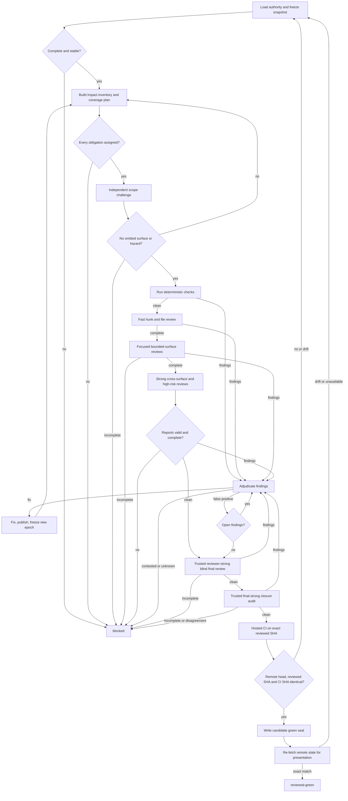

# Trustworthy Iterative Review Design

> **Status:** Approved for implementation by the human partner on 2026-08-21.

## Problem

The current `iterative-review` skill contains useful review-loop ideas, but it cannot safely prove that a pull request is reviewed green. Its router primarily sequences node names. It does not prove that every affected surface and risk obligation was assessed, that reviewer output is complete, that findings were resolved with evidence, or that all evidence applies to the exact remote pull-request snapshot presented to the human partner.

The current implementation also has executable contradictions: normal routes can be circular or non-terminating, some evidence-producing nodes can be skipped, snapshot material can become stale after fixes, and the final reviewer can authorize closeout without a machine-validated review report.

## Goal

Build an `iterative-review` skill that lets a weaker agent model reliably obtain the defect-detection quality a frontier agent can normally achieve by decomposing review into explicit obligations, assigning bounded independent reviewer roles, validating structured evidence, and failing closed whenever coverage or evidence is incomplete.

The system does not promise omniscience or formal correctness. It prevents a false green caused by incomplete process, missing evidence, stale inputs, unresolved findings, reviewer truncation, or pull-request drift.

This creates two separately measured guarantees:

- **Process soundness:** deterministic tests prove that an incomplete, stale, malformed, uncertain, or internally inconsistent review state cannot become green.
- **Detection sensitivity:** an adversarial benchmark proves that the weaker-model workflow finds every issue in a stable frontier-reference set on every required trial. This is an empirical release gate, not a universal correctness proof.

## Green invariant

`reviewed-green` is lawful only when all of the following predicates hold for one immutable review snapshot:

1. **Authority complete:** repository law, pull-request description, linked issues, linked documents, governing plans/specs, and declared non-goals have been loaded or explicitly classified as unavailable and blocking.
2. **Snapshot sealed:** base commit, head commit, tree, diff, authority set, and pull-request metadata use full identifiers and content hashes.
3. **Coverage complete:** every changed and affected surface is mapped to every applicable review obligation, and every obligation is `covered` or evidence-backed `not-applicable`.
4. **No accepted defect:** every finding at every severity is `fixed` or `false-positive`; no finding is open, deferred, contested, unassessed, or accepted as risk. An accepted risk produces `reviewed-with-exceptions`, never `reviewed-green`.
5. **Verification current:** deterministic checks, targeted checks, reviewer attestations, final review, closure audit, and hosted CI all refer to the current snapshot epoch.
6. **Independent closure:** a blind final reviewer and a separate closure auditor both return valid structured attestations.
7. **Remote identity:** the remote pull-request head equals the reviewed head and the commit tested by required hosted checks.
8. **No uncertainty:** tool failures, truncation, unavailable reviewers, malformed reports, unreviewed obligations, or unresolved assumptions route to `blocked`.
9. **Reasoning floor met:** every review dispatch meets the minimum capability and reasoning tier derived from its risk and scope aperture; the whole-PR final review and closure audit use a trusted `final-strong` route in fresh contexts, preferring an effective harness-defined `reviewer-strong` profile when available.

The final report must still state residual uncertainty: review green means no known unresolved issue and no uncovered declared obligation, not proof that no defect can exist.

## Architecture

### 1. One machine authority

`review-state.json` becomes the sole decision authority. All mutations go through one thin CLI, `reviewctl.py`, backed by focused modules under `scripts/review_core/`.

The state contains:

- schema version and review identity;
- current snapshot epoch and snapshot fingerprint;
- authority records;
- coverage obligations and assignments;
- reviewer dispatches and attestations;
- findings and dispositions;
- deterministic and hosted verification results;
- blockers and resume evidence;
- the final green seal;
- an append-only history of accepted transitions.

Reports, metrics, Markdown summaries, and JSON exports are derived views. They never decide the next action.

All state writes are atomic. Evidence files are registered by SHA-256 and bound to a snapshot epoch. Unknown fields, invalid enum values, missing evidence references, stale epochs, broken history hashes, or ad hoc edits that do not preserve the complete validated contract fail validation. The file is not a cryptographic defense against a malicious local writer; the CLI is the only supported mutation surface.

#### Version-2 state contract

The top-level object contains exactly these keys:

```json
{
  "schema_version": 2,
  "review_id": "review-uuid",
  "status": "active",
  "stage": "intake",
  "scratch_dir": "C:/absolute/review/path",
  "snapshot": null,
  "evidence": {},
  "authorities": {},
  "obligations": {},
  "dispatches": {},
  "reviews": {},
  "findings": {},
  "checks": {},
  "blockers": {},
  "green_seal": null,
  "history": []
}
```

`status` is one of `active`, `blocked`, or `reviewed-with-exceptions`. Stored state never asserts green; it may only reach the derived `green-candidate` stage. `stage` is derived from predicates and cannot be advanced by caller assertion. Mappings are keyed by the identifier repeated inside their record. Every record uses `additionalProperties: false` in the interoperability schema.

| Record | Required fields |
|---|---|
| Evidence | `evidence_id`, `kind`, absolute `path`, `sha256`, `bytes`, `snapshot_epoch`, `snapshot_fingerprint` |
| Authority | `authority_id`, `kind`, `locator`, `sha256`, `availability`, `evidence_id`, `snapshot_epoch`, `snapshot_fingerprint` |
| Obligation | `obligation_id`, `category`, non-empty `surfaces`, `risk`, `scope_level`, `minimum_capability_tier`, `minimum_reasoning_floor`, non-empty `assignees`, `status`, `evidence_ids`, `snapshot_epoch`, `snapshot_fingerprint` |
| Dispatch | `dispatch_id`, `role`, `profile`, `profile_sha256`, `capability_tier`, `reasoning_floor`, `model`, `reasoning`, `context_mode`, nullable `parent_model`, nullable `parent_reasoning`, `selection_mode`, `route_selection_evidence_id`, non-empty `assignment_ids`, non-empty `context_evidence_ids`, `required_tool_classes`, `status`, `snapshot_epoch`, `snapshot_fingerprint` |
| Review | `attestation_id`, `dispatch_id`, `role`, `profile`, `profile_sha256`, `capability_tier`, `reasoning_floor`, `model`, `reasoning`, `context_mode`, non-empty `assignment_ids`, `verdict`, `finding_ids`, `uncertainties`, `evidence_id`, `snapshot_epoch`, `snapshot_fingerprint` |
| Finding | `finding_id`, `source_kind`, `source_id`, `obligation_id`, `severity`, `title`, `description`, non-empty `locations`, `evidence_ids`, nullable `regression_of`, `disposition`, nullable `resolution`, `discovered_snapshot_epoch`, `discovered_snapshot_fingerprint` |
| Check | `check_id`, `kind`, `command`, `required`, `conclusion`, `head_sha`, `evidence_id`, `snapshot_epoch`, `snapshot_fingerprint` |
| Blocker | `blocker_id`, `class`, `reason`, `evidence_ids`, `active`, `opened_sequence`, nullable `closed_sequence`, `snapshot_epoch`, `snapshot_fingerprint` |
| Green seal | `snapshot_epoch`, `snapshot_fingerprint`, `coverage_sha256`, `findings_sha256`, `reviews_sha256`, `checks_sha256`, `evidence_ids`, `created_at` |
| History | `sequence`, `event`, `snapshot_epoch`, `snapshot_fingerprint`, `data_sha256`, `previous_record_sha256`, `record_sha256` |

The closed vocabularies are:

- evidence `kind`: `snapshot`, `authority`, `impact-map`, `scope-challenge`, `route-selection`, `check-output`, `review-attestation`, `finding-proof`, `fix-proof`, `human-decision`, `remote-ci`;
- authority `kind`: `repo-law`, `pr-description`, `issue`, `document`, `plan`, `spec`, `non-goal`; `availability`: `loaded`, `unavailable`;
- obligation `category`: `authority-scope`, `behavioral-correctness`, `test-adequacy`, `security-privacy`, `reliability-concurrency`, `compatibility-migration`, `performance-resources`, `operability-configuration`, `documentation-contract`, `source-custody`; `risk`: `high`, `medium`, `low`; `status`: `pending`, `covered`, `not-applicable`, `invalidated`, `unassessed`;
- obligation `scope_level`: `hunk`, `file`, `surface`, `cross-surface`, `whole-pr`; `minimum_capability_tier`: `fast`, `focused`, `strong`, `final-strong`; `minimum_reasoning_floor`: `low`, `standard`, `high`, `final-strong`;
- dispatch `selection_mode`: `trusted-profile`, `runtime-role-map`, `literal-inherit`, `explicit-route`; `context_mode`: `fresh`, `forked`; `status`: `pending`, `reported`, `incomplete`, `invalidated`; `required_tool_classes` contains zero or more of `repo-read`, `git-read`, `github-read`, `issue-read`, `document-read`, `command-exec`, `browser-read`, `domain-read`;
- route-selection `qualification_source`: `effective-profile`, `runtime-adapter`, `parent-inheritance`, `explicit-route`;
- review `role`: `impact-mapper-semantic`, `impact-mapper-contract`, `scope-challenger`, `obligation-reviewer`, `finding-adjudicator`, `fix-reviewer`, `blind-final`, `closure-auditor`; `verdict`: `clean`, `findings`, `incomplete`, `blocked`;
- finding `source_kind`: `review`, `check`; `severity`: `blocking`, `important`, `minor`; `disposition`: `open`, `fixed`, `false-positive`, `accepted-risk`, `deferred`, `contested`, `unassessed`;
- check `kind`: `preflight`, `targeted`, `remote-ci`; `conclusion`: `success`, `failure`, `cancelled`, `skipped`;
- blocker `class`: `authority-missing`, `coverage-gap`, `incomplete-review`, `malformed-evidence`, `snapshot-drift`, `tool-blocked`, `contested`, `state-invalid`.

A finding location is exactly `{"path": "repo/relative/path", "line": 1}`. Every non-null resolution includes `resolved_snapshot_epoch` and `resolved_snapshot_fingerprint`. A `fixed` resolution also includes `kind`, `fix_sha`, non-empty `verification_evidence_ids`, and non-empty `rereview_attestation_ids`. A `false-positive` resolution also includes `kind`, non-empty `counter_evidence_ids`, and `adjudicator_attestation_id`. An `accepted-risk` resolution also includes `kind` and `human_decision_evidence_id`; it is excluded from green. Open dispositions require `resolution: null`.

The transient remote observation consumed by presentation contains exactly `pr_url`, full `head_sha`, `authority_metadata_sha256`, `required_checks` as a name-to-conclusion mapping, and RFC 3339 UTC `observed_at`. It is valid for at most 60 seconds and may not be more than 5 seconds in the future. It is not persisted as proof of durable remote state.

For obligation, adjudication, fix, final, and closure roles, each `assignment_ids` item must resolve to a current obligation or finding as appropriate. Impact mappers use the snapshot fingerprint as their assignment; the scope challenger uses both impact-map evidence IDs. This avoids inventing coverage obligations before impact discovery while keeping every dispatch bounded and checkable. A review is valid only when its role, profile hash, tier, model/reasoning/context observations, assignment IDs, epoch, and fingerprint match its dispatch. Blind-final dispatch context must exclude prior review and finding evidence IDs; the validator checks that exclusion rather than trusting the prompt to be blind.

Each dispatch's route-selection evidence is a strict JSON object with exactly `schema_version`, `observed_at`, `inventory_evidence_sha256`, `budget_contract_sha256`, `required_capability_tier`, `profile`, `profile_sha256`, `selection_mode`, `selected_model`, `selected_reasoning`, `selected_context_mode`, nullable `parent_model`, nullable `parent_reasoning`, `qualification_source`, and `rationale`. It records the live inventory and budget inputs through their content hashes and preserves the profile or route authority used for dispatch. Its duplicated fields must equal the dispatch.

Route qualification follows this order:

1. **Trusted named profile:** if the harness resolves an effective `reviewer-strong` custom subagent, the shared `selecting-a-subagent` role contract qualifies it as `final-strong`; dispatch that profile without a model or reasoning override. Other custom profile names require an explicit adapter classification at the requested tier. The profile's baked route is authoritative. Record the effective profile bytes hash when readable; for an opaque harness-owned profile, hash the runtime adapter's profile-identity record. The skill does not compare that baked route with the parent.
2. **Runtime role map:** if the harness does not consume named profiles directly, use the current `selecting-a-subagent` adapter mapping for `reviewer-strong` and hash that mapping as the profile contract.
3. **Fallback route:** only when neither profile form exists, use literal inheritance or an explicit model/reasoning route that the current adapter qualifies as `final-strong`.

An arbitrary requested profile string cannot bless an unclassified route: the harness must resolve the effective profile through its configured profile search path or role adapter, and dispatch must preserve that result's baked configuration. Conversely, an opaque but harness-recognized custom profile is not rejected merely because the skill cannot inspect its baked model. Final and closure dispatches require `context_mode: fresh`; an unavailable profile, failed dispatch, unqualified fallback, or model override applied to a trusted profile blocks.

For `trusted-profile`, `selected_model` and `selected_reasoning` are descriptive observations when the harness exposes them and the literal value `profile-defined` otherwise; neither field is sent as an override. For `runtime-role-map` and `explicit-route`, they record the selected concrete route. For `literal-inherit`, both are `inherit`. This lets the state distinguish trusting a profile from pretending to know its internals.

One current qualification record may be referenced by multiple dispatches that use the same effective profile, adapter identity, inventory hash, budget hash, and required tier. Re-resolve only when one of those inputs changes. The evidence exists to prevent silent substitution, not to make the orchestrator rediscover a stable custom profile before every lens.

An evidence reference is valid only when the registered file still exists and its current bytes match the registered size and digest. A record used to satisfy a current coverage, review, check, or seal predicate must match the current epoch and fingerprint. Findings preserve their discovery epoch; their resolution proof may be from a later epoch, while current impacted-obligation attestations prove the resolved behavior still holds. Historical records remain retained but cannot directly satisfy current predicates.

The empty intake state has no evidence or history records. No record may use epoch 0. A failed first freeze leaves intake unchanged and returns a blocking decision; a successfully frozen but unavailable authority is recorded at epoch 1 and blocks there.

### 2. Snapshot epochs

A review snapshot records:

```json
{
  "epoch": 3,
  "git_object_format": "sha1",
  "base_sha": "<40-character commit>",
  "head_sha": "<40-character commit>",
  "tree_sha": "<40-character tree>",
  "diff_sha256": "<sha256>",
  "pr_metadata_sha256": "<sha256>",
  "authority_manifest_sha256": "<sha256>",
  "fingerprint": "<sha256 of canonical snapshot fields>"
}
```

`git_object_format` is `sha1` or `sha256`; object identifiers are validated at 40 or 64 lowercase hexadecimal characters accordingly. Any change to object format, head, base, tree, pull-request scope, or governing authority creates a new epoch. Evidence from earlier epochs remains historical but cannot satisfy a current obligation. The impact planner determines which coverage assignments must be repeated; deterministic preflight, final review, closure audit, remote identity, and hosted CI are always invalidated.

### 3. Coverage obligations

Lens selection becomes coverage planning. A lens is an assignee, not proof of coverage. Two independent discovery passes produce (1) a semantic change-and-dependency map and (2) a contract, data-flow, and user-journey map. The coverage plan uses their union. A separate scope challenger must either add omitted affected surfaces and hazard hypotheses or attest that none remain.

Each changed or affected surface must receive the universal obligations that apply:

- authority and scope fidelity;
- behavioral correctness and edge cases;
- test adequacy and negative cases;
- security, privacy, authorization, and secret handling;
- reliability, error handling, recovery, and concurrency;
- compatibility, API contracts, migrations, and rollback;
- performance and resource behavior;
- operability, observability, deployment, and configuration;
- documentation and human-facing contract accuracy;
- source custody, generated-output, and repository-domain rules.

Repository-specific reviewer profiles add obligations. They do not remove the universal correctness obligation. A generated mirror may be excluded from duplicate semantic review only when an obligation proves its canonical source, generator, regenerated bytes, and validation result.

An obligation record includes:

```json
{
  "obligation_id": "surface:review_core/policy.py:behavioral-correctness",
  "snapshot_epoch": 3,
  "surfaces": ["scripts/review_core/policy.py"],
  "category": "behavioral-correctness",
  "risk": "high",
  "scope_level": "cross-surface",
  "minimum_capability_tier": "strong",
  "minimum_reasoning_floor": "high",
  "assignees": ["reviewer-correctness", "reviewer-strong"],
  "status": "pending",
  "evidence_ids": []
}
```

Zero matching deep lenses is a coverage failure. Sliced diffs are navigation aids only; reviewers also receive the complete patch, affected-file and dependency context, authorities, and read-only repository access. A report that cannot inspect necessary context is incomplete, not clean.

### 4. Structured reviewer contract

Every reviewer writes JSON that validates against one schema. A terminal status line is only a transport acknowledgement.

```json
{
  "schema_version": 1,
  "review_session_id": "<review-session-id>",
  "attestation_id": "<attestation-id>",
  "snapshot_epoch": 3,
  "snapshot_fingerprint": "<fingerprint>",
  "dispatch_id": "<dispatch-id>",
  "reviewer": {
    "profile": "reviewer-correctness",
    "profile_sha256": "<sha256>",
    "capability_tier": "strong",
    "reasoning_floor": "high",
    "model": "<observed model or inherit>",
    "reasoning": "<observed reasoning or inherit>",
    "context_mode": "<observed mode>"
  },
  "assignments": [
    {
      "assignment_id": "<assigned-id>",
      "status": "covered",
      "evidence": ["path:line", "command or reasoning reference"],
      "notes": "<bounded conclusion>"
    }
  ],
  "findings": [],
  "uncertainties": [],
  "verdict": "clean"
}
```

`clean` is valid only when every dispatch assignment is `covered` or evidence-backed `not-applicable`, no uncertainty exists, and the report matches the dispatch and snapshot. Each assignment attestation records inspected surfaces, hypotheses checked, commands or tests used, and a bounded conclusion. Tool caps may end a reviewer run, but the result is then `incomplete`; remaining assignments must be redispatched or the review blocks.

### 5. Review roles

The review uses bounded roles so weaker models receive smaller, explicit questions:

1. Deterministic preflight for machine-decidable rules.
2. Independent impact mappers and a scope challenger for affected-surface completeness.
3. Tiered obligation reviewers, executed in order: fast mechanical hunk/file review, focused bounded-surface review, then strong cross-file, high-risk, security, and architectural review.
4. Adjudication that independently verifies every finding and records an evidence-backed disposition.
5. Targeted fix review by the originating obligation owner plus every obligation invalidated by the impact planner.
6. A blind final reviewer that receives the final snapshot and governing authorities but not prior reviewer conclusions.
7. A closure auditor that receives the coverage, finding, and verification ledgers and attempts to prove green is unlawful.

High-risk obligations require overlapping independent assignees. Lower-risk obligations may use one focused reviewer plus the blind final reviewer.

### 5a. Scope-to-reasoning ladder

The orchestrator resolves the live named profiles, role mappings, models, reasoning, context, capacity, and user-supplied budget contract through `selecting-a-subagent`. The portable skill does not assume a model name, price, entitlement, or that the parent is the strongest route. An available custom profile is a harness-owned routing decision; inheritance is used only when the active role mapping chooses it or no qualifying profile/mapping exists and the adapter approves it as fallback.

Review capability must rise as the review aperture widens:

| Tier | Normal profile | Review aperture | Minimum reasoning floor |
|---|---|---|---|
| `fast` | `reviewer-fast` | mechanical hunk/file checks | `low` |
| `focused` | `reviewer-fixes` or a narrow `reviewer-*` lens | one finding, file group, or bounded surface | `standard` |
| `strong` | `reviewer` or a strong domain lens | component, cross-file behavior, security, architecture, or cross-surface interaction | `high` |
| `final-strong` | `reviewer-strong` and the closure auditor | whole pull request, cross-lens synthesis, and green challenge | `final-strong` |

These are policy tiers, not hard-coded provider routes. The runtime adapter records the live inventory, effective profile or role mapping, and any fallback it selected. The required tier for an obligation is the greater of its scope floor and its risk/consequence floor; high-risk work is at least `strong` even when the diff is small. A cheaper or lower-reasoning result may discover findings, but it cannot satisfy a higher-tier obligation.

The portable floor calculation is deterministic:

| Input | Required tier |
|---|---|
| `hunk` or `file` scope | `fast` |
| `surface` scope | `focused` |
| `cross-surface` scope | `strong` |
| `whole-pr` scope | `final-strong` |
| `low` risk | `fast` |
| `medium` risk | `focused` |
| `high` risk | `strong` |
| security, authorization, privacy, secrets, irreversible data loss, concurrency/recovery, migration/rollback, public compatibility, or source-custody consequence | at least `strong` |

The assigned capability tier is the maximum row that applies. Its normalized reasoning floor is `low` for `fast`, `standard` for `focused`, `high` for `strong`, and `final-strong` for the whole-PR tier. Repo/domain law may raise a floor but never lower it. The scope challenger disputes under-classified scope, risk, and consequence as well as missing surfaces.

`reviewer-strong` is a semantic profile contract, not an instruction to reconstruct its model choice. A harness-defined profile may bake in a model, reasoning setting, tools, and context policy; when the active `selecting-a-subagent` contract recognizes it as `final-strong`, the workflow trusts and dispatches it as defined. Literal parent inheritance remains a valid fallback in runtimes where that is the recognized `reviewer-strong` mapping, but parent equality is not a universal requirement. The skill never silently substitutes an unqualified cheaper route or overrides a trusted profile's baked model.

The ladder is monotonic during each outward review ascent: fast local review precedes focused and strong obligation review, which precedes the trusted final-strong blind final and closure challenge. A fix narrows the aperture and may legitimately return to `reviewer-fixes`; after that fix passes, every invalidated broader tier is repeated in ascending order. A lower tier never replaces a failed, unavailable, or disagreeing higher tier.

### 6. Finding lifecycle

Findings include full text, locations, risk, evidence, originating obligation, snapshot epoch, and reviewer identity. Valid dispositions are:

- `fixed`, with fix commit, RED/GREEN evidence when applicable, deterministic verification, and reviewer attestation;
- `false-positive`, with concrete counter-evidence and adjudicator identity;
- `accepted-risk`, with durable human decision evidence; when every other finding is fixed, false-positive, or also accepted-risk this permits `reviewed-with-exceptions`, but never green;
- `open`, `deferred`, `contested`, or `unassessed`, all of which block completion.

Minor findings do not disappear at final review. Finding identifiers are immutable. A resolution cannot reference a nonexistent finding, check, attestation, or evidence item; its resolution epoch must be the epoch in which that proof was produced and may be later than discovery.

### 7. Mutation and re-review

Every fix creates a new snapshot epoch after publication. The impact planner recomputes changed and affected surfaces, invalidates applicable coverage, and re-runs deterministic checks. Non-trivial or cross-cutting fixes expand the affected surface set instead of relying only on the originating lens.

Planning-artifact archive or closeout changes happen before the final snapshot is frozen or in a separate pull request. No repository mutation is allowed after final review without invalidating the green candidate.

### 8. Final review and remote seal

The blind final reviewer and closure auditor run on the same final snapshot. Hosted CI may require the pull request to leave draft; this creates a `remote-ci-candidate`, not `reviewed-green`. The green seal is written only after required checks pass for the reviewed SHA and the remote head has not changed.

The seal records the snapshot fingerprint, required check names and conclusions, review attestation hashes, coverage digest, finding digest, and timestamp. It is a candidate proof, not a durable claim about mutable remote state. The human-facing handoff must be generated by a read-only `reviewctl present` command that re-fetches the pull-request head, authority metadata, and required hosted checks immediately before presentation. It evaluates the candidate against that transient observation and emits a reviewed-SHA proof without mutating state. A changed or unavailable remote state refuses green and routes the next mutation back through snapshot intake.

### 9. Agent-facing experience

`SKILL.md` becomes a control plane under 500 words. The normal path is:

```text
reviewctl start -> reviewctl next -> perform named action -> reviewctl complete
```

`reviewctl next` prints one action, the exact required inputs, the evidence schema, and the command that records completion. It never claims that ordering alone proves the action happened.

Encoding normalization, metrics compilation, ledger rendering, and status summaries move behind CLI boundaries. Separate semantic nodes for these bookkeeping operations are removed.

## Fail-closed graph



## Migration

- Existing version-1 scratch workspaces cannot be promoted to green by the version-2 engine.
- A version-1 review may be inspected and exported as history, but a new version-2 review must start from a fresh remote snapshot.
- Legacy scripts remain compatibility shims only until the final cutover plan. They do not remain parallel authorities.
- Existing active iterative-review roadmap work is superseded where it conflicts with this design; useful generation-aware lens work is absorbed into the coverage-planning plan.

## Validation

### Deterministic tests

- Exhaustive transition-table tests for every stage and blocker.
- Negative green-predicate tests that remove one required predicate at a time.
- Property-style state tests: no invalid state can reach green; mutation always revokes current evidence.
- Snapshot-drift tests for base, head, tree, PR metadata, and authority changes.
- Report-schema tests for missing obligations, truncation, stale epochs, wrong dispatch IDs, and malformed findings.
- Finding tests for every severity and disposition.
- Regression tests for every defect identified in the 2026-08-21 assessment.
- Exact-SHA hosted-check fixtures.

### Agent pressure tests

Run RED/GREEN campaigns with weaker subagents for at least these pressures:

- reviewer says clean but omits an assigned obligation;
- no deep lens matches;
- a reviewer hits its tool cap;
- a minor finding remains deferred;
- the head changes after final review;
- CI passed on a previous SHA;
- prior lens reports anchor the final reviewer;
- the harness exposes `reviewer-strong` with a baked model; the orchestrator must dispatch the named profile without model/reasoning overrides;
- the harness exposes `reviewer-strong` but hides its baked model; the recognized role contract remains valid and records `profile-defined` rather than blocking;
- an effective profile or runtime role mapping changes between dispatches; cached qualification is invalidated and resolved again;
- a human-equivalent authority pressures the orchestrator to declare green early;
- generated mirrors are excluded without regeneration proof;
- a fix changes a surface outside its originating lens.

The GREEN campaign succeeds only when the agent blocks or loops correctly and cites the machine gate rather than relying on confidence language.

### Frontier-reference benchmark

Maintain a versioned corpus of representative pull requests and seeded mutations covering behavioral, test, security, authorization, concurrency, migration, generated-source, operability, documentation, and repository-law failures. Build the reference set from issues independently found by at least two blinded frontier-review runs or confirmed by human adjudication. Do not give reference findings to evaluated reviewers.

For each supported weaker model/profile combination, run at least three fresh trials per corpus case. Release is permitted only when every trial:

- finds every reference issue at the correct or higher severity;
- produces no green when a required tool or context is unavailable;
- closes no seeded issue as `not-applicable` or `false-positive` without valid counter-evidence;
- preserves exact snapshot identity through presentation.

Report per-category recall, false-green count, incomplete/block rate, token/tool cost, and disagreements. Aggregate average recall is not a substitute for the per-trial 100% reference-recall gate. A new frontier-stable miss becomes a permanent regression fixture.

### External frontier escape rate

External frontier review is outside the skill's green graph and does not become routine internal ceremony. It is the downstream quality audit whose cost the skill is expected to protect. For benchmark and dogfood PRs, give an independent frontier reviewer the final PR snapshot and authorities but none of the internal reports. Any valid issue within the skill's declared coverage that this reviewer finds after internal green is a **frontier escape**: revoke the benchmark pass, classify the internal tier that should have caught it, and add the case as a permanent regression fixture.

Track frontier escapes per internally green PR, by severity and obligation category. The release target is zero frontier escapes across the versioned benchmark trials. Production escape rate is an observed improvement metric, not a claim that external review can never find a novel issue.

### Repository validation

- `py -3 -m pytest codex-marketplace/plugins/superpowers-plus/skills/iterative-review/tests -q`
- `py -3 tools/run.py marketplace --apply`
- `git add -A`
- `py -3 tools/run.py ci --check`
- Draft pull request, self-review, iterative review of the replacement workflow, ready transition, and hosted CI on the exact head SHA.

## Non-goals

- Proving that no unknown defect exists.
- Replacing repository-specific domain law or canonical CI.
- Auto-merging pull requests.
- Treating reviewer count as a substitute for coverage.
- Keeping version-1 metrics or node names for compatibility after cutover.
- Making every review maximally expensive; overlap is risk-based, while completeness remains mandatory.
