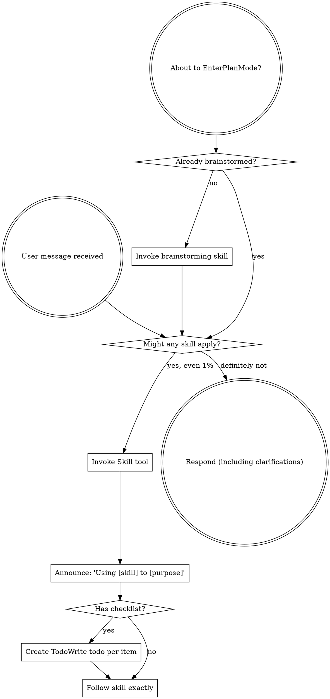

<SUBAGENT-STOP>
If you were dispatched as a subagent to execute a specific task, skip this skill.
</SUBAGENT-STOP>

<EXTREMELY-IMPORTANT>
If you think there is even a 1% chance a skill might apply to what you are doing, you ABSOLUTELY MUST invoke the skill.

IF A SKILL APPLIES TO YOUR TASK, YOU DO NOT HAVE A CHOICE. YOU MUST USE IT.

This is not negotiable. This is not optional. You cannot rationalize your way out of this.
</EXTREMELY-IMPORTANT>

## Instruction Priority

System, developer, runtime policy, and repo-scoped instructions remain authoritative.

Within that governing stack, explicit user instructions remain authoritative.

Superpowers skills are workflow guidance that operates inside those boundaries.

If platform, repo, or user instructions conflict with a skill, follow the governing instruction.

The skill shapes workflow. It does not overrule policy.

## How to Access Skills

**In Claude Code:** Use the `Skill` tool. When you invoke a skill, its content is loaded and presented to you—follow it directly. Never use the Read tool on skill files.

**In Copilot CLI:** Use the `skill` tool. Skills are auto-discovered from installed plugins. The `skill` tool works the same as Claude Code's `Skill` tool.

**In Gemini CLI:** Skills activate via the `activate_skill` tool. Gemini loads skill metadata at session start and activates the full content on demand.

**In other environments:** Check your platform's documentation for how skills are loaded.

## Platform Adaptation

Skills use Claude Code tool names. Non-CC platforms: see `references/copilot-tools.md` (Copilot CLI), `references/codex-tools.md` (Codex) for tool equivalents. Gemini CLI users get the tool mapping loaded automatically via GEMINI.md.

## Asset Marketplace Routing

This projection is Asset Marketplace `Superpowers+` adaptation behavior, not upstream/base Superpowers doctrine. It only routes to wrapper skills that are actually projected into `superpowers-plus`.

- Brainstorming and initial task framing: use `brainstorming`.
- Plan-shaped work: use `writing-plans` to make the plan checkable, then `executing-plans` to update verified checkboxes as work lands, then `verification-before-completion` before any completion or ready-for-review claim.
- Plan creation and plan execution: use `writing-plans` for route review and `executing-plans` for implementation.
- Direct implementation work where test discipline matters: use `test-driven-development`.
- Debugging, bug-finding, and unexpected behavior analysis: use `systematic-debugging`.
- Validation, pass/fail claims, and completion assertions: use `verification-before-completion`.
- Review and redline workflows: use `requesting-code-review` and `receiving-code-review`.
- Branch completion and publication closeout: use `finishing-a-development-branch`.
- Linear issue shaping and smallest-applicable workflow selection: use `linear-superpowers`.
- GitHub-facing proof, PRs, branches, commits, and publication state: use `github-superpowers`.
- Repo-specific anti-slop or profile work: use `unslop-superpowers`.
- Architecture review and composition boundaries: use `architecture-superpowers`.
- ECC workflow-shaped work: use `ecc-superpowers` to route to the dedicated
  `superpowers-ecc` pack.
- Parallel agent dispatch or worktree setup when those are the smallest useful helpers: use `subagent-driven-development`, `dispatching-parallel-agents`, or `using-git-worktrees`.
- Writing or updating skill content: use `writing-skills`.

Do not treat these wrapper routes as upstream doctrine. They are the Marketplace projection's adaptation layer for Asset Marketplace work, and they only refer to wrappers actually projected into `superpowers-plus`.

# Using Skills

## The Rule

**Invoke relevant or requested skills BEFORE any response or action.** Even a 1% chance a skill might apply means that you should invoke the skill to check. If an invoked skill turns out to be wrong for the situation, you don't need to use it.

## Red Flags

These thoughts mean STOP - you're rationalizing:

| Thought | Reality |
|---------|---------|
| "This is just a simple question" | Questions are tasks. Check for skills. |
| "I need more context first" | Skill check comes BEFORE clarifying questions. |
| "Let me explore the codebase first" | Skills tell you HOW to explore. Check first. |
| "I can check git/files quickly" | Files lack conversation context. Check for skills. |
| "Let me gather information first" | Skills tell you HOW to gather information. |
| "This doesn't need a formal skill" | If a skill exists, use it. |
| "I remember this skill" | Skills evolve. Read current version. |
| "This doesn't count as a task" | Action = task. Check for skills. |
| "The skill is overkill" | Simple things become complex. Use it. |
| "I'll just do this one thing first" | Check BEFORE doing anything. |
| "This feels productive" | Undisciplined action wastes time. Skills prevent this. |
| "I know what that means" | Knowing the concept != using the skill. Invoke it. |

## Skill Priority

When multiple skills could apply, use this order:

1. **Process skills first** (brainstorming, debugging) - these determine HOW to approach the task
2. **Implementation skills second** (frontend-design, mcp-builder) - these guide execution

"Let's build X" -> brainstorming first, then implementation skills.
"Fix this bug" -> debugging first, then domain-specific skills.

## Skill Types

**Rigid** (TDD, debugging): Follow exactly. Don't adapt away discipline.

**Flexible** (patterns): Adapt principles to context.

The skill itself tells you which.

## User Instructions

Instructions say WHAT, not HOW. "Add X" or "Fix Y" doesn't mean skip workflows.

## Quick Pattern

1. Read the current request and surrounding context.
2. Choose the smallest skill that fits the moment.
3. If the task is unclear, start with brainstorming.
4. If a plan already exists, move to planning or execution.
5. If the work is nearly done, switch to verification or closeout.

## Guardrails

- Do not skip the skill selection step.
- Do not force one workflow onto every task.
- Keep the chosen workflow aligned with the actual stage of work.

## Codex Marketplace Compatibility

In this projection, Superpowers skills are workflow guidance inside the normal
instruction stack. They do not override system, developer, runtime, or repo
instructions. See `references/codex-marketplace-compatibility.md`.
